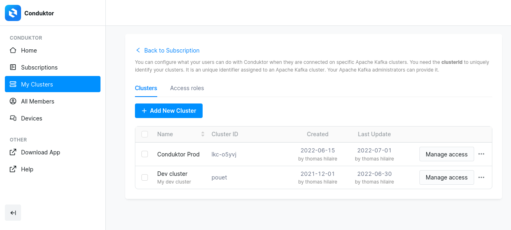
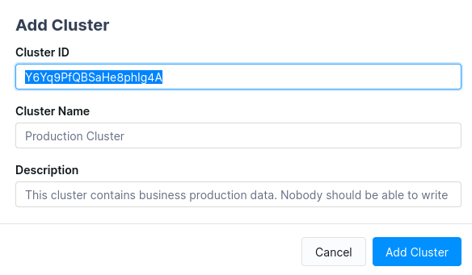
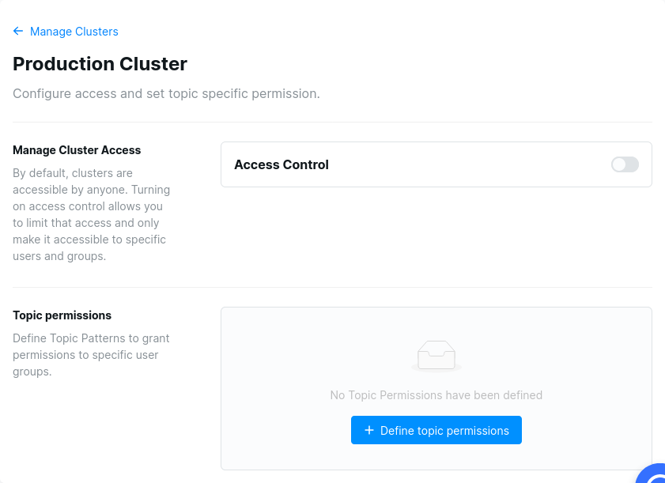
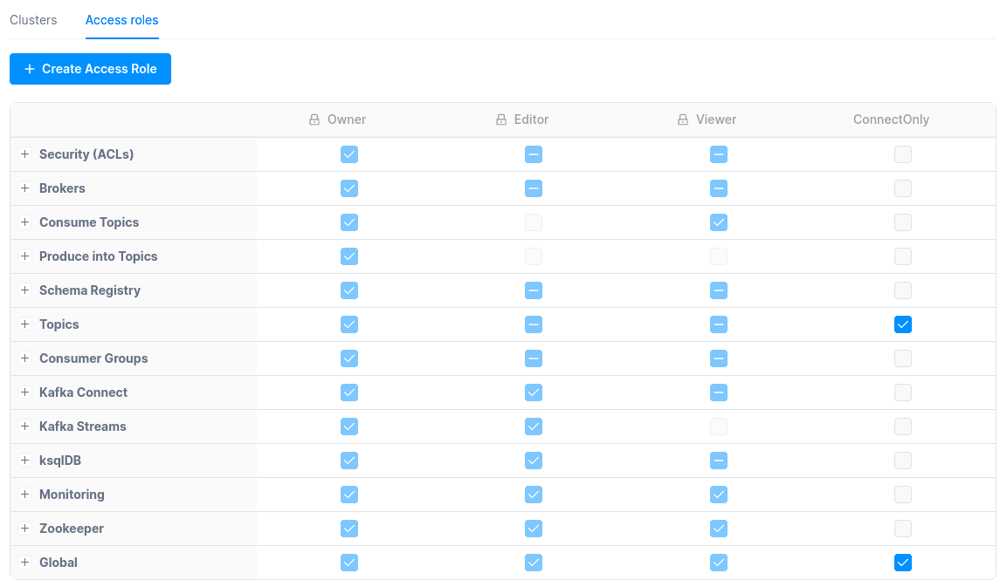
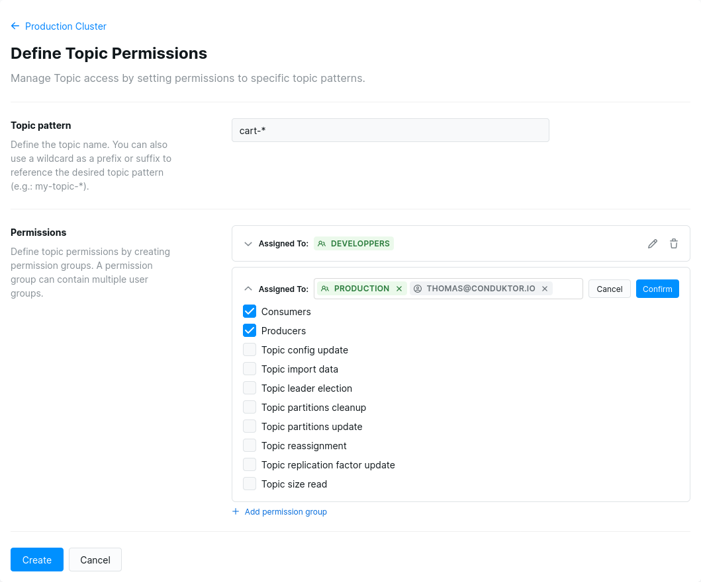
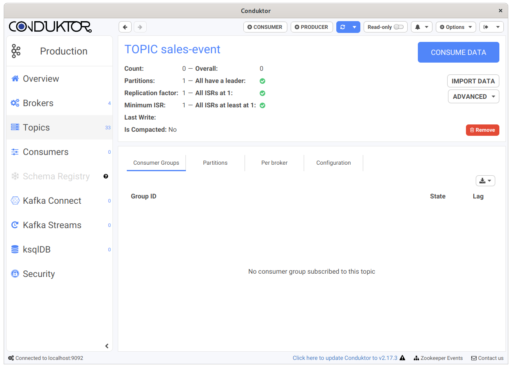

# Managing Permissions / RBAC

:::info
This feature is available only for Enterprises.
:::

To be in control of what features your users can use on your clusters when using Conduktor Desktop, considering limiting their permissions. This is available on your account at [https://account.conduktor.io](https://account.conduktor.io).

## Scope

You can control permissions on a **per-cluster** and also **per-topic** if you need more granularity.

## Example

You want to ensure that all your users cannot write into your production clusters: you want to provide read-only access. You also want them to have all the permissions on your development clusters: this is the default (when no restrictions are put in place).

## How to enable Access Control of an Apache Kafka cluster?

- On the Account Management Portal, click on **My Clusters** to get to the _Cluster Permission_ page
- Here you will be able to declare your clusters or change the permission of an existing cluster

- Click **Add new cluster** to declare a new cluster, you need to provide:
  - the Cluster ID: provides by your Apache Kafka administrators / your Ops team / Also available within Conduktor in the "Brokers" view
  - a short name
  - a longer description.&#x20;

:::tip
A cluster ID uniquely identifies your clusters. It is a unique identifier assigned automatically
to an Apache Kafka cluster.
:::

## How to setup the permissions of a cluster?

Once you've added a cluster, you will be able to allow or deny access to specific features of Conduktor Desktop. Click on button **Manage Access** on the right of your created cluster.

By default, there is any restriction on what your users can do on your clusters. The access control is disabled :&#x20;

:::tip
You can enable access control and choose the base role _Viewer_ to set predefined permissions to
prevent any modifications to your cluster by your users (eg: disallowing producing to topics,
broker config modifications, topic creation/deletion, altering schemas in schema registry, ...)
:::

### How to set a role for specific groups or users?

You can provide different permissions set for your users by assigning them different roles. Select the user or group you want to manage, click on the button **Add**, and assign to him the desired role :&#x20;

:::caution
The effective permissions of a user is the total of his permissions and all permissions of groups he belongs to.

The base role will give its permissions access to every users of the subscription. You can't give less access right for a single user. We advise you to not give a too powerful base role on your cluster.
:::

### Could I define my own role?

We predefined three roles to help you restrict access :&#x20;

- Viewer : You can only read data on the cluster.
- Editor : You can write data on the cluster.
- Owner : You have access to all the features available.

But you can define your own role on the **Access roles** tab with the **Create Access Role** button :

## How to define permissions of specific topics

You want to give differents permissions on a specific topic to some of your users or groups? Go to your cluster Access Control page, then click on the **Define topic permissions** button.

In the first input, you can define the name of the topic you want to manage the access. Give a simple name like `cart-prod` or a pattern like `cart-*`. We support wildcard as prefix or suffix only.

Then click on **Add permission group** to select the members and the permissions you want for them. Once you are done, **Confirm** your selection then click on **Create** to save.

:::info
The permissions assigned to an user are loaded when he connects to the cluster with Conduktor
Desktop. Already connected users won't have their permissions changed until they disconnect then
reconnect to the cluster.
:::

## How does this affect Conduktor Desktop?

When a permission is denied, the corresponding button or menu entry will not appear in Conduktor Desktop.

For instance, if we disabled "Produce Into Topics" on a cluster, users connected to this cluster won't be able to Produce any data (no "Producer" button):

:::info
Removing the specific permission **_Allow Users to Connect_** will entirely prevent
the connection to the cluster.
:::

## Additional Remarks

- This does not persist any ACLs into your Apache Kafka clusters, this controls only Conduktor
- Clusters that are not declared in the portal get all permissions by default.
