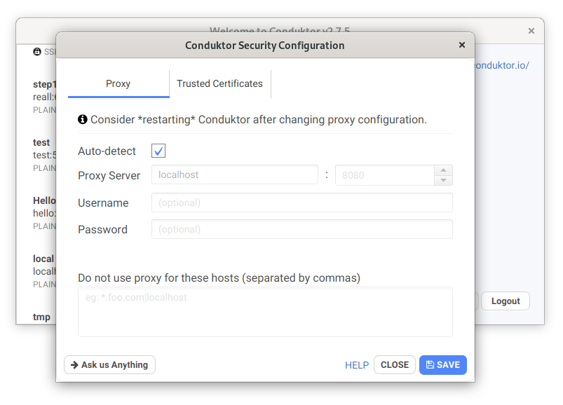

# Using an internet proxy

In case you have an internet proxy \(usually if you are part of a corporate with network security controls\), then you may need to set-up Conduktor to be able to work with this proxy, otherwise the login won't work.

By default Conduktor will automatically detect and use your system proxies.

The proxy configuration can be found in the bottom right corner of the start screen of Conduktor.

From there, you can set the proxy manually and enter:

- hostname
- port
- username
- password
- a list of domains the proxy should not be used on

<Tip>
After changing the proxy settings, please restart Conduktor
</Tip>
