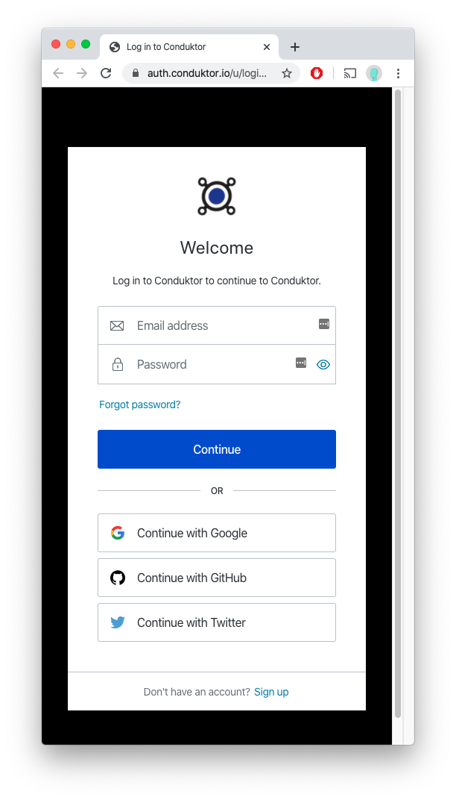

# Sign in to Conduktor

In order for us to verify the license you have purchased, we require you to sign in to Conduktor. For this, we are using Auth0 for user management.&#x20;

<Info>
Do you have an internet proxy? Check out the
[internet proxy section](/desktop/conduktor-first-steps/login-troubleshooting/internet-proxy).
</Info>

## Login flow

Upon starting Conduktor, you will have to first sign-up & login

.png>)

This will open a web browser window to allow you to log-in&#x20;

A valid internet connection is required to access the domain auth.conduktor.io.&#x20;

## Google / GitHub / Twitter

This is the **easiest way to get started with Conduktor**. We will retrieve your email address, which will be automatically verified, and you'll be all set!&#x20;

## Manual Login

You must create a username and a password with the following constraints:

.png>)

After being signed-up correctly, you will have to verify your email before using Conduktor:

.png>)

Check your spam folder if you can't find anything from us

.png>)

After verifying your email, you can **refresh** Conduktor

.png>)

And you're all set!

## Login issues?

Please read the following page:

[Login Troubleshooting & FAQ](/desktop/conduktor-first-steps/login-troubleshooting)
