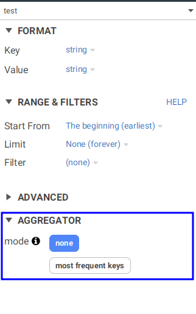

# Advanced Consumer

## Consume only specific partitions

While most of the users will consume the data from a topic and all its partitions, some advanced users could only want to consume for a given set of partitions because they know where the info they're looking for is.

In the Advanced panel, you can set the partitions to a specific number, or a range, or a combinaison of ranges etc (as the tooltip explains).

Example:

- 42
- 20-30
- 20-21,24,26

## Show only the latest value

It's possible to get only the latest value for any keys when consuming data. If you know Kafka Streams, it's the same concept as the KTable, without Kafka Streams!

For instance, if you want to know what is the _last modification_ on a certain key, this is definitely a must.

In the Advanced panel, check "Latest by Key" and consume your topic. Nothing will change _except_ that all the visible keys will be the last version of them. You will see the records with the same key updated in-place with their latest value.

## Consumer tuning

By default, Conduktor is configured to work properly in the vast majority of use-case. For less common usage, it's possible to tune some properties used when working with the consumer

In the Advanced panel, click on Open Settings to get directly to the consumer settings: (it's possible to get there by the main Settings button in Conduktor's main view)

.png>)

For instance, if you have large messages in your topic, consider:

- Reducing Max Poll Records
- Raising Fetch Max Size and Partition Fetch Size

## Consumer Offsets

Conduktor is able to read the special internal topic of Kafka where all the consumer committed offsets are stored. Not everybody has access to this topic **\_\_consumer_offsets**. If you have, you'll see that you won't be able to choose how to read this topic, because there is only one way:

You will still be able to do classic operations like filtering, to look for your consumer group for instance. It's useful to track Kafka rebalancing, commits and so on.

There are different type of key/value in this topic that we won't explain here. If you're interesting reading this topic, I'm sure you know what you're doing!

### Aggregators

Conduktor is able to aggregate your events. For the moment only one aggregator is available which is named "most frequent key". This aggregator is powered by a TopK algorithm, this is a probabilistic structure and the results are can diverge from the real distribution by a few percent. This aggregator is very useful to understand the distribution of your data or to analyze key hot spots.

