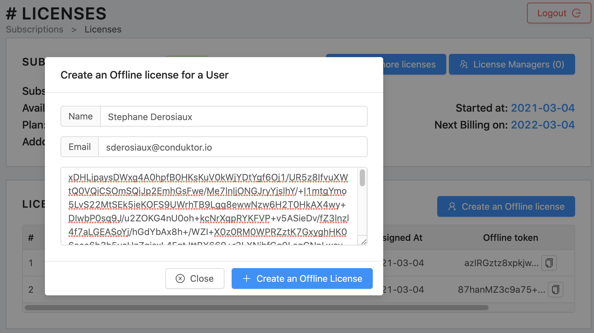
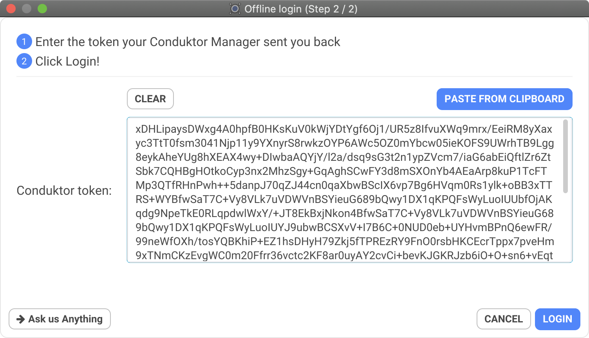
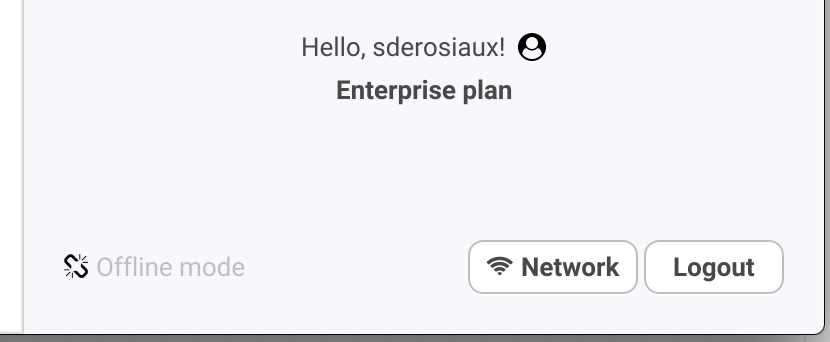

# Offline Licenses

Conduktor relies on [Auth0](../data-security.md) to manage user authentication securely and check our software licenses. Therefore, it is not _normally_ possible to use Conduktor if you don't have an online access. This was limitating for secured enterprises where online is just not possible (insurance, banking institutions etc.). This is why we developed an offline mode.


Make sure to purchase the **Offline** **option** with your subscription to use this feature.


## Process to login offline

To work in offline mode, there is a few steps to be followed by the user and the manager.

### 1. User: Enable offline Login

To avoid using auth0, Conduktor can identify you using a "offline token" instead. Doing such, no contact to the outside world is necessary, and you can work offline, with your clusters still accessible on your network.

To get this "offline token", you need to enable the Offline mode into Conduktor by going into the Network options, on the welcome screen:

By doing so, the "LOGIN / SIGNUP" button now reads "OFFLINE LOGIN".

### 2. User: Click on Offline Login and generate a Code

This is open a dialog where you have to enter your email address, then click on "Generate Code".

This will generate a code **specific for your account and your machine**, that you need to send to your Conduktor manager. Every code generated will be different.

### 3. Manager: Create an Offline License from the Code

Using our portal (through an online access), the manager of your team / company will be able to create an "offline token" for Conduktor, from a code.

A token is specific PER USER. All users will have a different token.

- Step 1: the manager enters the code of the user, this will generate a license with a token
- Step 2: the manager copies the token of the license and give it back to the user

### 4. User: Paste its personal "offline token" into Conduktor

Paste the token your manager sent you in the Step 2 / 2, then click on Login:

Et voilà! You are "offline logged in"! You can show the "Offline mode" enabled on the bottom left.

## A few things

### Offline means nothing goes out

Because you are offline, some options are now disabled and hidden (like Analytics & Reports: they have nowhere to go!).

### By Machine&#x20;

A code is generated for a specific machine (where Conduktor is installed). A token generated is also specific for this same machine (where the original code was generated).

You cannot use a token on a different machine, you will need to generate a new token for the user (hence a new license).

### Renewal every year

Subscriptions are typically renewed every year.

Therefore, the generated tokens will be declared **INVALID** by Conduktor on the subscription anniversary date (there is _one day_ of slack to provide a "smooth" migration). All tokens will need to be generated again for all users under this mode.
