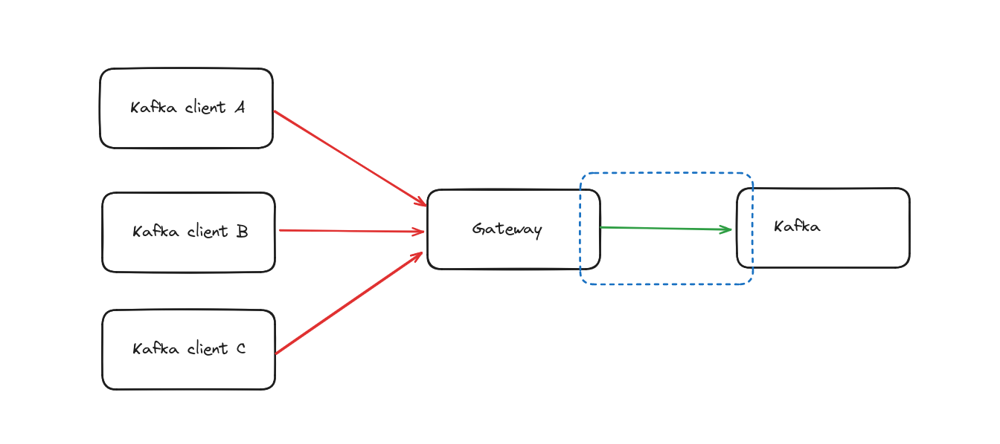

# Gateway to Kafka Authentication



You can use all the Kafka security protocols; `PLAINTEXT`, `SASL_PLAINTEXT`, `SASL_SSL` and `SSL`. For these security protocols we support all SASL mechanisms; `PLAIN`, `SCRAM SHA`, `OAuthBearer`, `Kerberos` etc.

There are two ways of providing your configuration on how to connect to Kafka : envrionement variables and properties configuration file.

## Environment variables

_This is the default mode._

Provide Gateway with the environment variables to connect to Kafka.

Use the variables that start with a `KAFKA_` prefix as it is Gateway's connection to **Kafka**.

```yaml
    conduktor-gateway:
        image: conduktor/conduktor-gateway:3.0.3
        environment:
          KAFKA_BOOTSTRAP_SERVERS: kafka1:9092,kafka2:9092
          KAFKA_SASL_MECHANISM: PLAIN
          KAFKA_SECURITY_PROTOCOL: SASL_PLAINTEXT
          KAFKA_SASL_JAAS_CONFIG: org.apache.kafka.common.security.plain.PlainLoginModule required  username="admin" password="admin-secret";
```

## Property file

You can edit the Gateway configuration to point to a property file to use for your Kafka connection.
```yaml
    conduktor-gateway:
        image: conduktor/conduktor-gateway:2.3.0
        environment:
          GATEWAY_BACKEND_KAFKA_SELECTOR: '{ file : { path: /kafka.properties } }'
        volumes:
          - type: bind
            source: "./kafka.properties"
            target: /kafka.properties
            read_only: true
```

With this configuration Gateway will load the mounted configuration file and use it as property source to the Kafka connectivity.

# Delegated Kafka authentication

A special case for Gateway to Kafka connectivity is when you configure Client to Gateway security to delegate the authentication to Kafka (See [this doc](02-Clients.md#delegated_sasl_plaintext) )

All previous configuration still applies but the authentication set in your provided configuration will not be used outside of Gateway administration tasks ( list nodes on startup, ...)

          