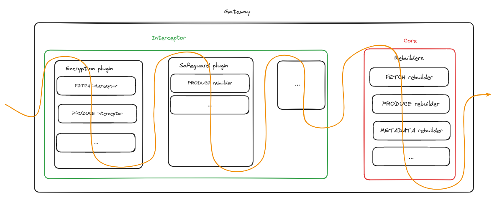

What we commonly called `Interceptor` is actually implement by the class `Plugin`. A `Plugin` define a set of `Interceptor` to apply on a subset of [Kafka protocol's API keys](https://kafka.apache.org/0101/protocol.html#protocol_api_keys).



You can list all available Interceptor's plugin by calling the Gateway API:
```bash
$ curl --request GET "http://localhost:8888/admin/plugins/v1/extended" -u admin:conduktor | jq .

[
    ...
    {
          "plugin": "class io.conduktor.gateway.interceptor.CacheInterceptorPlugin",
          "pluginId": "io.conduktor.gateway.interceptor.CacheInterceptorPlugin",
          "tags": {
            "parent": "optimize",
            "license": "enterprise",
            "description": "Cache requests to lower your costs and latency",
            "title": "Caching",
            "version": "3.0.0-SNAPSHOT"
          },
          "readme": "---\nversion: 3.0.0-SNAPSHOT\ntitle: Caching\ndescription: Cache requests to lower your costs and latency\nparent: optimize\nlicense: enterprise\n---\n\n## Introduction\n\nCache Interceptor is designed to improve the performance of record retrieval in a Kafka cluster by caching records.\n\nIt intercepts produce and fetch requests, caching produced records and serving fetched records from the cache if\navailable.\n\n## Benefits\n\nCache Interceptor offers several benefits:\n\n- Improved Performance:\n  By serving fetched records from the cache, subsequent fetch requests can be served faster, reducing the overall\n  latency and improving the response time for clients.\n- Reduced Load on Kafka Cluster:\n  With the cache interceptor in place, the Kafka cluster experiences reduced load during fetch requests since a portion\n  of the requests can be satisfied from the cache directly, reducing the number of requests hitting the cluster.\n- Enhanced Scalability:\n  The cache interceptor provides an additional layer of scalability by distributing the workload between the cache and\n  the Kafka cluster.\n  It can handle a higher volume of fetch requests without overwhelming the Kafka cluster.\n\n## Configuration\n\n| config      | type                         | default | description                                                                                                                       |\n|:------------|------------------------------|:--------|:----------------------------------------------------------------------------------------------------------------------------------|\n| topic       | String                       | `.*`    | Topic regex, topic that match this regex will have the interceptor applied. If no value is set, it will be applied to all topics. |\n| cacheConfig | [Cache Config](#cacheConfig) |         | Configuration for cache.                                                                                                          |\n\n### CacheConfig\n\n| config        | type                             | description                        |\n|:--------------|----------------------------------|:-----------------------------------|\n| type          | enum (IN_MEMORY, ROCKSDB)        | Default: IN_MEMORY.                |\n| rocksdbConfig | [Rocksdb Config](#rocksdbConfig) | Configuration for rocksdb cache.   |\n| inMemConfig   | [In Mem Config](#inMemConfig)    | Configuration for im-memory cache. |\n\n### RocksdbConfig\n\n| config    | type   | description                                 |\n|:----------|--------|:--------------------------------------------|\n| dbPath    | String | Path to RocksDB database                    |\n| cacheSize | int    | RocksDB cache size in bytes, default: 100MB |\n\n### InMemConfig\n\n| config       | type | description                                      |\n|:-------------|------|:-------------------------------------------------|\n| cacheSize    | int  | In-memory cache size.                            |\n| expireTimeMs | long | In-memory cache expiration time in milliseconds. |\n\n## Example\n\n```json\n{\n  \"name\": \"myCacheInterceptor\",\n  \"pluginClass\": \"io.conduktor.gateway.interceptor.CacheInterceptorPlugin\",\n  \"priority\": 100,\n  \"config\": {\n    \"topic\": \".*\",\n    \"cacheConfig\": {\n      \"type\": \"ROCKSDB\",\n      \"rocksdbConfig\": {\n        \"dbPath\": \"/caching_storage\",\n        \"cacheSize\": 104857600\n      }\n    }\n  }\n}\n```"
    },
    ...
]
```

We can deploy a `Plugin` instance by configuring it. The `Plugin` configuration can choose which `Interceptor` will be applied. For instance the `AuditPlugin` generate a bunch of log when some requests are received by the Gateway.
If we want to generate log only on Topic creation we can deployed the `AuditPlugin` with the following configuration:
```json
{
    "apiKeys": ["CREATE_TOPICS"]
}
```
Then, the `AuditPlugin` will applied only the Interceptor related to `CREATE_TOPICS` api key.

Here we created a new interceptor `myOwnInterceptor` by deploying an instance of `CreateTopicPolicyPlugin`. We configured it to limit the replication & topic number when creating a topic:
```bash
$ cat request-payload.json
{
    "pluginClass": "io.conduktor.gateway.interceptor.safeguard.CreateTopicPolicyPlugin"
    "priority": "100"
    "config": {
      "replicationFactor": {
        "min": 2,
        "max": 2
      },
      "numPartition": {
        "min": 1,
        "max": 3
      }
    }
}

$ curl POST http://localhost:8888/admin/interceptors/v1/interceptor/myOwnInterceptor -d @request-payload.json
```

The priority number define the order on which the set of interceptors will be applied in the request/response pipeline.
