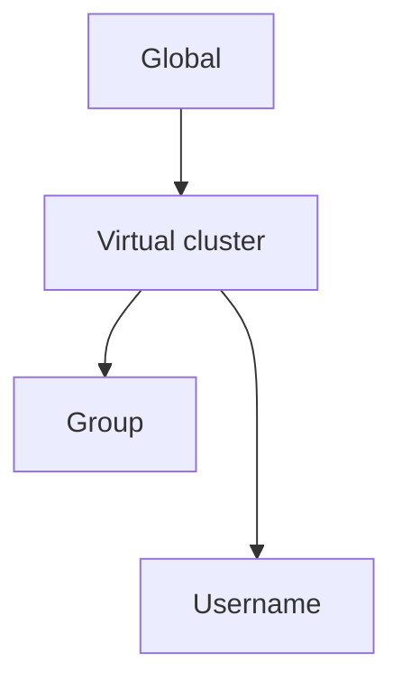
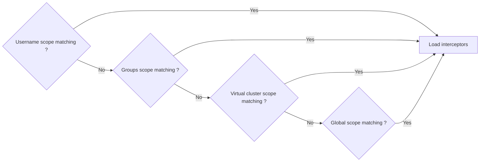

# Plugin targeting

All plugins loaded on Gateway should not always apply for all request. The first tool is the interceptors in a plugins that targets only some Kafka api keys.  
Plugin targeting is the Gateway feature that allow a user to define a scope to apply a plugin to.

This document outlines the various scopes and hierarchy levels at which plugins can be targeted within the Gateway system. 
Plugins can be targeted globally, scoped to a virtual cluster or scoped for specific users or groups in a virtual cluster.

## Scope

A scope is the functional unit that allow an administrator to enable a plugin to run with a specific configuration on a scope.
A scope contain define the following
 - `vcluster` (Optional)
 - `group` (Optional)
 - `username` (Optional)

_Global Scope_ : A global scope is a scope where all scope possible values aren't defined.

Scope were defined as a hierarchical concept. A global scope can be specialized by a vcluster scope, which can be specialized by a group or a username scope.  
Group is, as an optional set value for Users, a special case treated as a Username one.
We can define the scope hierarchy as the following.

### Scope configuration

A same plugin can be associated with different scope. Each scope will define for a plugin configured its configuration and execution priority.  

As an example you can define that you want to configure a plugin `topicProtection` to apply a `CreateTopicSafeguardPlugin`. 
And this `topicProtection` plugin should be executed with : 
- Priotity `10` and configuration `X` on global scope
- Priority `12` and configuration `Y` for the vcluster `conduktor`

### Interceptor resolution

When a message is processed by Gateway, we have to detect and apply all `Interceptors` for that request based on the message context.

For each message, interceptor resolution is based on a context containing the following elements :
 - Gateway [User](../03-User.md) 
   - VCluster
   - Username
   - Groups (Optional)
 - Kafka Message type

Based on this context for all configured plugin we search if it could apply by search if there is at least one scope matching the request context.
If a plugin have multiple matching scope we result the most precise ones (Username then Group then Virtual cluster then Global).
Then for the configured plugin we load the corresponding Interceptors with the priority and the configuration of this scope.

__Special case__: Since groups are a multiple optional value. If no username scope match the context but multiple group scopes does then we load interceptors for all matching groups.