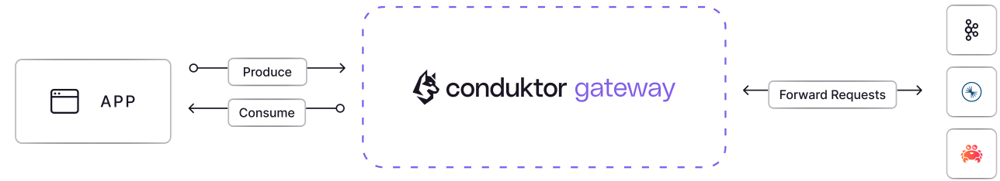
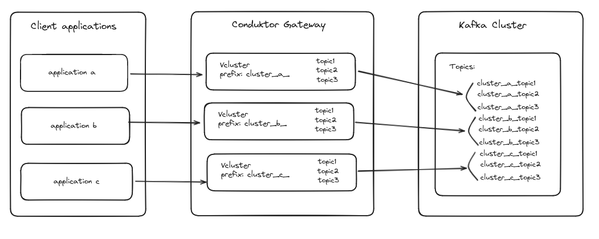

:::info
Use this document to understand each concept of Conduktor Gateway at a high-level, diving deeper into each child page as necessary.```
If you already understand Conduktor Gateway's concepts and you are looking for a detailed reference, check this page instead: Gateway Resource Reference(todo)
:::

## Conduktor Gateway

Conduktor Gateway is deployed between your client applications and existing Kafka clusters. As it's Kafka protocol compliant, there are minimal adjustments required for clients other than pointing to a new bootstrap server.



Conduktor Gateway extends Kafka to provide new functionalities with different techniques:
- **Interceptors** are pluggable components that augment Kafka by intercepting specific requests of the Kafka protocol and applying operations to it.
- **Core features** like Authentication, Virtual clusters, Logical Topics and Failover are features that blend much more deeply the Kafka protocol. For that reason, we decided they should be experienced as dedicated features for simplicity and ease of understanding (as opposed to pluggable Interceptors).

Most core features and all interceptors can be configured using the Gateway HTTP API or using the Conduktor CLI.

## Interceptors

Conduktor Gateway has a significant number of Interceptors available to satisfy many different use-cases. Check our [Interceptor Catalog](/gateway/category/interceptors-catalog/) for more details.

A few examples:
- Full-body or field-level Encryption & Decryption
- Reject (during produce) or Skip (during consume) records that don't match some business data quality rules
- Enforce producer configurations such as acks or compression
- Enforce or override configurations during a CreateTopic request, such as replication factor or naming convention


To deploy an Interceptor, you need to prepare its configuration. Configuring and deploying an interceptor is a bit similar to what you'd do with Kafka Connect Connectors.

Here's an example for an interceptor whose responsibility is to prevent creation of topics with more than 6 partitions:
````json
PUT /gateway/v2/interceptors
{
  "name": "enforce-partition-limit",
  "pluginClass": "io.conduktor.gateway.interceptor.safeguard.CreateTopicPolicyPlugin",
  "priority": 100,
  "config": {
    "topic": ".*",
    "numPartition": {
      "min": 1,
      "max": 6,
      "action": "BLOCK"
    }
}
````

Interceptors also combine with each other to create very powerful interactions and solve many interesting use-cases in different ways.

The most basic possibility is to chain them together so that each interceptor performs its action sequentially and independently, and pass its result to the next.
The order of execution is determined by the **priority** of each interceptor. Lower numbers gets executed first.


 ```mermaid
flowchart LR
    A[User App]
    subgraph G [Gateway]
        direction LR
        Auth[Authentication & </br> Authorization]
        subgraph I [Dynamic interceptor pipeline]
            direction LR
            I1(Plugin </br> priority: 1 </br> interceptor)
            I2(Plugin </br> priority: 10 </br> interceptor1 & interceptor2)
            I3(Plugin </br> priority: 42 </br> interceptor)
            I1 <--> I2 <--> I3
        end
        subgraph Core [Core features]
            direction TB
            LT(Logical Topics)
            VC(Virtual clusters)
        end
        Auth <--> I
    end
    subgraph K [Main Kafka cluster]
    B1(broker 1)
    B2(broker 2)
    B3(broker 3)
    B1 === B2 === B3
    end
    A --> Auth
    I <--> Core
    Core <--> K
```

More advanced behaviors can also be configured such as **Scoping** and **Overriding**. They are presented in the detailed [Interceptor Concept](/gateway/concepts/interceptors) page


## Gateway Service Accounts & Authentication

Gateway Service Accounts are tightly coupled to the Authentication method you choose to connect your clients to the Gateway.

:::info
The objective of Authentication, whatever the method used, is to provide Conduktor Gateway with a Service Account **name** to be used in Kafka, and optionally a **set of Groups** and a **Virtual Cluster** to associate to the Service Account.
:::

There are 3 ways to authenticate users with the Gateway:
- **Delegating** authentication to the backing cluster (Confluent Cloud API Keys for instance)
- Using an **External** source of authentication such as OAuth/OIDC, mTLS, LDAP
- Using Gateway **Local** Service Accounts

Check the dedicated [Authentication page](/gateway/concepts/authentication) for more details.

## Virtual Clusters

A Virtual Cluster in Conduktor Gateway is a logical representation of a Kafka cluster. This innovative concept allows users to create multiple virtual clusters while maintaining just a single physical Kafka cluster. Essentially, it enables the simulation of multiple Kafka environments on a single physical infrastructure.

:::info
Virtual Cluster concept is entirely optional. If you choose not to configure any Virtual Clusters, Conduktor Gateway will act as a transparent proxy for your backing Kafka Cluster. This default mode, all topics and resources will be visible and accessible as usual, without any additional configuration.
:::

Check the detailed [Virtual Clusters Concept page](/gateway/concepts/virtual-clusters) for more details.

## Other interesting features

There are several other interesting features available with Conduktor Gateway.

Check their dedicated Concept pages for more details.

**Logical Topics** are abstractions over real Kafka topics to provide additional functionalities not possible by default.  
We offer 3 kinds of Logical Topic so far:
- [Alias topics](/gateway/concepts/logical-topics/alias-topics/) are topics that can be accessed with a name, but really points to another real topic behind the scenes. It can be useful in a few scenarios such a topic renaming or cross virtual cluster topic sharing.
- [Concentrated topics](/gateway/concepts/logical-topics/concentrated-topics/) allows co-locating multiple topics in the same physical topic behind the scenes. It's very useful when you want to regroup many topics with low-volume but a large number of partitions.
- [SQL topics](/gateway/concepts/logical-topics/sql-topics/) are using SQL language to query & filter an existing topic, very useful to filter out the records that doesn't correspond to your business needs.