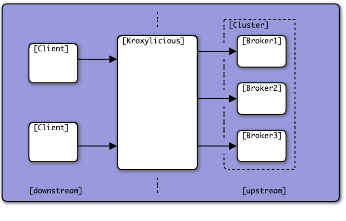
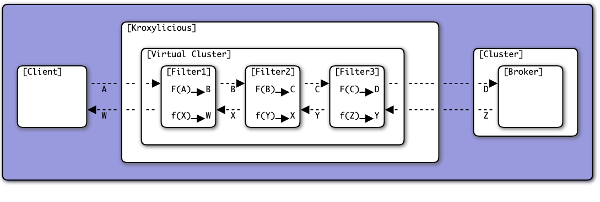

:::info
The objective of this document is to introduce each concept individually and gradually while keeping the complexity and details to a minimum. 
If you already understand Conduktor Gateway's concepts and you are looking for a detailed reference, check this page instead: Gateway Resource Reference(todo)
:::

## Conduktor Gateway

Conduktor Gateway is a proxy that sits between your Kafka cluster and your clients. It extends the capabilities of Kafka while maintaining a strict compatibility with the Kafka protocol.   

Once configured, the only required change on the Kafka clients is to update the `bootstrap.servers` property to point to the Gateway instead of the upstream Kafka.  
We call the upstream kafka the backing kafka or backing cluster.

Conduktor Gateway extends Kafka to provide new functionalities with different techniques:
- **Interceptors** are pluggable components that augment Kafka by intercepting specific requests of the Kafka protocol and applying operations to it.
- **Core features** like Authentication, Virtual clusters, Logical Topics, Failover... are features that blend much more deeply the Kafka protocol. For that reason we decided should be experienced as a dedicated feature for simplicity and ease of understanding (as opposed to pluggable Interceptors).

Most core features and all interceptors can be configured using the Gateway HTTP API or using the Conduktor CLI.



## Interceptors

Conduktor Gateway has a massive list of Interceptors available. Check our [Interceptor Catalog](/gateway/category/interceptors-catalog/) for more details.

A few examples:
- Full-body or field-level Encryption & Decryption
- Reject (during produce) or Skip (during consume) records that don't match some business data quality rules
- Enforce producer configurations such as acks or compression
- Enforce or override configurations during a CreateTopic requests, such as replication factor or naming convention


To deploy an Interceptor, you need to prepare its configuration. The configuration of an interceptor is a little similar to configuring a Kafka Connect Connector.

Here's an example for an interceptor whose responsibility is to prevent creation of topics with more than 6 partitions:
TODO (tabbed view for API vs CLI)
- Using the API `POST /interceptors`
````json
{
  "name": "enforce-partition-limit",
  "pluginClass": "io.conduktor.gateway.interceptor.safeguard.CreateTopicPolicyPlugin",
  "priority": 100,
  "config": {
    "topic": ".*",
    "numPartition": {
      "min": 1,
      "max": 6,
      "action": "BLOCK"
    }
}
````
- Using the CLI conduktor gateway apply -f file.yml
````yaml
---
kind: Interceptor
metadata:
  name: enforce-partition-limit
spec:
  pluginClass: "io.conduktor.gateway.interceptor.safeguard.CreateTopicPolicyPlugin",
  priority: 100,
  config:
    topics: ".*"
    numPartition:
      min: 1,
      max: 6,
      action: "BLOCK"
````

Interceptors combine with each other in 3 different ways to create very powerful interactions and solve many interesting use-cases:  **Chaining**, **Targeting** & **Overriding**.

**Interceptor Chaining** lets you deploy multiple interceptors (using different names) with different purpose, where each interceptor performs its action sequentially and independently, and pass its result to the next.
The order of execution is determined by the priority of each interceptor. Lower numbers gets executed first.


**Interceptor Targeting** lets you define which Kafka Clients (ultimately resolved as Service Accounts) must be affected by those interceptors. 
There are 4 targeting scopes available: Global, VirtualCluster, Group & ServiceAccount.  
Check the Reference Documentation for more details.
````yaml
# This interceptors only triggers for service account 'sa-clickstream'
---
kind: Interceptor
metadata:
  user: sa-clickstream
  name: enforce-partition-limit
spec:
  pluginClass: "io.conduktor.gateway.interceptor.safeguard.CreateTopicPolicyPlugin",
  priority: 100,
  config:
    topics: ".*"
    numPartition:
      min: 1,
      max: 20,
      action: "BLOCK"
````

**Interceptor Overriding** lets you change the behavior of an interceptor, by redeploying it with the **same name**, but under a different scope. This effectively overrides the effect of the interceptors with lower precedence.  

:::info
The order of precedence from lowest (most easily overridden) to highest (overrides all others) is:
- Global
- VirtualCluster (More on this below)
- Group (More on this below)
- ServiceAccount
:::

**Example**  
In the example below, we can see how **Chaining**, **Targeting** & **Overriding** interact with each other.
- `interceptor-C` is deployed only for Alice. (Targeting)
- `interceptor-D` is deployed globally, but also deployed specifically for Bob (Overriding)
- `interceptor-A` and `interceptor-B` are deployed globally and finally the priorities are considered for the execution order (Chaining)


When you need Interceptors to apply conditionally, targeting by Service Account is the most straightforward way to go.


## Gateway Service Accounts

Gateway Service Account are tightly coupled to the Authentication method you choose to connect your clients to the Gateway.
There are 3 ways to authenticate users with the Gateway:
- Using the same credentials as the backing cluster (Confluent Cloud API Keys for instance)
- Using an external source of authentication or an IdP like OAuth, mTLS or LDAP
- Using Gateway Local users

When the authentication is not managed directly in the Gateway, it will simply validate the result of the authentication.
- For OAuth/OIDC, it will validate the JWT claim
- For mTLS, Gateway will verify the client certificate against the truststore
- For delegated (backing cluster) authentication, it will initiate and maintain the connection to the backing cluster using the provided credentials

:::info
In most typical configurations, nothing is further necessary regarding Service Accounts. 

There are a few exceptions where it can be necessary to declare GatewayServiceAccount resources namely **Local Gateway Users**, **Service Account mapping** or **Virtual Cluster mapping**, each explained below.
:::

**Local Gateway Users**  
If you don't use any form of external authentication (delegated, Oauth, mTLS, ...), but still want authentication (you can also stay with unauthenticated users), then you can declare Local Gateway users.
````yaml
---
kind: GatewayServiceAccount
metadata:
  name: alice
spec:
  type: LOCAL
---
kind: GatewayServiceAccount
metadata:
 name: bob
spec:
 type: LOCAL
````
You can then generate password using the dedicated endpoint.
````json
PUT /v2/token
{
  "name": "alice"
  "ttl": "3days"
}
````

**Service Account mapping**  
Sometimes, you don't have control on the JWT generated by your OIDC provider and you need to associate the subject of the claim to a more friendly and recognizable name in Kafka.
````json
{
  "aud": "https://myapi.example.com",
  "iss": "https://login.microsoftonline.com/{tenant_id}/v2.0",
  "sub": "8d5e86b4-6a41-4e94-b6a8-1e5b7723e858",
  "exp": 1643482800,
  "nbf": 1643479200,
  "iat": 1643479200,
  "nonce": "12345"
}
````
Given this JWT token, deploying this `GatewayServiceAccount` resource will map the unreadable sub into a clear name `alice`, which you will then use for Interceptor Targeting, ACLs, ...
````yaml
kind: GatewayServiceAccount
metadata:
  name: alice
spec:
  type: EXTERNAL
  externalMapping: "8d5e86b4-6a41-4e94-b6a8-1e5b7723e858"
````

**Virtual Cluster mapping**  


## Virtual Clusters