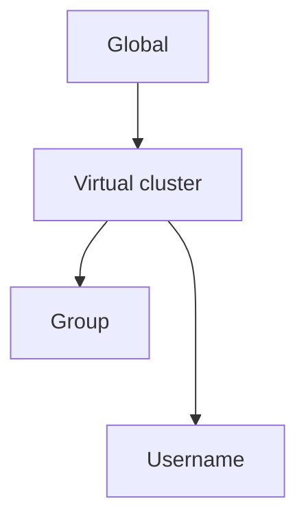
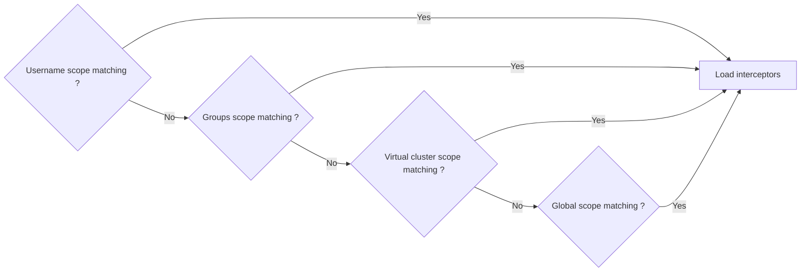

## Interceptors

Conduktor Gateway has a massive list of Interceptors available. Check our [Interceptor Catalog](/gateway/category/interceptors-catalog/) for more details.

A few examples:
- Full-body or field-level Encryption & Decryption
- Reject (during produce) or Skip (during consume) records that don't match some business data quality rules
- Enforce producer configurations such as acks or compression
- Enforce or override configurations during a CreateTopic requests, such as replication factor or naming convention


To deploy an Interceptor, you need to prepare its configuration. Configuring and deploying an interceptor is a bit similar to what you'd do with Kafka Connect Connectors.

Here's an example for an interceptor whose responsibility is to prevent creation of topics with more than 6 partitions:
TODO (tabbed view for API vs CLI)
- Using the API `POST /interceptors`
````json
{
  "name": "enforce-partition-limit",
  "pluginClass": "io.conduktor.gateway.interceptor.safeguard.CreateTopicPolicyPlugin",
  "priority": 100,
  "config": {
    "topic": ".*",
    "numPartition": {
      "min": 1,
      "max": 6,
      "action": "BLOCK"
    }
}
````
- Using the CLI conduktor gateway apply -f file.yml
````yaml
---
kind: Interceptor
metadata:
  name: enforce-partition-limit
spec:
  pluginClass: "io.conduktor.gateway.interceptor.safeguard.CreateTopicPolicyPlugin",
  priority: 100,
  config:
    topics: ".*"
    numPartition:
      min: 1,
      max: 6,
      action: "BLOCK"
````

Interceptors combine with each other's in multiple different ways to create very powerful interactions and solve many interesting use-cases:  **Chaining**, **Scoping** & **Overriding**.

**Interceptor Chaining** lets you deploy multiple interceptors (using different names) with different purpose, where each interceptor performs its action sequentially and independently, and pass its result to the next.
The order of execution is determined by the priority of each interceptor. Lower numbers gets executed first.


**Interceptor Scoping** lets you define which Kafka Clients (ultimately resolved as Service Accounts) must be affected by those interceptors.
There are 4 targeting scopes available: Global, VirtualCluster, Group & ServiceAccount.  
Check the Reference Documentation for more details.
````yaml
# This interceptors only triggers for service account 'sa-clickstream'
---
kind: Interceptor
metadata:
  user: sa-clickstream
  name: enforce-partition-limit
spec:
  pluginClass: "io.conduktor.gateway.interceptor.safeguard.CreateTopicPolicyPlugin",
  priority: 100,
  config:
    topics: ".*"
    numPartition:
      min: 1,
      max: 20,
      action: "BLOCK"
````

**Interceptor Overriding** lets you change the behavior of an interceptor, by redeploying it with the **same name**, but under a different scope. This effectively overrides the effect of the interceptors with lower precedence.

:::info
The order of precedence from lowest (most easily overridden) to highest (overrides all others) is:
- Global
- VirtualCluster
- Group
- ServiceAccount
  :::

**Example**  
In the example below, we can see how **Chaining**, **Targeting** & **Overriding** interact with each other.
- `interceptor-C` is deployed only for Alice. (Targeting)
- `interceptor-D` is deployed globally, but also deployed specifically for Bob (Overriding)
- `interceptor-A` and `interceptor-B` are deployed globally and finally the priorities are considered for the execution order (Chaining)
  

When you need Interceptors to apply conditionally, targeting by Service Account is the most straightforward way to go.


# Interceptors_OLD

Interceptors are used to add technical and business logic, such as message encryption, inside your Gateway deployment. 

Interceptors can be deployed and managed through the [REST API](https://developers.conduktor.io/), and targeted at different granularities.

# Interceptor Targeting

This document outlines the various scopes and hierarchy levels at which interceptors can be targeted within the Gateway system. 

Interceptors can be targeted globally, to a specific virtual cluster, or to specific username or group within a virtual cluster.

## Scope

A scope is the functional unit that allow an administrator to enable a interceptor to run with a specific configuration on a scope.
A scope define contains the following:
 - `vcluster` (Optional)
 - `group` (Optional)
 - `username` (Optional)

_Global Scope_ : A global scope is a scope where all possible values aren't defined.

Scope has been defined as a hierarchical concept. A global scope can be specialized to a vcluster scope, which can be specialized to a group or username scope.  
Group is as an optional value for a User, a special case and is treated as a Username scope.

We can define the scope hierarchy as the following:


### Scope configuration

A similar interceptor can be associated with a different scope. Each scope will define for an interceptor configured its configuration and execution priority.  

As an example you can define that you want to configure an interceptor `topicProtection` to apply a `CreateTopicSafeguardPlugin`, and this `topicProtection` interceptor should be executed with : 
- Priotity `10` and configuration `X` on global scope
- Priority `12` and configuration `Y` for the vcluster `conduktor`


### Interceptor resolution

When a message is processed by Gateway, we have to detect and apply all `Interceptors` for that request based on the message context.

For each message, interceptor resolution is based on a context containing the following elements :
 - Gateway [User](../service-accounts) 
   - VCluster
   - Username
   - Groups (Optional)
 - Kafka Message type

Based on this context for all configured interceptor we search if it could apply by search if there is at least one scope matching the request context.
If an interceptor has multiple matching scopes the most precise one (Username, then Group, then Virtual cluster, then Global) will be used.
Then for the configured interceptor we load the one with the priority and the configuration of this scope.



__Special case__: Since groups are a multiple optional value. If no username scope match the context but multiple group scopes does then we load interceptors for all matching groups.