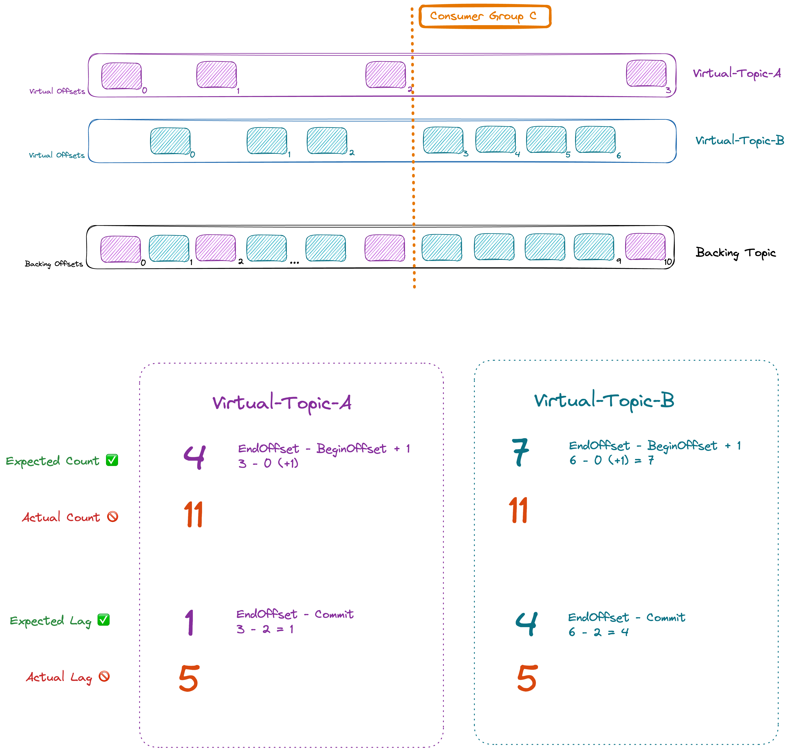

Topic Concentration helps reduce costs on low-volume topics. It does this by co-locating messages from multiple topics on the same physical topic behind the scenes.  

This is totally transparent for consumers and producers that continue to write into topics normally.  

One advantage is the ability to emulate a higher or lower number of partitions irrespective of the backing topic's actual number of partitions.  

## Limitations
### Configuration
Only the following topic configs are allowed
- `partitions` 
- `cleanup.policy`
- `retention.ms`
- `retention.bytes`
- `delete.retention.ms`

`retention.ms` and `retention.bytes` values must not exceed the backing topic's configuration unless `autoManaged` is set to true.
Any other config defined during the topic creation will fail the topic creation (unless they have the same value as the backing cluster).

:::info
With Concentrated Topics, the true retention is the one from the backing cluster's topic, not the retention requested during the concentrated topic creation.

retention.ms and retention.bytes are not cleanup guarantees. They are retention guarantees.
:::
### Performance
Gateway must read all the messages for all the consumers and skip the ones that are not necessary for each consumer.

### Message Count & Lag, Offset (in)correctness
Concentrated topics & SQL topics are not real and that doesn't work nicely with the tools available in the Kafka Ecosystem (Conduktor included) that rely on topic metadata to generate reports, graphs or calculations based on that metadata.
Right now, the 2 most problematic calculations are **Lag** and **Message Count**. This is due to the calculation method that rely on partition **EndOffset**.



Any tooling will currently display the message count of the backing topic, and the lag relative to the EndOffset of the backing topic.
In some situations, for instance when a concentrated topic just created (so is empty), it causes a lot of confusion to customers displaying numbers that are totally wrong.

:::tip
We are working to address that limitation in the near-future. Contact us to get more information.
:::

## Usage
To configure a Concentrated Topic rule as a Gateway Admin, configure a dedicated prefix of topic names to become concentrated using the API.  

````json
POST /admin/vclusters/v1/vcluster/{vcluster}/concentration-rules
{
  "pattern": "concentrated-",
  "physicalTopicName": "concentrated",
  "autoManaged" : false
}
````

Then, to create a Concentrated Topics, simply use the AdminClient as usual with a name that matches the Concentrated Topic Rule set by the Gateway Admin.

```shell
kafka-topics --bootstrap-server gateway:6969 --topic concentrated-topicA --partitions 10
```

## Auto-Manage Flag
When enabled, Gateway will automatically create the 3 backing topics using the backing cluster's default configuration and default number of partitions ( settings `num.partitions`).

When enabled, Concentrated Topics created with a higher `retention.ms` and `retention.bytes` (than the one of the broker) will cause the associated backing topic to be updated to guarantee that new configuration.

:::caution
Use AutoExtendTopics at your own risk. We recommend that you don't use autoManageBackingTopics.
Any Concentrated topic created with a retention.ms of -1 will cause the backing topic to be Infinite storage (beware FS Full)
:::
