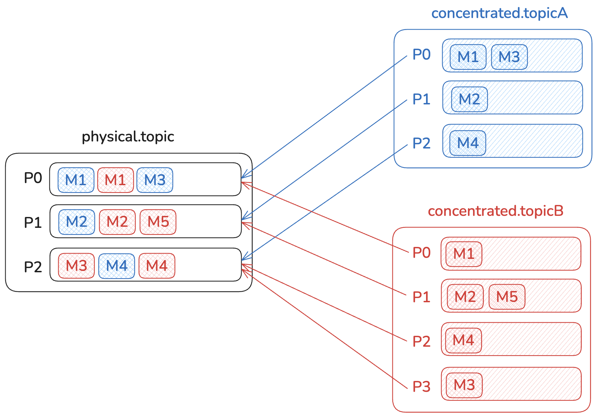

Concentrated Topics transparently act as pointers to a single physical topic on your Kafka cluster.  They allow you to reduce costs on low-volume topics by co-locating messages.  They are completely transparent to consumers and producers and allow you to emulate different partition counts irrespective of the backing physical topic's partition count.


## Usage

As written in the Gateway API documentation (accessible on the port 8888 of your Gateway by default), you can create a concentration rule to concentrate topics based on a prefix.

For that, you can use the following API call, that will make every new topics starting with `concentrated.` be concentrated topics:

```bash
curl \
  --request PUT \
  --url 'http://localhost:8888/gateway/v2/concentration-rule' \
  --user 'admin:conduktor' \
  --header 'Content-Type: application/json' \
  --data-raw '{
  "kind": "ConcentrationRule",
  "apiVersion": "gateway/v2",
  "metadata": {
    "name": "concentrationRule1",
    "vCluster": "passthrough"
  },
  "spec": {
    "pattern": "concentrated.*",
    "physicalTopics": {
      "delete": "physical.topic.delete",
      "compact": "physical.topic.compact",
      "deleteCompact": "physical.topic.deleteCompact"
    },
    "autoManaged": true
  }
}'
```

In this configuration, you can provide 3 `physicalTopics`, based on their cleanup policy. Each will store the messages of concentrated topics matching their cleanup policy.

The `autoManaged` flag, when enabled, will automatically create the physical topics with the default configuration of the physical cluster and the default number of partitions (`num.partitions`).

:::note
In the `autoManaged` mode, topics created by users will auto-extend the configuration (for example to honour the request `retention.ms`). As a result, if one users asks for a compacted topic with a retention of -1 (infinite), all other compacted topics associated with the concentration rule are now with infinite retention.
:::

Then, you can create a concentrated topic by matching the `pattern` mentioned in your concentration rule.

```sh
kafka-topics \
  --bootstrap-server conduktor-gateway:6969 \
  --topic concentrated.topicA \
  --partitions 10
```

## How does it work?

When you create a concentrated topic, each concentrated partition is mapped to a physical partition, as shown below:



In this case, we have 2 concentrated topics (`concentrated.topicA` & `concentrated.topicB`), with respectively 3 and 4 partitions, that are mapped to a single physical topic (`physical.topic`) with 3 partitions.

To ensure that consumers don't consume messages from other partitions - or even worse, from other concentrated topics - we store the concentrated partition and the concentrated topic name in the record headers. That way, the Gateway will filter the messages that should be returned to the consumer accordingly to what it asked for.

### Compact Cleanup Policy

In the case of a compact cleanup policy, we should not force two records produced into two different concentrated topics with the same key to be stored in the same partition.

For that, the Gateway will add an identifier for each concentrated compacted topic as a key suffix. You can find this suffix in the internal topic that stores all the topic mappings.

Of course, this suffix is invisible for applications and is removed on consume.

:::tip
In this internal topic, you can also see how concentrated and physical partitions are mapped together!
:::

## Limitations

### Configuration

Only the following topic properties can be set for the concentrated topics:
- `partitions` 
- `cleanup.policy`
- `retention.ms`
- `retention.bytes`
- `delete.retention.ms`

If another configuration is being set, and is different from the physical cluster default, the topic creation will fail with an error:

```
Configuration is invalid.
```

If `autoManaged` is disabled, the `retention.ms` and `retention.bytes` values must not exceed the physical topic's configuration. Otherwise, the topic creation will fail with an error like the one below:

```
Error while executing topic command : Value '704800000' for configuration 'retention.ms' is incompatible with physical topic value '604800000'.
```

:::info
With concentrated topics, the real retention is the physical topic's one, not the one requested at the concentrated topic creation.

`retention.ms` and `retention.bytes` are not cleanup guarantees. They are retention guarantees.
:::

### Performance

Gateway must read all the messages for all the consumers and skip the ones that are not necessary for each consumer.

### Message Count & Lag, Offset (in)correctness

Concentrated topics & SQL topics are not real, and that's not compatible with the tools available in the Kafka Ecosystem (Conduktor included) that rely on topics metadata to generate reports, graphs or calculations.

Right now, the 2 most problematic calculations are **Lag** and **Message Count**. This is due to the calculation method that rely on partition **EndOffset**.


Any tooling will currently display the message count, and the lag relative to the `EndOffset`, of the physical topic. This can create confusion for customers and applications that will see wrong metrics.

:::tip
We are working to address that limitation in the near-future. Contact us to get more information.
:::
