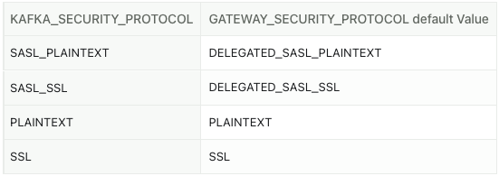

## Set environment variables

Configuring environment variables is the recommended method for setting up Conduktor Gateway. They can be **set in the Gateway container**, or **taken from a file**. You can make sure the values have been properly set by checking the startup logs.

### In the container

#### For Docker

You can set them during the docker-run command with `-e` or `--env`:

```shell
docker run -d \
  -e KAFKA_BOOTSTRAP_SERVERS=kafka1:9092,kafka2:9092 \
  -e KAFKA_SECURITY_PROTOCOL=SASL_PLAINTEXT \
  -e KAFKA_SASL_MECHANISM=PLAIN \
  -e KAFKA_SASL_JAAS_CONFIG="org.apache.kafka.common.security.plain.PlainLoginModule required username='usr' password='pwd';" \
  -p 6969:6969 \
  conduktor/conduktor-gateway:latest
```

Or in a `docker-compose.yaml`:

```yaml
services:
  conduktor-gateway:
    image: conduktor/conduktor-gateway:latest
    ports:
      - 6969:6969
    environment:
      KAFKA_BOOTSTRAP_SERVERS: kafka1:9092,kafka2:9092
      KAFKA_SECURITY_PROTOCOL: SASL_PLAINTEXT
      KAFKA_SASL_MECHANISM: PLAIN
      KAFKA_SASL_JAAS_CONFIG: org.apache.kafka.common.security.plain.PlainLoginModule required username='usr' password='pwd';
```

#### For Kubernetes

You can set them in the `values.yaml` of our [Helm chart](https://github.com/conduktor/conduktor-public-charts/blob/main/charts/gateway/README.md):

```yaml
gateway:
  env:
    KAFKA_BOOTSTRAP_SERVERS: kafka1:9092,kafka2:9092
    KAFKA_SECURITY_PROTOCOL: SASL_PLAINTEXT
    KAFKA_SASL_MECHANISM: PLAIN
    KAFKA_SASL_JAAS_CONFIG: org.apache.kafka.common.security.plain.PlainLoginModule required username='usr' password='pwd';
```

### Using a file

You can mount a file that contains the key-value pairs into the container and provide its path by setting the environment variable `GATEWAY_ENV_FILE`.

```env title="Example"
KAFKA_BOOTSTRAP_SERVERS=kafka1:9092,kafka2:9092
KAFKA_SECURITY_PROTOCOL=SASL_PLAINTEXT
KAFKA_SASL_MECHANISM=PLAIN
KAFKA_SASL_JAAS_CONFIG=org.apache.kafka.common.security.plain.PlainLoginModule required username='usr' password='pwd';
```

You'll get a confirmation in the logs: `Sourcing environment variables from $GATEWAY_ENV_FILE`, or a warning if the file is not found: `Warning: GATEWAY_ENV_FILE is set but the file does not exist or is not readable.`

## Networking

### Port & SNI routing

| **Environment variable**                                                        | **Description**                                                                                                                                            | **Default value**                                                                                       |
|---------------------------------------------------------------------------------|------------------------------------------------------------------------------------------------------------------------------------------------------------|---------------------------------------------------------------------------------------------------------|
| **Common Properties**                                                           |                                                                                                                                                            |                                                                                                         |
| `GATEWAY_ADVERTISED_HOST`                                                       | The hostname returned in the Gateway’s metadata for clients to connect to.                                                                                 | Your hostname                                                                                           |
| `GATEWAY_ROUTING_MECHANISM`                                                     | Defines the routing method: **`port` for port routing, `host` for SNI routing**.                                                                           | `port`                                                                                                  |
| `GATEWAY_PORT_START`                                                            | The first port the Gateway listens on.                                                                                                                     | `6969`                                                                                                  |
| `GATEWAY_MIN_BROKERID`                                                          | The broker ID associated with the first port (`GATEWAY_PORT_START`). Should match the lowest `broker.id` (or `node.id`) in the Kafka cluster.              | `0`                                                                                                     |
| `GATEWAY_BIND_HOST`                                                             | The network interface the Gateway binds to.                                                                                                                | `0.0.0.0`                                                                                               |
| [**Port routing specific**](/gateway/configuration/network/#port-based-routing) |                                                                                                                                                            |                                                                                                         |
| `GATEWAY_PORT_COUNT`                                                            | The total number of ports used by the Gateway.                                                                                                             | `(maxBrokerId - minBrokerId) + 3`                                                                       |
| [**SNI routing specific**](/gateway/how-to/sni-routing)                         |                                                                                                                                                            |                                                                                                         |
| `GATEWAY_ADVERTISED_SNI_PORT`                                                   | The port returned in the Gateway’s metadata for clients to connect to when using SNI routing.                                                              | `GATEWAY_PORT_START`                                                                                    |
| `GATEWAY_ADVERTISED_HOST_PREFIX`                                                | Configures the advertised broker names.                                                                                                                    | `broker`                                                                                                |
| `GATEWAY_SECURITY_PROTOCOL`                                                     | Defines the security protocol clients should use to connect to the Gateway. **Must be set to `SSL`, `SASL_SSL`, or `DELEGATED_SASL_SSL`** for SNI routing. | The default value depends on KAFKA_SECURITY_PROTOCOL.  |
| `GATEWAY_SNI_HOST_SEPARATOR`                                                    | The separator used to construct returned metadata.                                                                                                         | `-`                                                                                                     |

### Load Balancing

| **Environment variable**                        | **Description**                                                                                                           | **Default value** |
|-------------------------------------------------|---------------------------------------------------------------------------------------------------------------------------|-------------------|
| `GATEWAY_CLUSTER_ID`                            | A unique identifier for a given Gateway cluster, this is used to establish Gateway cluster membership for load balancing. | `gateway`         |
| `GATEWAY_FEATURE_FLAGS_INTERNAL_LOAD_BALANCING` | Whether to use Conduktor Gateway's internal load balancer to balance connections between Gateway instances.               | `true`            |
| `GATEWAY_RACK_ID`                               | Similar as `broker.rack`.                                                                                                 |                   |

### HTTP API

| **Environment variable**             | **Description**                                                                                                                    | **Default value**                                       |
|--------------------------------------|------------------------------------------------------------------------------------------------------------------------------------|---------------------------------------------------------|
| `GATEWAY_HTTP_PORT`                  | The port on which the gateway will present the HTTP management API.                                                                | `8888`                                                  |
| `GATEWAY_SECURED_METRICS`            | Determines whether the HTTP management API requires authentication.                                                                | `true`                                                  |
| `GATEWAY_ADMIN_API_USERS`            | Users that can access the API. Note: Admin access is required for write operations. Setting `admin: true` grants read-only access. | `[{username: admin, password: conduktor, admin: true}]` |
| **HTTPS Configuration**              |                                                                                                                                    |                                                         |
| `GATEWAY_HTTPS_KEY_STORE_PATH`       | Enables HTTPS and specifies the keystore to use for TLS connections.                                                               |                                                         |
| `GATEWAY_HTTPS_KEY_STORE_PASSWORD`   | Sets the password for the keystore used in HTTPS TLS connections.                                                                  |                                                         |
| `GATEWAY_HTTPS_CLIENT_AUTH`          | Client authentication configuration for mTLS. Possible values: `NONE`, `REQUEST`, `REQUIRED`.                                      | `NONE`                                                  |
| `GATEWAY_HTTPS_TRUST_STORE_PATH`     | Specifies the truststore used for mTLS.                                                                                            |                                                         |
| `GATEWAY_HTTPS_TRUST_STORE_PASSWORD` | Password for the truststore defined above.                                                                                         |                                                         |

### Upstream Connection

| **Environment variable**                | **Description**                                                                                                                      | **Default value** |
|-----------------------------------------|--------------------------------------------------------------------------------------------------------------------------------------|-------------------|
| `GATEWAY_UPSTREAM_CONNECTION_POOL_TYPE` | Upstream connection pool type. Possible values are `NONE` (no connection pool), `ROUND_ROBIN` (Round robin selected connection pool) | `NONE`            |
| `GATEWAY_UPSTREAM_NUM_CONNECTION`       | The number of connections between Conduktor Gateway and Kafka per upstream thread. Used only when `ROUND_ROBIN` is enabled.          | `10`              |


## Licensing

| **Environment variable** | **Description** | **Default value** |
|--------------------------|-----------------|-------------------|
| `GATEWAY_LICENSE_KEY`    | License key     | None              |

## Connection from Gateway to Kafka

Conduktor Gateway's connection to Kafka are configured by the `KAFKA_` environment variables.

When translating Kafka's properties, use upper case instead and replace the `.` with `_`.  

For example;  
When defining Gateway's Kafka property `bootstrap.servers`, declare it as the environment variable `KAFKA_BOOTSTRAP_SERVERS`.

Any variable prefixed with `KAFKA_` will be treated as a connection parameter by Gateway.

You can find snippets for each security protocol on [this page](/gateway/configuration/kafka-authentication/).

## Connection from Clients to Gateway

| **Environment variable**                          | **Description**                                                                                                                                                                                                          | **Default value**                                                                                       |
|---------------------------------------------------|--------------------------------------------------------------------------------------------------------------------------------------------------------------------------------------------------------------------------|---------------------------------------------------------------------------------------------------------|
| `GATEWAY_SECURITY_PROTOCOL`                       | The type of authentication clients should use to connect to the gateway, valid values are `PLAINTEXT`, `SASL_PLAINTEXT`, `SASL_SSL`, `SSL`, `DELEGATED_SASL_PLAINTEXT` and `DELEGATED_SASL_SSL`.                         | The default value depends on KAFKA_SECURITY_PROTOCOL.  |
| `GATEWAY_FEATURE_FLAGS_MANDATORY_VCLUSTER`        | If no virtual cluster was detected, then user automatically falls back into the transparent virtual cluster, named `passthrough`. Reject authentication if set to `true` and vcluster is not configured for a principal. | `false`                                                                                                 |
| `GATEWAY_ACL_ENABLED`                             | Enable/Disable ACLs support on the Gateway transparent virtual cluster (`passthrough`) only.                                                                                                                             | `false`                                                                                                 |
| `GATEWAY_SUPER_USERS`                             | semicolon-separated (`;`) list of service accounts that will be super users on Gateway (**excluding virtual clusters**).<br/> Example: `alice;bob`.                                                                      | Usernames from GATEWAY_ADMIN_API_USERS                                                                  |
| `GATEWAY_ACL_STORE_ENABLED`                       | **Obsolete, use [VirtualCluster](/gateway/reference/resources-reference/#virtualcluster) resource now** <br/>Enable/Disable ACLs support for Virtual Clusters only.                                                      | `false`                                                                                                 |
| `GATEWAY_AUTHENTICATION_CONNECTION_MAX_REAUTH_MS` | Force the client reauthentication after this amount of time. If set to 0, we never force the client to reauthenticate until the next connection                                                                          | `0`                                                                                                     |

### SSL

See [Client Authentication](/gateway/configuration/client-authentication/#ssl) for details.

| **Environment variable**                      | **Description**                                                                                                                                                                                                                                                                                                                                                                                       | **Default value**    |
|-----------------------------------------------|-------------------------------------------------------------------------------------------------------------------------------------------------------------------------------------------------------------------------------------------------------------------------------------------------------------------------------------------------------------------------------------------------------|----------------------|
| **Keystore**                                  |                                                                                                                                                                                                                                                                                                                                                                                                       |                      |
| `GATEWAY_SSL_KEY_STORE_PATH`                  | Path to a mounted keystore for SSL connections                                                                                                                                                                                                                                                                                                                                                        |                      |
| `GATEWAY_SSL_KEY_STORE_PASSWORD`              | Password for the keystore defined above                                                                                                                                                                                                                                                                                                                                                               |                      |
| `GATEWAY_SSL_KEY_PASSWORD`                    | Password for the key contained in the store above                                                                                                                                                                                                                                                                                                                                                     |                      |
| `GATEWAY_SSL_KEY_TYPE`                        | `jks`or `pkcs12`                                                                                                                                                                                                                                                                                                                                                                                      | `jks`                |
| `GATEWAY_SSL_UPDATE_CONTEXT_INTERVAL_MINUTES` | Interval in minutes to refresh SSL context                                                                                                                                                                                                                                                                                                                                                            | `5`                  |
| **Truststore (for mTLS)**                     |                                                                                                                                                                                                                                                                                                                                                                                                       |                      |
| `GATEWAY_SSL_TRUST_STORE_PATH`                | Path to a keystore for SSL connections                                                                                                                                                                                                                                                                                                                                                                |                      |
| `GATEWAY_SSL_TRUST_STORE_PASSWORD`            | Password for the truststore defined above                                                                                                                                                                                                                                                                                                                                                             |                      |
| `GATEWAY_SSL_TRUST_STORE_TYPE`                | `jks`, `pkcs12`                                                                                                                                                                                                                                                                                                                                                                                       | `jks`                |
| `GATEWAY_SSL_CLIENT_AUTH`                     | `NONE` will not request client authentication, `OPTIONAL` will request client authentication, `REQUIRE` will require client authentication                                                                                                                                                                                                                                                            | `NONE`               |
| `GATEWAY_SSL_PRINCIPAL_MAPPING_RULES`         | mTLS leverages SSL mutual authentication to identify a Kafka client. Principal for mTLS connection can be detected from the subject certificate using the same feature as in Apache Kafka, the [SSL principal mapping](https://docs.confluent.io/platform/current/kafka/configure-mds/mutual-tls-auth-rbac.html#principal-mapping-rules-for-tls-ssl-listeners-extract-a-principal-from-a-certificate) | extracts the Subject |

### OAuthbearer

Some of these definitions are taken from the Kafka documentation, e.g. [SASL_OAUTHBEARER_JWKS_ENDPOINT_REFRESH](https://kafka.apache.org/35/javadoc/constant-values.html#org.apache.kafka.common.config.SaslConfigs.SASL_OAUTHBEARER_JWKS_ENDPOINT_REFRESH_MS_DOC).

| **Environment variable**           | **Description**                                                                                                                                                                                                                                                                                                                                                                                                                                                       |
|------------------------------------|-----------------------------------------------------------------------------------------------------------------------------------------------------------------------------------------------------------------------------------------------------------------------------------------------------------------------------------------------------------------------------------------------------------------------------------------------------------------------|
| `GATEWAY_OAUTH_JWKS_URL`           | The OAuth/OIDC provider URL from which the provider's JWKS (JSON Web Key Set) can be retrieved. The URL can be HTTP(S)-based or file-based.                                                                                                                                                                                                                                                                                                                           |
| `GATEWAY_OAUTH_EXPECTED_ISSUER`    | The (optional) setting for the broker to use to verify that the JWT was created by the expected issuer. The JWT will be inspected for the standard OAuth `iss` claim and if this value is set, the broker will match it exactly against what is in the JWT's `iss` claim. If there is no match, the broker will reject the JWT and authentication will fail                                                                                                           |
| `GATEWAY_OAUTH_EXPECTED_AUDIENCES` | The (optional) comma-delimited setting for the broker to use to verify that the JWT was issued for one of the expected audiences. The JWT will be inspected for the standard OAuth `aud` claim and if this value is set, the broker will match the value from JWT's `aud` claim to see if there is an exact match. If there is no match, the broker will reject the JWT and authentication will fail.                                                                 |
| `GATEWAY_OAUTH_JWKS_REFRESH`       | The (optional) value in milliseconds for the broker to wait between refreshing its JWKS (JSON Web Key Set) cache that contains the keys to verify the signature of the JWT.                                                                                                                                                                                                                                                                                           |
| `GATEWAY_OAUTH_JWKS_RETRY`         | The (optional) value in milliseconds for the initial wait between JWKS (JSON Web Key Set) retrieval attempts from the external authentication provider. JWKS retrieval uses an exponential backoff algorithm with an initial wait based on the sasl.oauthbearer.jwks.endpoint.retry.backoff.ms setting and will double in wait length between attempts up to a maximum wait length specified by the sasl.oauthbearer.jwks.endpoint.retry.backoff.max.ms setting       |
| `GATEWAY_OAUTH_JWKS_MAX_RETRY`     | The (optional) value in milliseconds for the maximum wait between attempts to retrieve the JWKS (JSON Web Key Set) from the external authentication provider. JWKS retrieval uses an exponential backoff algorithm with an initial wait based on the sasl.oauthbearer.jwks.endpoint.retry.backoff.ms setting and will double in wait length between attempts up to a maximum wait length specified by the sasl.oauthbearer.jwks.endpoint.retry.backoff.max.ms setting |
| `GATEWAY_OAUTH_SCOPE_CLAIM_NAME`   | The OAuth claim for the scope is often named `scope`, but this (optional) setting can provide a different name to use for the scope included in the JWT payload's claims if the OAuth/OIDC provider uses a different name for that claim.                                                                                                                                                                                                                             |
| `GATEWAY_OAUTH_SUB_CLAIM_NAME`     | The OAuth claim for the subject is often named `sub`, but this (optional) setting can provide a different name to use for the subject included in the JWT payload's claims if the OAuth/OIDC provider uses a different name for that claim.                                                                                                                                                                                                                           |
| `GATEWAY_OAUTH_USE_CC_POOL_ID`     | Set to `true` to use the Confluent Cloud pool ID as the principal name. This is useful for Confluent Cloud users in Delegated mode who want to use the pool ID as the principal name instead of the `sub` claim.                                                                                                                                                                                                                                                      |

### Plain

See [Client Authentication](/gateway/configuration/client-authentication/#plain) for details.

| **Environment variable**                     | **Description**                                                                                                                                                                                                                                                                                                                                                           | **Default value**                                                 |
|----------------------------------------------|---------------------------------------------------------------------------------------------------------------------------------------------------------------------------------------------------------------------------------------------------------------------------------------------------------------------------------------------------------------------------|-------------------------------------------------------------------|
| `GATEWAY_USER_POOL_SECRET_KEY`               | Base64 encoded value of 256bits long (e.g. `openssl rand -base64 32`). If using SASL_PLAIN or SASL_SSL, you have the ability to create local service accounts on Gateway. These service accounts will have credentials generated by Gateway based on the `GATEWAY_USER_POOL_SECRET_KEY`. We strongly recommend that you **change this value for production deployments**. | A default value is used to sign tokens and **has to be changed**. |
| `GATEWAY_USER_POOL_SERVICE_ACCOUNT_REQUIRED` | If true, verify the existence of user mapping for the service account when the user connects in Non-Delegated SASL/PLAIN mode.                                                                                                                                                                                                                                            | `false`                                                           |

### Security provider

| **Environment variable**    | **Description**                                                                                                                                                                             | **Default value** |
|-----------------------------|---------------------------------------------------------------------------------------------------------------------------------------------------------------------------------------------|-------------------|
| `GATEWAY_SECURITY_PROVIDER` | Specify your security provider, can be `DEFAULT` (from your JRE), `BOUNCY_CASTLE`, `BOUNCY_CASTLE_FIPS` and `CONSCRYPT`. Please note that `CONSCRYPT` does not support Mac OS with aarch64. | `DEFAULT`         |

## Cluster Switching / Failover

Setting up your Kafka clusters for [failover](/gateway/how-to/configuring-failover) is similar to the standard setup, but you need to provide two sets of properties: one for your main cluster and one for your failover cluster. You can define these properties as environment variables, or load a [clusters configuration file](/gateway/how-to/configuring-failover/#configuring-through-a-cluster-config-file) if you prefer.

| **Environment variable**           | **Description**                                                                                                  |
|------------------------------------|------------------------------------------------------------------------------------------------------------------|
| `GATEWAY_BACKEND_KAFKA_SELECTOR`   | Indicates the use of a configuration file and provides its path, e.g., `'file: { path: /cluster-config.yaml }'`. |
| `KAFKA_FAILOVER_GATEWAY_ROLES`     | Set the Gateway into failover mode, set this to `failover` for this scenario.                                    |
| **Main Cluster**                   |                                                                                                                  |
| `KAFKA_MAIN_BOOTSTRAP_SERVERS`     | Bootstrap server.                                                                                                |
| `KAFKA_MAIN_SECURITY_PROTOCOL`     | Security protocol.                                                                                               |
| `KAFKA_MAIN_SASL_MECHANISM`        | SASL mechanism.                                                                                                  |
| `KAFKA_MAIN_SASL_JAAS_CONFIG`      | SASL jaas config.                                                                                                |
| **Failover Cluster**               |                                                                                                                  |
| `KAFKA_FAILOVER_BOOTSTRAP_SERVERS` | Bootstrap server.                                                                                                |
| `KAFKA_FAILOVER_SECURITY_PROTOCOL` | Security protocol.                                                                                               |
| `KAFKA_FAILOVER_SASL_MECHANISM`    | SASL mechanism.                                                                                                  |
| `KAFKA_FAILOVER_SASL_JAAS_CONFIG`  | SASL jaas config.                                                                                                |

## Internal topics

As the Gateway is stateless, it uses Kafka topics to store its internal state. The following environment variables can be used to configure these topics. Gateway will automatically create these topcis if they are missing, and it has permission to do so. You can also create them independetenly of Gateway, but when doing so please ensure they are configured as described below.

### Internal State

Firstly, there are some general configuration settings for the Gateway internal state management which apply to all topics used.

| **Environment variable**                        | **Description**                                                                                                                                                                                     | **Default value**                 |
|-------------------------------------------------|-----------------------------------------------------------------------------------------------------------------------------------------------------------------------------------------------------|-----------------------------------|
| `GATEWAY_GROUP_ID`                              | Set the consumer group name used by Gateway to consume the internal license topic. This is thanks to this consumer group that the Gateways from the same Gateway cluster will recognize each other. | `conduktor_${GATEWAY_CLUSTER_ID}` |
| `GATEWAY_STORE_TTL_MS`                          | Time between full refresh.                                                                                                                                                                          | `604800000`                       |
| `GATEWAY_TOPIC_STORE_KCACHE_REPLICATION_FACTOR` | Defaults to the one defined in your cluster settings.                                                                                                                                               | `-1`                              |

### Topic Names

| **Environment variable**            | **Description**                                                                           | **Default value**                                         |
|-------------------------------------|-------------------------------------------------------------------------------------------|-----------------------------------------------------------|
| `GATEWAY_LICENSE_TOPIC`             | Topic where the license is stored.                                                        | `_conduktor_${GATEWAY_CLUSTER_ID}_license`                |
| `GATEWAY_TOPIC_MAPPINGS_TOPIC`      | Topic where the topics aliases are stored.                                                | `_conduktor_${GATEWAY_CLUSTER_ID}_topicmappings`          |
| `GATEWAY_USER_MAPPINGS_TOPIC`       | Topic where the service accounts are stored.                                              | `_conduktor_${GATEWAY_CLUSTER_ID}_usermappings`           |
| `GATEWAY_CONSUMER_OFFSETS_TOPIC`    | Topic where the offsets for concentrated topic consumption are stored.                    | `_conduktor_${GATEWAY_CLUSTER_ID}_consumer_offsets`       |
| `GATEWAY_INTERCEPTOR_CONFIGS_TOPIC` | Topic where the deployed interceptors are stored.                                         | `_conduktor_${GATEWAY_CLUSTER_ID}_interceptor_configs`    |
| `GATEWAY_ENCRYPTION_CONFIGS_TOPIC`  | Topic where the encryption configuration is stored, in specific cases.                    | `_conduktor_${GATEWAY_CLUSTER_ID}_encryption_configs`     |
| `GATEWAY_ACLS_TOPIC`                | Topic where the ACLs managed by Gateway are stored.                                       | `_conduktor_${GATEWAY_CLUSTER_ID}_acls`                   |
| `GATEWAY_AUDIT_LOG_TOPIC`           | Topic where the Gateway audit log is stored.                                              | `_conduktor_${GATEWAY_CLUSTER_ID}_auditlogs`              |
| `GATEWAY_VCLUSTERS_TOPIC`           | Topic where the virtual clusters are stored.                                              | `_conduktor_${GATEWAY_CLUSTER_ID}_vclusters`              |
| `GATEWAY_GROUPS_TOPIC`              | Topic where the service account groups are stored.                                        | `_conduktor_${GATEWAY_CLUSTER_ID}_groups`                 |
| `GATEWAY_ENCRYPTION_KEYS_TOPIC`     | Name of the topic for storing EDEKs when `gateway` KMS enabled in encryption interceptors | `_conduktor_${GATEWAY_CLUSTER_ID}_encryption_keys`        |
| `GATEWAY_DATA_QUALITY_TOPIC`        | Topic where the data quality violation are stored.                                        | `_conduktor_${GATEWAY_CLUSTER_ID}_data_quality_violation` |


### Required Topic Configurations

The most important setting is the clean up policy - set by the `log.cleanup.policy` configuration for the topic. Most of the topics Gateway uses are compacted, but some use time based retention. If this is not set up properly, the Gateway will error on start up. If Gateway creates the topics for you, it will set the right values.

* Set `log.cleanup.policy=compact` for compaction
* Set `log.cleanup.policy=delete` for time based retention

The next most important setting is the replication factor. This should be set to at least 3 in production environments to ensure the data is safe, and the Gateway will warn on start up if it is set to less than 3 (but otherwise work fine). The Gateway uses the default value for your Kafka brokers for this setting when it creates the topics.

For partition counts, most of the topics are low volume and can operate well with only a single partition. This is not required (the Gateway will work with multi partition topics for internal state), however there is no need to have more than 1 partition.
The exception to this is the audit log topic, which can have a lot of events written to it if enabled for a busy cluster. For the audit log we recommend starting with 3 partitions - this setting does not actually affect gateway performance (as it is a writer, not a reader), but will impact any other consumers you may run reading from it.

| Topic                                                   | Cleanup Policy | Recommended Partitions | Other Configuration                                                                  |
|---------------------------------------------------------|----------------|------------------------|--------------------------------------------------------------------------------------|
| _conduktor_${GATEWAY_CLUSTER_ID}_license                | compact        | 1                      |                                                                                      |
| _conduktor_${GATEWAY_CLUSTER_ID}_topicmappings          | compact        | 1                      |                                                                                      |
| _conduktor_${GATEWAY_CLUSTER_ID}_usermappings           | compact        | 1                      |                                                                                      |
| _conduktor_${GATEWAY_CLUSTER_ID}_consumer_offsets       | compact        | 1                      |                                                                                      |
| _conduktor_${GATEWAY_CLUSTER_ID}_interceptor_configs    | compact        | 1                      |                                                                                      |
| _conduktor_${GATEWAY_CLUSTER_ID}_encryption_configs     | compact        | 1                      |                                                                                      |
| _conduktor_${GATEWAY_CLUSTER_ID}_acls                   | compact        | 1                      |                                                                                      |
| _conduktor_${GATEWAY_CLUSTER_ID}_vclusters              | compact        | 1                      |                                                                                      |
| _conduktor_${GATEWAY_CLUSTER_ID}_groups                 | compact        | 1                      |                                                                                      |
| _conduktor_${GATEWAY_CLUSTER_ID}_encryption_keys        | compact        | 1                      |                                                                                      |
| _conduktor_${GATEWAY_CLUSTER_ID}_data_quality_violation | delete         | 1                      |                                                                                      | 
| _conduktor_${GATEWAY_CLUSTER_ID}_auditlogs              | delete         | 3                      | We recommend a retention time of around 7 days for this topic due to its high volume |

>>>>>>> f9cc95ac (Add config details to internal GW topics)

## Internal Setup

### Threading

| **Environment variable**    | **Description**                                                                      | **Default value** |
|-----------------------------|--------------------------------------------------------------------------------------|-------------------|
| `GATEWAY_DOWNSTREAM_THREAD` | The number of threads dedicated to handling IO between clients and Conduktor Gateway | number of cores   |
| `GATEWAY_UPSTREAM_THREAD`   | The number of threads dedicated to handling IO between Kafka and Conduktor Gateway   | number of cores   |

### Feature Flags

| **Environment variable**                        | **Description**                                              | **Default value** |
|-------------------------------------------------|--------------------------------------------------------------|-------------------|
| `GATEWAY_FEATURE_FLAGS_AUDIT`                   | Whether or not to enable the audit feature                   | `true`            |
| `GATEWAY_FEATURE_FLAGS_INTERNAL_LOAD_BALANCING` | Whether or not to enable the Gateway internal load balancing | `true`            |

## Monitoring

### Audit

| **Environment variable**                        | **Description**                                                                                                     | **Default value**                            |
|-------------------------------------------------|---------------------------------------------------------------------------------------------------------------------|----------------------------------------------|
| `GATEWAY_AUDIT_LOG_CONFIG_SPEC_VERSION`         | Version                                                                                                             | `0.1.0`                                      |
| `GATEWAY_AUDIT_LOG_SERVICE_BACKING_TOPIC`       | Target topic name                                                                                                   | `_conduktor_${GATEWAY_CLUSTER_ID}_auditlogs` |
| `GATEWAY_AUDIT_LOG_REPLICATION_FACTOR_OF_TOPIC` | Replication factor to be used when creating the audit topic, defaults to the one defined in your cluster settings   | `-1`                                         |
| `GATEWAY_AUDIT_LOG_NUM_PARTITIONS_OF_TOPIC`     | Number of partitions to be used when creating the audit topic, defaults to the one defined in your cluster settings | `-1`                                         |
| `GATEWAY_AUDIT_LOG_KAFKA_`                      | Overrides Kafka Producer configuration for Audit Logs ie. `GATEWAY_AUDIT_LOG_KAFKA_LINGER_MS=0`                     |                                              |

### Logging

| **Environment variable**                               | **Description**                                                                                                             | **Default value** | **Package**                              |
|--------------------------------------------------------|-----------------------------------------------------------------------------------------------------------------------------|-------------------|------------------------------------------|
| `LOG4J2_APPENDER_LAYOUT`                               | The format to output console logging. Use `json` for json layout or `pattern` for pattern layout                            | `pattern`         |                                          |
| `LOG4J2_IO_CONDUKTOR_PROXY_NETWORK_LEVEL`              | Low-level networking, connection mapping, authentication, authorization                                                     | `info`            | io.conduktor.proxy.network               |
| `LOG4J2_IO_CONDUKTOR_UPSTREAM_THREAD_LEVEL`            | Requests processing and forwarding. At `trace`, log requests sent                                                           | `info`            | io.conduktor.proxy.thread.UpstreamThread |
| `LOG4J2_IO_CONDUKTOR_PROXY_REBUILDER_COMPONENTS_LEVEL` | Requests and responses rewriting. Logs responses payload in `debug` (useful for checking METADATA)                          | `info`            | io.conduktor.proxy.rebuilder.components  |
| `LOG4J2_IO_CONDUKTOR_PROXY_SERVICE_LEVEL`              | Various. Logs ACL checks and interceptor targettings at `debug`. Logs post-interceptor requests/response payload at `trace` | `info`            | io.conduktor.proxy.service               |
| `LOG4J2_IO_CONDUKTOR_LEVEL`                            | Get even more logs not covered by specific packages                                                                         | `info`            | io.conduktor                             |
| `LOG4J2_ORG_APACHE_KAFKA_LEVEL`                        | Kafka log level                                                                                                             | `warn`            | org.apache.kafka                         |
| `LOG4J2_IO_KCACHE_LEVEL`                               | Kcache log level (our persistence library)                                                                                  | `warn`            | io.kcache                                |
| `LOG4J2_IO_VERTX_LEVEL`                                | Vertx log level (our HTTP API framework)                                                                                    | `warn`            | io.vertx                                 |
| `LOG4J2_IO_NETTY_LEVEL`                                | Netty log level (our network framework)                                                                                     | `error`           | io.netty                                 |
| `LOG4J2_IO_MICROMETER_LEVEL`                           | Micrometer log level (our metrics framework)                                                                                | `error`           | io.micrometer                            |
| `LOG4J2_ROOT_LEVEL`                                    | Root logging level (applies to anything else that hasn't been listed above)                                                 | `info`            | (root)                                   |

### Product Analytics

| **Environment variable**          | **Description**                                                                                                                                                                                                                               | **Default value** |
|-----------------------------------|-----------------------------------------------------------------------------------------------------------------------------------------------------------------------------------------------------------------------------------------------|-------------------|
| `GATEWAY_FEATURE_FLAGS_ANALYTICS` | Conduktor collects basic user analytics to understand product usage and enhance product development and improvement, such as a Gateway Started event. This is not based on any of the underlying Kafka data which is never sent to Conduktor. | `true`            |

### Data Quality topic configs

| **Environment variable**                        | **Description**                                                                                                            | **Default value**                                         |
|-------------------------------------------------|----------------------------------------------------------------------------------------------------------------------------|-----------------------------------------------------------|
| `GATEWAY_DATA_QUALITY_TOPIC`                    | Target topic name                                                                                                          | `_conduktor_${GATEWAY_CLUSTER_ID}_data_quality_violation` |
| `GATEWAY_DATA_QUALITY_TOPIC_REPLICATION_FACTOR` | Replication factor to be used when creating the data quality topic, defaults to the one defined in your cluster settings   | cluster default                                           |
| `GATEWAY_DATA_QUALITY_TOPIC_PARTITIONS`         | Number of partitions to be used when creating the data quality topic, defaults to the one defined in your cluster settings | cluster default                                           |
| `GATEWAY_DATA_QUALITY_TOPIC_RETENTION_HOUR`     | Retention period (in hours) to be used when creating the data quality topic                                                | 168 (7 days)                                              |
