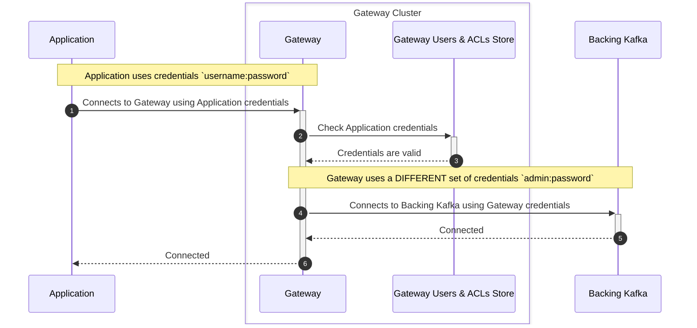
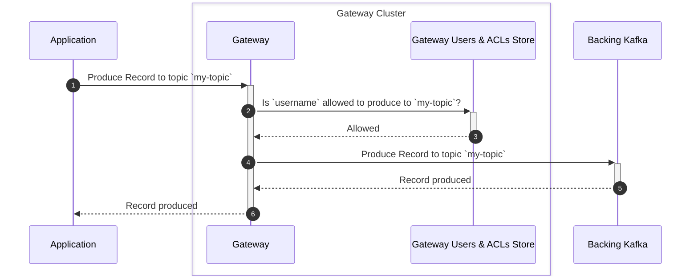
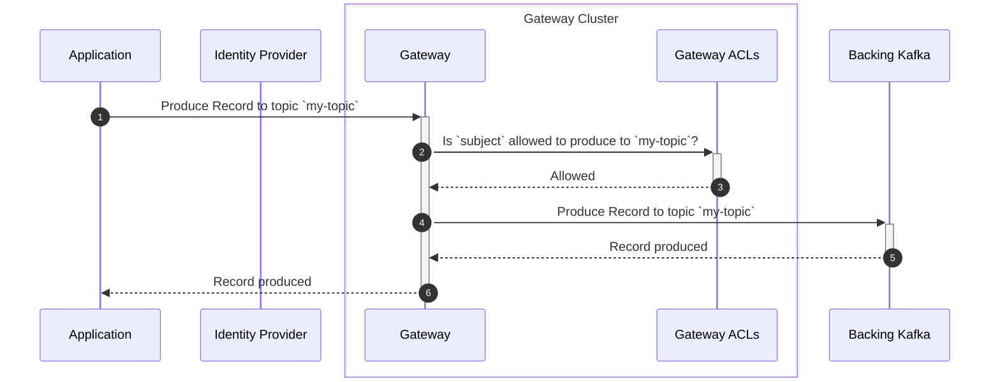
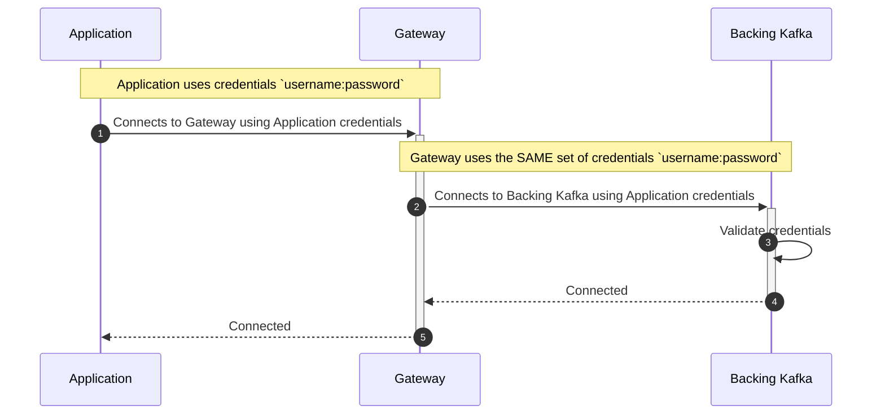
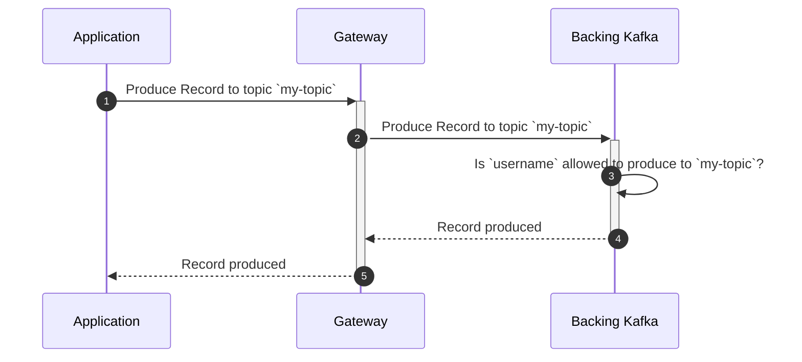
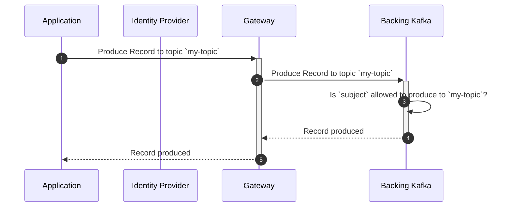

Configuring Conduktor Gateway involves making decisions regarding several subjects.

1. Choose your [Networking](../configuration/network.md) / [Load Balancing](../reference/load-balancing.md) requirements
2. Configure how the [Gateway connects to your Backing Kafka Cluster](../configuration/kafka-authentication.md)
3. Configure the [Gateway to accept Client connections](../configuration/client-authentication.md)
4. Decide whether you need [Virtual Cluster](../concepts/virtual-clusters.md) capabilities

## Authentication and Authorization Flows
:::caution
This is a **conceptual** view of the authentication and authorization flows.  
Specifically:
- it does not include every network call involved within each stage
- it does not reflect the exact order of the network calls
:::

### Gateway Security with Credentials managed by Gateway
 
Security protocol: `SASL_PLAINTEXT` or `SASL_SSL`  
SASL mechanism: `PLAIN`
#### Authentication Flow

#### Authorization Flow (Produce Message)

### Gateway Security with Oauth
Security protocol: `SASL_PLAINTEXT` or `SASL_SSL`  
SASL mechanism: `OAUTHBEARER`
#### Authentication Flow

#### Authorization Flow (Produce Message)

### Backing Kafka Security with SASL User
Security protocol: `DELEGATED_SASL_PLAINTEXT` or `DELEGATED_SASL_SSL`  
SASL mechanism: `PLAIN` (ie Confluent Cloud) or `SCRAM-SHA-256` or `SCRAM-SHA-512`
#### Authentication Flow

#### Authorization Flow (Produce Message)

### Backing Kafka Security with OAuth
Security protocol: `DELEGATED_SASL_PLAINTEXT` or `DELEGATED_SASL_SSL`    
SASL mechanism: `OAUTHBEARER`
#### Authentication Flow

#### Authorization Flow (Produce Message)
