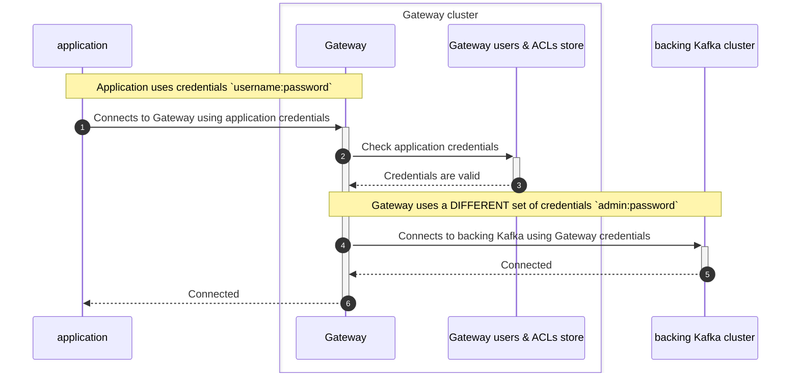
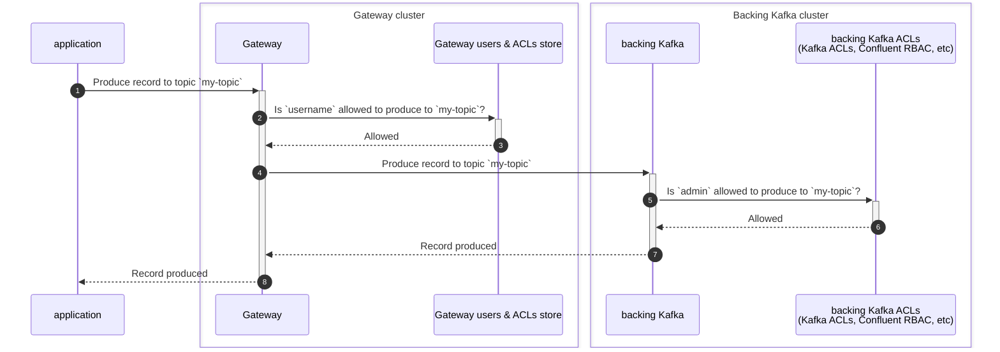
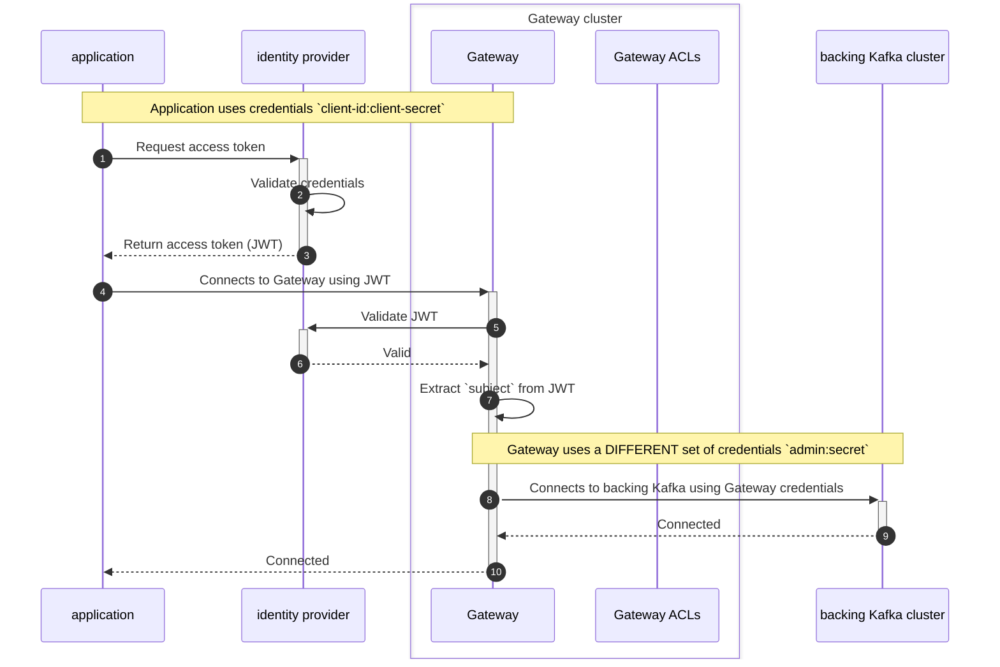
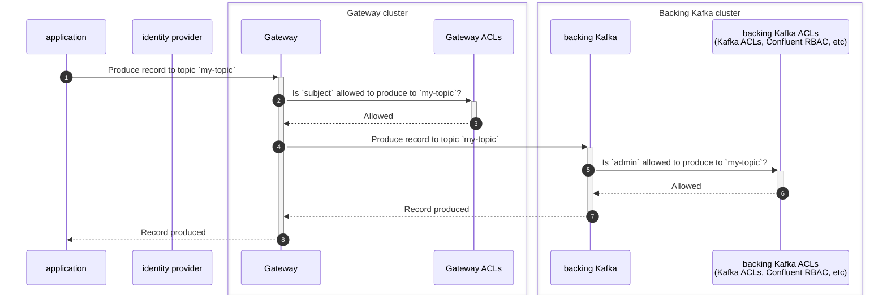
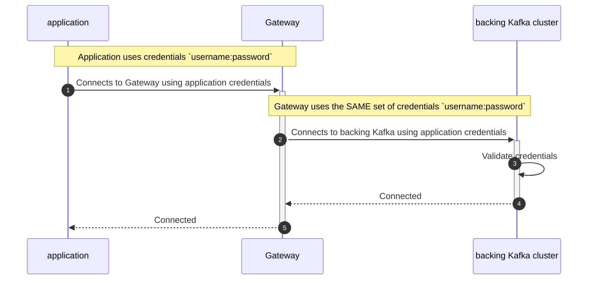
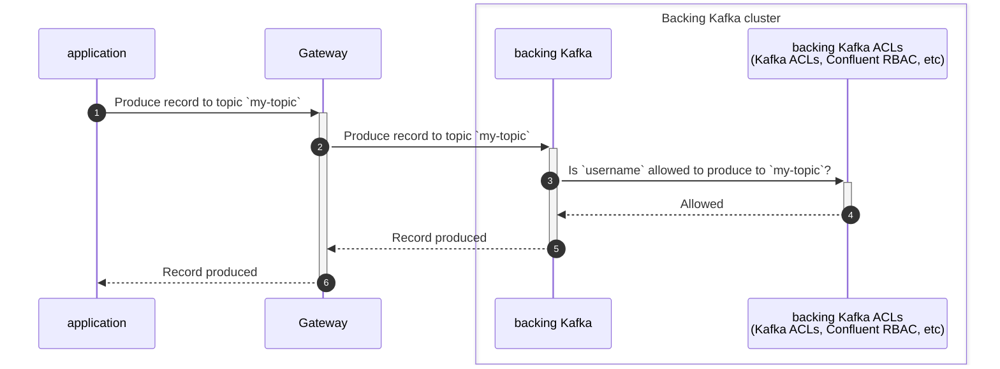
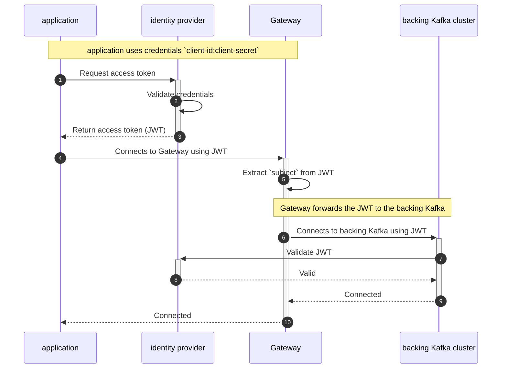
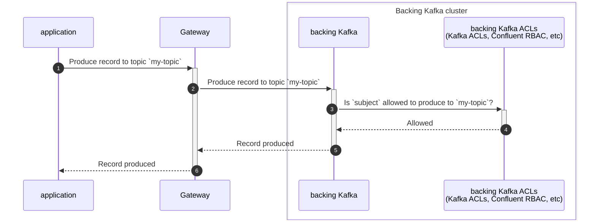

To configure Conduktor Gateway, you have to:

1. Decide on your [networking](../configuration/network.md)/[load balancing](../reference/load-balancing.md) requirements.
1. Configure how [Gateway connects to your 'backing' Kafka cluster](../configuration/kafka-authentication.md).
1. Configure [Gateway to accept client connections](../configuration/client-authentication.md).
1. Decide whether you need [virtual clusters](../concepts/virtual-clusters.md).

## Authentication and authorization flows

:::warning[Conceptual visualization]
This is a conceptual view of the authentication and authorization flows. It **doesn't include** every network call in each stage or the exact order of the calls.
:::

### Gateway security with credentials managed by Gateway
Before:  
Security protocol: `SASL_PLAINTEXT` or `SASL_SSL`  
SASL mechanism: `PLAIN`  

Now:
```env
GATEWAY_SECURITY_MODE: GATEWAY_SECURITY
GATEWAY_SECURITY_PROTOCOL: SASL_PLAINTEXT or SASL_SSL
```
#### Authentication flow



#### Authorization flow (produce message)



### Gateway security with OAuth
Before:
Security protocol: `SASL_PLAINTEXT` or `SASL_SSL`  
SASL mechanism: `OAUTHBEARER`

Now:
```env
GATEWAY_SECURITY_MODE: GATEWAY_SECURITY
GATEWAY_SECURITY_PROTOCOL: SASL_PLAINTEXT or SASL_SSL
```
#### Authentication flow



#### Authorization flow (produce message)



### Backing Kafka security with SASL users
Before:  
Security protocol: `DELEGATED_SASL_PLAINTEXT` or `DELEGATED_SASL_SSL`  
SASL mechanism: `PLAIN` (ie Confluent Cloud) or `SCRAM-SHA-256` or `SCRAM-SHA-512`

Now:
```env
GATEWAY_SECURITY_MODE: BACKING_KAFKA_SECURITY
GATEWAY_SECURITY_PROTOCOL: SASL_PLAINTEXT or SASL_SSL
```
#### Authentication flow



#### Authorization flow (produce message)



### Backing Kafka Security with OAuth
Before:  
Security protocol: `DELEGATED_SASL_PLAINTEXT` or `DELEGATED_SASL_SSL`    
SASL mechanism: `OAUTHBEARER`

Now:
```env
GATEWAY_SECURITY_MODE: BACKING_KAFKA_SECURITY
GATEWAY_SECURITY_PROTOCOL: SASL_PLAINTEXT or SASL_SSL
```
#### Authentication flow



#### Authorization flow (produce message)


