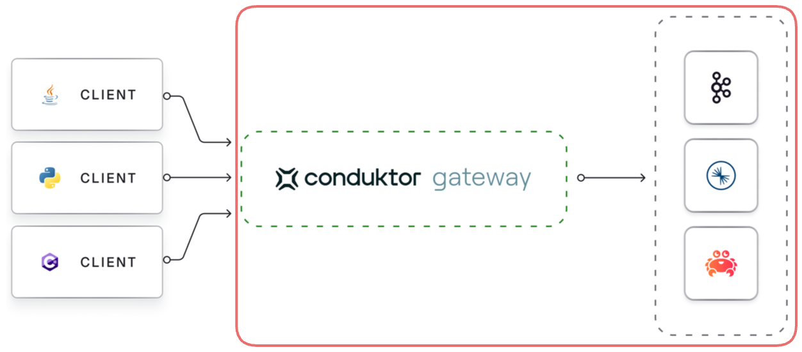

# Connecting Gateway to Kafka



Gateway depends on a 'backing' Kafka cluster for its operation.

Configuring the Gateway connection to the backing Kafka cluster is similar to configuring a standard Kafka client's connection to a cluster. If you haven't done so already, set the [client to Gateway](/gateway/configuration/client-authentication) configuration variables. This way Gateway will know how to interact with Kafka based on how authentication is being provided by the clients.

The two are related because Gateway must know whether you want Kafka to manage authentication or not. [Find out more about Kafka managed authentication](#kafka-managed-authentication).

The configuration is done via environment variables.

All the environment variables that start with `KAFKA_` are mapped to configuration properties for connecting Gateway to the Kafka cluster.

As Gateway is based on the Java-based Kafka-clients, it supports all configuration properties that Java-clients do. Kafka configuration properties are mapped to Gateway environment variables like this:

- add a `KAFKA_` prefix
- replace each dot `.` with an underscore, `_`
- convert to uppercase

For example: `bootstrap.servers` is set by the `KAFKA_BOOTSTRAP_SERVERS` environment variable.

## Supported protocols

You can use all the Kafka security protocols to authenticate Gateway to the Kafka cluster; `PLAINTEXT`, `SASL_PLAINTEXT`, `SASL_SSL` and `SSL`.  

These can be used with all SASL mechanisms supported by Apache Kafka: `PLAIN`, `SCRAM-SHA`, `OAuthBearer`, `Kerberos` etc. In addition, we support IAM authentication for AWS MSK clusters.

In the following examples, we provide blocks of environment variables which can be provided to Gateway, e.g. in a docker-compose file, or a `helm` deployment.

Information which should be customized is enclosed by `<` and `>`.

### PLAINTEXT

Kafka cluster without authentication or encryption in transit, `PLAINTEXT`.

In this case you just need the bootstrap servers:

```yaml
KAFKA_BOOTSTRAP_SERVERS: <your.kafka.broker-1:9092>,<your.kafka.broker-2:9092>
```

### SSL

```yaml
GATEWAY_SECURITY_PROTOCOL: PLAINTEXT # Change to relevant client-side value if known
KAFKA_BOOTSTRAP_SERVERS: <your.kafka.broker-1:9092>,<your.kafka.broker-2:9092>
KAFKA_SECURITY_PROTOCOL: SSL
KAFKA_SASL_MECHANISM: PLAIN
KAFKA_SASL_JAAS_CONFIG: org.apache.kafka.common.security.plain.PlainLoginModule required username="<gw-sa-username>" password="<gw-sa-password>";
KAFKA_SSL_TRUSTSTORE_TYPE: <JKS>
KAFKA_SSL_TRUSTSTORE_LOCATION: </path/to/truststore.jks>
KAFKA_SSL_TRUSTSTORE_PASSWORD: <truststore-password>
KAFKA_SSL_KEYSTORE_TYPE: <JKS>
KAFKA_SSL_KEYSTORE_LOCATION: </path/to/keystore.jks>
KAFKA_SSL_KEYSTORE_PASSWORD: <keystore-password>
KAFKA_SSL_KEY_PASSWORD: <key-password>
```

#### mTLS

Kafka cluster with mTLS client authentication.

```yaml
GATEWAY_SECURITY_PROTOCOL: PLAINTEXT # Change to relevant client-side value if known
KAFKA_BOOTSTRAP_SERVERS: <your.kafka.broker-1:9092>,<your.kafka.broker-2:9092>, <your.kafka.broker-3:9092>
KAFKA_SECURITY_PROTOCOL: SSL
KAFKA_SSL_TRUSTSTORE_LOCATION: /security/truststore.jks
KAFKA_SSL_TRUSTSTORE_PASSWORD: conduktor
KAFKA_SSL_KEYSTORE_LOCATION: /security/kafka.gw.keystore.jks
KAFKA_SSL_KEYSTORE_PASSWORD: conduktor
KAFKA_SSL_KEY_PASSWORD: conduktor
```

### SASL_PLAINTEXT

Kafka cluster with SASL_PLAINTEXT security protocol but no encryption in transit, supporting the following SASL_MECHANISMs.

#### SASL PLAIN

```yaml
GATEWAY_SECURITY_PROTOCOL: PLAINTEXT # Change to relevant client-side value if known
KAFKA_BOOTSTRAP_SERVERS: <your.kafka.broker-1:9092>,<your.kafka.broker-2:9092>
KAFKA_SECURITY_PROTOCOL: SASL_PLAINTEXT
KAFKA_SASL_MECHANISM: PLAIN
KAFKA_SASL_JAAS_CONFIG: org.apache.kafka.common.security.plain.PlainLoginModule required username="<gw-sa-username>" password="<gw-sa-password>";
```

#### SASL SCRAM

```yaml
GATEWAY_SECURITY_PROTOCOL: PLAINTEXT # Change to relevant client-side value if known
KAFKA_BOOTSTRAP_SERVERS: <your.kafka.broker-1:9092>,<your.kafka.broker-2:9092>
KAFKA_SECURITY_PROTOCOL: SASL_PLAINTEXT
KAFKA_SASL_MECHANISM: SCRAM-SHA-256 # or SCRAM-SHA-512
KAFKA_SASL_JAAS_CONFIG: org.apache.kafka.common.security.scram.ScramLoginModule required username="<gw-sa-username>" password="<gw-sa-password>";
```

#### OAuthbearer

```yaml
GATEWAY_SECURITY_PROTOCOL: PLAINTEXT
KAFKA_BOOTSTRAP_SERVERS: <your.kafka.broker-1:9092>,<your.kafka.broker-2:9092>
KAFKA_SECURITY_PROTOCOL: SASL_PLAINTEXT
KAFKA_SASL_MECHANISM: OAUTHBEARER
KAFKA_SASL_OAUTHBEARER_TOKEN_ENDPOINT_URL: "<https://myidp.example.com/oauth2/default/v1/token>"
KAFKA_SASL_LOGIN_CALLBACK_HANDLER_CLASS: org.apache.kafka.common.security.oauthbearer.OAuthBearerLoginCallbackHandler
KAFKA_SASL_JAAS_CONFIG: org.apache.kafka.common.security.oauthbearer.OAuthBearerLoginModule required clientId=“<>” clientSecret=“<>” scope=“.default”;
```

:::note
When using Kafka 4.0, you must set the `org.apache.kafka.sasl.oauthbearer.allowed.urls` property in your Gateway configuration.
For example: `JAVA_TOOL_OPTIONS: -Dorg.apache.kafka.sasl.oauthbearer.allowed.urls=https://www.example.com`.
Also, ensure you're using the new OAuth callback handler: `org.apache.kafka.common.security.oauthbearer.OAuthBearerLoginCallbackHandler`
:::

### SASL_SSL

Kafka cluster that uses SASL for authentication and TLS (formerly SSL) for encryption in transit.

#### PLAIN

Kafka cluster with SASL_SSL and PLAIN SASL mechanism.

##### Confluent Cloud with API key/secret

This example can be seen as a special case of the above.

```yaml
GATEWAY_SECURITY_PROTOCOL: PLAINTEXT # Change to relevant client-side value if known
KAFKA_BOOTSTRAP_SERVERS: <your.cluster.confluent.cloud:9092>
KAFKA_SECURITY_PROTOCOL: SASL_SSL
KAFKA_SASL_MECHANISM: PLAIN
KAFKA_SASL_JAAS_CONFIG: org.apache.kafka.common.security.plain.PlainLoginModule required username="<API_KEY>" password="<API_SECRET>";
```

As Confluent Cloud uses certificates signed by a well-known CA, you normally do not need to specify a trust-store.

Note: In case you are using this in a PoC setting without TLS encryption between *clients* and Gateway, you should set `GATEWAY_SECURITY_PROTOCOL` to `SASL_PLAINTEXT` and `GATEWAY_SECURITY_MODE` to `KAFKA_MANAGED`. Then clients will be able to authenticate using their own API keys/secrets.

#### SASL SCRAM

```yaml
GATEWAY_SECURITY_PROTOCOL: PLAINTEXT # Change to relevant client-side value if known
KAFKA_BOOTSTRAP_SERVERS: <your.kafka.broker-1:9092>,<your.kafka.broker-2:9092>
KAFKA_SECURITY_PROTOCOL: SASL_SSL
KAFKA_SASL_MECHANISM: SCRAM-SHA-256 # or SCRAM-SHA-512
KAFKA_SASL_JAAS_CONFIG: org.apache.kafka.common.security.scram.ScramLoginModule required username="<gw-sa-username>" password="<gw-sa-password>";
KAFKA_SSL_TRUSTSTORE_TYPE: <JKS>
KAFKA_SSL_TRUSTSTORE_LOCATION: </path/to/truststore.jks>
KAFKA_SSL_TRUSTSTORE_PASSWORD: <truststore-password>
```

#### SASL GSSAPI (Kerberos)

```yaml
GATEWAY_SECURITY_PROTOCOL: PLAINTEXT # Change to relevant client-side value if known
KAFKA_BOOTSTRAP_SERVERS: <your.kafka.broker-1:9092>,<your.kafka.broker-2:9092>
KAFKA_SECURITY_PROTOCOL: SASL_SSL
KAFKA_SASL_MECHANISM: GSSAPI
KAFKA_SASL_JAAS_CONFIG: com.sun.security.auth.module.Krb5LoginModule required useKeyTab=true storeKey=true keyTab="<>>" principal="<>";
KAFKA_SASL_KERBEROS_SERVICE_NAME: <kafka>
KAFKA_SSL_TRUSTSTORE_TYPE: <JKS>
KAFKA_SSL_TRUSTSTORE_LOCATION: </path/to/truststore.jks>
KAFKA_SSL_TRUSTSTORE_PASSWORD: <truststore-password>
```

#### OAuthbearer

```yaml
GATEWAY_SECURITY_PROTOCOL: PLAINTEXT
KAFKA_BOOTSTRAP_SERVERS: <your.kafka.broker-1:9092>,<your.kafka.broker-2:9092>
KAFKA_SECURITY_PROTOCOL: SASL_SSL
KAFKA_SASL_MECHANISM: OAUTHBEARER
KAFKA_SASL_OAUTHBEARER_TOKEN_ENDPOINT_URL: "<https://myidp.example.com/oauth2/default/v1/token>"
KAFKA_SASL_LOGIN_CALLBACK_HANDLER_CLASS: org.apache.kafka.common.security.oauthbearer.OAuthBearerLoginCallbackHandler
KAFKA_SASL_JAAS_CONFIG: org.apache.kafka.common.security.oauthbearer.OAuthBearerLoginModule required clientId=“<>” clientSecret=“<>” scope=“.default”;
```

### AWS MSK cluster with IAM

```yaml
GATEWAY_SECURITY_PROTOCOL: PLAINTEXT # Change to relevant client-side value if known
KAFKA_BOOTSTRAP_SERVERS: <b-3-public.****.kafka.eu-west-1.amazonaws.com:9198>
KAFKA_SECURITY_PROTOCOL: SASL_SSL
KAFKA_SASL_MECHANISM: AWS_MSK_IAM
KAFKA_SASL_JAAS_CONFIG: software.amazon.msk.auth.iam.IAMLoginModule required;
KAFKA_SASL_CLIENT_CALLBACK_HANDLER_CLASS: io.conduktor.aws.IAMClientCallbackHandler
KAFKA_AWS_ACCESS_KEY_ID: <access-key-id>
KAFKA_AWS_SECRET_ACCESS_KEY: <secret-access-key>
```

### Service account and ACL requirements

Depending on the Client to Gateway authentication method you choose, the Service Account used to connect the Gateway might need different ACLs to operate properly.

#### Kafka managed authentication

We can enforce delegating authentication to Kafka by setting `${GATEWAY_SECURITY_MODE}` to `KAFKA_MANAGED`.

:::warning[Deprecated protocols]
As of [Gateway 3.10.0](/changelog/Gateway-3.10.0), the `DELEGATED_XXX` security protocols have been deprecated in favour of an additional environment variable,  `GATEWAY_SECURITY_MODE`.

The `DELEGATED` values remain supported for backward compatibility but are no longer recommended for new configurations.

If you're using `DELEGATED` security protocols, [see the security mode migration guide](/gateway/how-to/migration-guide-to-security-mode) before continuing.
:::

In Kafka managed mode, the credentials provided to establish the connection between the Client and the Gateway are the same used from the Gateway to the backing Kafka. Therefore, the client will inherit the ACLs of the service account configured on the backing cluster.

In addition, Gateway needs its own service account with the following ACLs to operate correctly:

- `Read` on internal topics and they should exist
- Describe consumer group for internal topic
- Describe on cluster
- Describe topics for alias topics creation

#### Gateway managed authentication

We can enforce Gateway managing authentication by setting `${GATEWAY_SECURITY_MODE}` to `GATEWAY_MANAGED`.

In Gateway managed Authentication (local, Oauth or mTLS), the connection is using the Gateway's service account to connect to the backing Kafka.

This service account has to have all the necessary ACLs to perform not only these Gateway operations:

- `Read` on internal topics and they should exist
- Describe consumer group for internal topic
- Describe on cluster
- Describe topics for alias topics creation but also all the permissions necessary to serve all Gateway users.

When in Gateway managed mode, ACLs will be enabled. You can use AdminClient to maintain ACLs with any service account declared in `GATEWAY_ADMIN_API_USERS`.

:::warning[Deprecated variable]
As of [Gateway v3.10.0](/changelog/Gateway-3.10.0), the `GATEWAY_ACL_STORE_ENABLED` environment variable has been deprecated.

Instead, when `GATEWAY_SECURITY_MODE` is set to `GATEWAY_MANAGED`, ACLs will be enabled.

When in `KAFKA_MANAGED` mode, ACLs will be disabled.

This `GATEWAY_ACL_STORE_ENABLED` environment variable continues to be supported for backward compatibility but is no longer recommended for new configurations.

If you're using `DELEGATED` security protocols, [See the migration to security mode guide](/docs/gateway/how-to/migration-guide-to-security-mode) before proceeding.
:::
