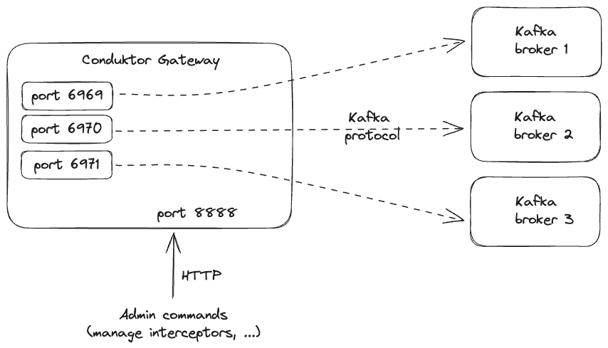
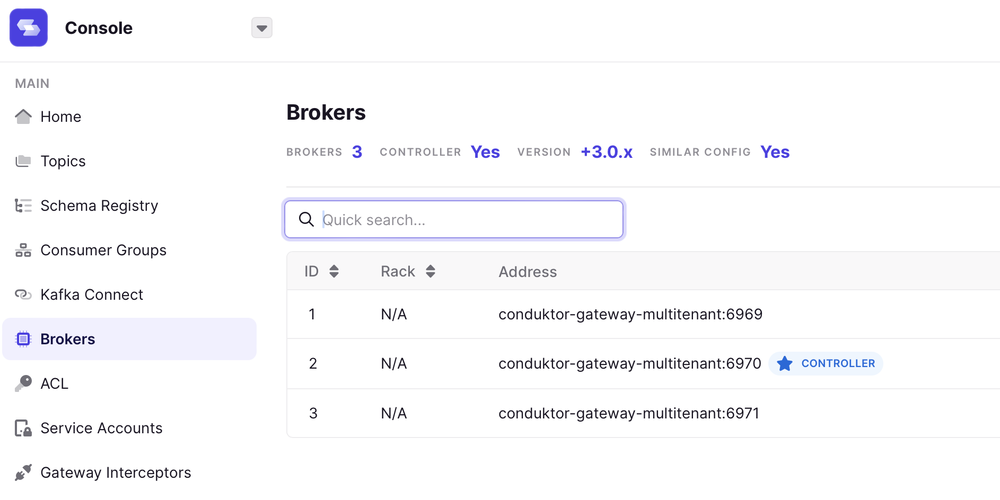

# SNI Routing

## What is it, what problem does it solve?


SNI routing reduces the number of ports/services that needs to be created for Gateway. You might need to do this if you are experiencing high administrative overhead for managing ports and/or load balancers or if you are limited in how many you can control e.g. a different team manage that.

*TL;DR* clients need to adress individual Kafka brokers through Gateway, when we have limited ports or they can't be updated frequently 1:1 may not work, in which case we can run multiple broker connections through a single port.

- [Relevant Context](#relevant-context)
    - [Defining Ports](#defining-ports)
- [Setting up SNI Routing](#setting-up-sni-routing)
    - [1. Prepare TLS Certificates](#1-prepare-tls-certificates)
    - [2. Configure Gateway](#2-configure-gateway)
    - [*Optional. Trust Store Configuration*](#optional-trust-store-configuration)
- [Debugging Tips](#useful-tips-for-debugging-and-troubleshooting)

## Relevant Context

**Background: how does a client interact with Kafka?**

Let's start out by describing the networking flow between Kafka clients and a Kafka cluster, using a producer as an example:
Using a producer in this example, the producer initiates a connection with a random broker (the famous `bootstrap server`) and sends a Metadata request.  

The broker responds to the producer with the cluster information, indicating which brokers (**hostnames and ports**) exist in the cluster and which broker is the leader for each topic partition. When the producer wants to send data to a topic partition, it will send a Produce request directly to the leader. The bootstrap-servers are not necessarily involved, unless they host a topic partition as well. Consumers essentially work in the same way.  

When we deploy Gateway, to proxy the Kafka traffic, we need to ensure that client requests are forwarded to the right brokers. In order to keep Gateway as stateless as possible we do not store and resolve the mapping of topic-partitions to brokers internally. Instead, we pass this information on to the client which will then try to contact the correct broker through Gateway. Hence, the client must be able to address each broker individually through Gateway. By default, this is done by opening one port per broker on the Gateway.




###  Defining ports

The starting port defaults to 6969 and can be configured using the GATEWAY_PORT_START [environment variable](/gateway/configuration/env-variables#hostport).  

Determining the number of brokers can be cumbersome, but made easier by tools such as Conduktor Console (read on for How-To), but it also changes. Luckily Gateway dynamically updates this for you, but your firewall or external config may not be as responsive.

Instead of relying on multiple ports on a Gateway instance we can use SNI routing to just open up a single port on each Gateway instance.

> SNI stands for Server Name Indication. It is an extension to the TLS (Transport Layer Security) protocol that allows a client to indicate the hostname of the server it wants to connect to during the initial handshake.
This allows the server to determine which certificate to present based on the requested hostname. This enables the hosting of multiple secure "resources" on a single IP address, improving resource utilization and making SSL/TLS deployments more flexible.

SNI routing relies on TLS and server name indication for Gateway to determine to which broker a client request should be forwarded to. This can drastically reduce the administrative overhead for managing ports and/or load balancers. The rest of this guide talks you through setting up SNI routing.

## Setting up SNI routing

### 1. Prepare TLS certificates

The certificate for a Gateway with SNI routing needs to include the Gateway host name as well as a SAN for each broker in the cluster. Alternatively, wildcards can be used in the SAN.
See below the alternative hostnames and how they can be customized.

### 2. Configure Gateway

The following table shows the environment variables used to configure Gateway, the config path will be displayed in the logs at Gateway startup and can be used to double-check that the correct value has been set.


| Environment var   | Config  | Possible values | Remarks |
|---|---|---|---|
| GATEWAY_ADVERTISED_HOST               | hostPortconfiguration.advertisedHost   |                  | Needs to be set, will be used as base domain for the brokers. For example: conduktor-gateway.sni-demo.local   |
| GATEWAY_SECURITY_PROTOCOL          | authenticationConfig.securityProtocol     | SASL_SSL or SSL |                                                                                            |
| GATEWAY_ROUTING_MECHANISM       | routing                                            | host               | Needs to be set to host for SNI routing.                                                |
| GATEWAY_PORT_START                      | hostPortConfiguration.portStart               |                  | The only port to be exposed by Gateway, defaults to 6969                            |
| GATEWAY_ADVERTISED_HOST_PREFIX | hostPortConfiguration.hostPrefix         |                  | Optional setting to configure the advertised broker names, see below. Defaults to broker. |
| GATEWAY_SSL_KEY_STORE_PATH         | authenticationConfig.sslConfig.keyStore.keyStorePath |         | Path for the mounted keystore                                                             |
| GATEWAY_SSL_KEY_STORE_PASSWORD | authenticationConfig.sslConfig.keyStore.keyStorePassword |    | Password of the keystore                                                                      |
| GATEWAY_SSL_KEY_PASSWORD            | authenticationConfig.sslConfig.keyStore.keyPassword           |    | Password of the key                                                                                |
| GATEWAY_SSL_KEY_TYPE                    | authenticationConfig.sslConfig.keyStore.keyStoreType      | jks, p12      | Type of the keystore. Defaults to jus                                                     |
| GATEWAY_SSL_UPDATE_CONTEXT_INTERVAL_MINUTES | authenticationConfig.sslConfig.updateContextIntervalMinutes |   |                                                                                                     |

#### *Optional. Trust store configuration*
For client authentication, you can additionally configure a trust store (including path, password, and type).

**Example**
```yaml
GATEWAY_ADVERTISED_HOST: conduktor-gateway.sni-demo.local
GATEWAY_SECURITY_PROTOCOL: SASL_SSL
GATEWAY_ROUTING_MECHANISM: host
GATEWAY_ADVERTISED_HOST_PREFIX: broker-passthrough
GATEWAY_SSL_KEY_STORE_PATH: /security/kafka.conduktor-gateway.sni-demo.local.keystore.jks
GATEWAY_SSL_KEY_STORE_PASSWORD: conduktor
GATEWAY_SSL_KEY_PASSWORD: conduktor
```

Given the configuration above, the necessary SANs for the certificate are:

```properties
broker-passthroughmain<broker id>.conduktor-gateway.sni-demo.local
```

for each broker in the cluster. For example:

```properties
broker-passthroughmain1.conduktor-gateway.sni-demo.local
broker-passthroughmain2.conduktor-gateway.sni-demo.local
broker-passthroughmain3.conduktor-gateway.sni-demo.local
```

In general, the format for the advertised brokers to be included as SANs in the Gateway certificate is:

```properties
 <host-prefix><cluster-id><broker-id>.<advertised-host>
```

Here, the `cluster-id` is used in case we have multiple back-end Kafka clusters, and defaults to main.

## Useful tips for debugging and troubleshooting
* You can use Console's Broker tab to view the advertised listeners of a Gateway once the initial connection and authentication are successful:



* Alternatively, [kcat](https://github.com/edenhill/kcat)'s metadata list mode (-L) can be used to check whether the right advertised listeners have been configured or how many brokers are in a given cluster.
* Setting `LOG4J2_IO_CONDUKTOR_PROXY_NETWORK_LEVEL` to `DEBUG` might be helpful when debugging issues.
