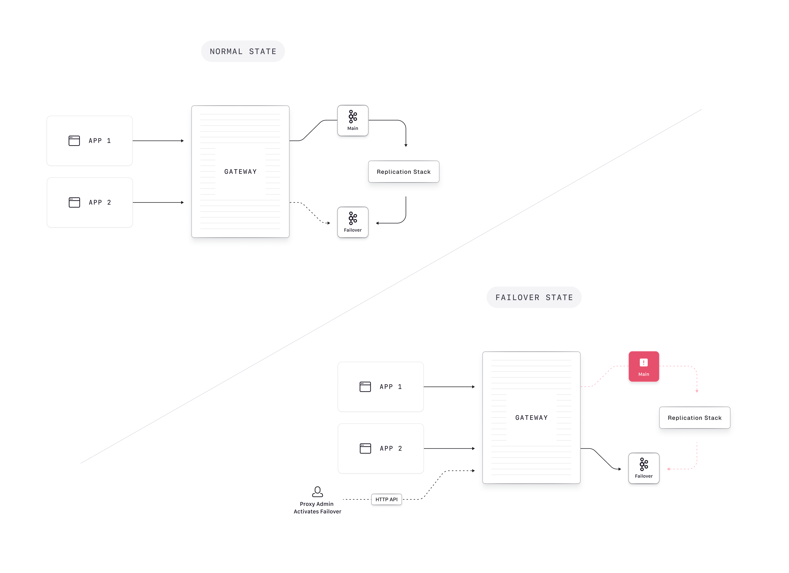

# How to configure Gateway for Failover

## What problem does it solve?

In a disaster recovery or business continuity scenario, we want to be able to switch clients from one Kafka cluster (the primary) to another one (the secondary) without having to reconfigure the clients. 

Reconfiguring clients would at least involve changing the bootstrap servers of the clients, forcing the clients to refresh the metadata and retry all messages in flight. It might also involve distributing new credentials to the clients. For example, API keys and secrets in Confluent Cloud are tied to a specific cluster. Other Kafka providers might have different restrictions.

Essentially, this implies that the central operations/Kafka team (who would be responsible for initiating the failover-process) would have knowledge about all clients, which in practice is not feasible. The failover capability of Gateway solves this by redirecting client connections from the primary to the secondary cluster. This can be initiated at a central location using the Gateway HTTP API without having to reconfigure/restart each Kafka client individually.

## Pre-requisites

### Data replication is already in place

Gateway does not currently provide any mechanism to replicate already written data from the primary to the secondary cluster. Therefore, to make use of our solution, you should already have this mechanism in place. Common solutions for this include:

 - MirrorMaker 2
 - Confluent Replicator
 - Confluent Cluster Linking

Note that none of these solutions (and therefore neither Conduktor's failover solution) can guarantee the absence of data loss during a disaster scenario.

### Kafka client configuration

No specific client configuration is necessary, besides ensuring that clients have configured enough retries (or that the `delivery.timeout.ms` for JVM-based clients) setting is large enough to cover the time necessary for the operations team to discover failure of the primary cluster and initiate a failover procedure. Especially for JVM-based clients, the default delivery timeout of 2 minutes might be too short.

### System requirements

 - Gateway version `3.2.0`+
 - Kafka brokers version `2.8.0`+
 - Gateway configured with [SNI Routing](./sni-routing.md) (support for port-based routing will come in an upcoming release)

Note that due to a current limitation in Kafka clients, the primary and secondary Kafka clusters must have some broker id's in common (see [KIP-899](https://cwiki.apache.org/confluence/display/KAFKA/KIP-899%3A+Allow+producer+and+consumer+clients+to+rebootstrap)). This ensures clients can recognize the secondary cluster as a legitimate continuation of the primary one.

## How it works

Conduktor Gateway acts as a 'hot-switch' to the secondary Kafka cluster, eliminating the need to change any client configurations in a disaster scenario. This is achievable because Gateway de-couples authentication between clients and the backing Kakfa cluster(s).

Note that to initiate failover, it must be triggered through an API request to every Gateway instance. The Conduktor team can support you in finding the best solution for initiating failover, depending on your deployment specifities.

_Note: Image needs 'productionising' before merging_



### Configuring Gateway

To setup Gateway for failover, you should configure the primary and secondary clusters along with their configuration properties. This can be achieved through a **cluster-config file**, or through **environment variables**.

#### Configuring through a cluster-config file

Specify your primary and secondary cluster configurations, along with a `gateway.roles` entry to mark the failover cluster - note that the API keys differ in the Confluent Cloud example below:

```yaml
config:
  main:
    bootstrap.servers: <primary bootstrap address>:9092
    security.protocol: SASL_SSL
    sasl.mechanism: PLAIN
    sasl.jaas.config: org.apache.kafka.common.security.plain.PlainLoginModule required username="<primary-api-key>" password="<primary-api-secret>";
  failover:
    bootstrap.servers: <secondary bootstrap address>:9092
    security.protocol: SASL_SSL
    sasl.mechanism: PLAIN
    sasl.jaas.config: org.apache.kafka.common.security.plain.PlainLoginModule required username="<secondary-api-key>" password="<secondary-api-secret>";
    gateway.roles: failover
```

Mount the cluster config file in the Gateway container using the configuration `GATEWAY_BACKEND_KAFKA_SELECTOR`:

```yaml
GATEWAY_BACKEND_KAFKA_SELECTOR: 'file : { path: /cluster-config.yaml}'
```

#### Configuring through environment variables

Alternatively, you can configure your primary and secondary cluster through environment variables:

```bash
KAFKA_MAIN_BOOTSTRAP_SERVERS='<primary bootstrap address>:9092'
KAFKA_MAIN_SECURITY_PROTOCOL='SASL_SSL'
KAFKA_MAIN_SASL_MECHANISM='PLAIN'
KAFKA_MAIN_SASL_JAAS_CONFIG='org.apache.kafka.common.security.plain.PlainLoginModule required username="<primary-api-key>" password="<primary-api-secret>";'
KAFKA_FAILOVER_BOOTSTRAP_SERVERS='<secondary bootstrap address>:9092'
KAFKA_FAILOVER_SECURITY_PROTOCOL='SASL_SSL'
KAFKA_FAILOVER_SASL_MECHANISM='PLAIN'
KAFKA_FAILOVER_SASL_JAAS_CONFIG='org.apache.kafka.common.security.plain.PlainLoginModule required username="<secondary-api-key>" password="<secondary-api-secret>";'
KAFKA_FAILOVER_GATEWAY_ROLES='failover'
```


### Initiating failover

To initiate failing over from the primary to the secondary cluster, the following request must be made to all Gateway instances:

```bash
curl \
  --request POST 'http://localhost:8888/admin/pclusters/v1/pcluster/main/switch?to=failover' \
  --user 'admin:conduktor' \
  --silent | jq
```

### Switching back

To switch back from the secondary cluster to the primary cluster, the following request must be made to all Gateway instances:

```bash
curl \
  --request POST 'http://localhost:8888/admin/pclusters/v1/pcluster/main/switch?to=main' \
  --user 'admin:conduktor' \
  --silent | jq
```


