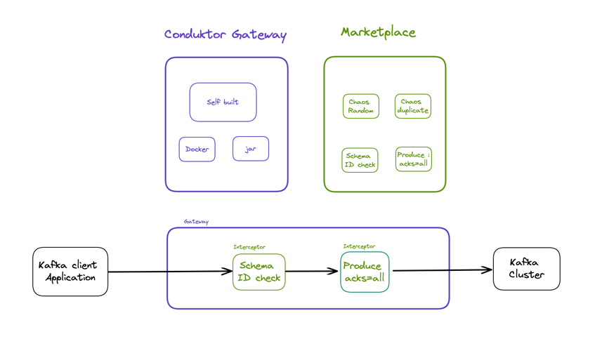

# Overview

## What is the Conduktor Gateway

Kafka is a powerful tool, with many nuances and great flexibility. However, this power and flexibility can lead to challenges around managing and bringing structure to your Kafka ecosystem, especially as it grows. 

Conduktor Gateway lets you build on this power by adding governance, security, auditability, testability and much more.  When using Conduktor Gateway it becomes much easier to progress up the Kafka maturity scale, helping you avoid pitfalls and the common challenges that come with this progression.  Conduktor Gateway enables you to add structure, organisation, enhanced functionality, and confidence to your Kafka Ecosystem.

The Source Available Conduktor Gateway can be found at [https://github.com/conduktor/conduktor-gateway](https://github.com/conduktor/conduktor-gateway). This is the backbone of the Conduktor Gateway functionality.  It is the transport layer that provides the wiring between your Kafka Client and your Kafka Cluster.

By itself, the gateway layer doesn't add functionality.  Instead it provides the framework for hosting Conduktor Interceptors. These are plugins that have access the Kafka traffic as it flows through the gateway layer, and can act on, or even manipulate the Kafka flows.

For example, the Chaos Random Bytes Interceptor can insert random bytes into produced messages to simulate data corruption, or malformed requests.  The Create Topic Configuration Interceptor can enforce administrator defined configuration on topic creation requests, such as requiring a replication factor of 3, or no more than 6 partitions.

The interceptors can be chained together in an interceptor pipeline, allowing you to combine their functionality.

Conduktor Interceptor plugins are available at the Conduktor Marketplace.  This Market place hosts a selection of free to use Interceptors to give you a taste of what is available to help you on your Kafka journey.  The Marketplace also includes links to paid for Interceptors.  These provide a much wider range of functionality and Conduktor can assist you in accessing and setting these up.

The API for creating an Interceptor is public, so if you find you have a use case that isn't covered by an existing Interceptor Plugin, then you can write your own, and even contribute it to the Marketplace for other people to use.

This diagram shows how the gateway and interceptors from the Marketplace combine to act on your Kafka data

### Getting Started

To start your Conduktor Proxy journey review installation options [here](./getting-started/getting-started.md)

## Resources

This project contains everything you need to get started with Conduktor Gateway including:

* The core gateway module
* The interceptor framework - a set of interfaces to be implemented in your own interceptor project
* An example interceptor implementation
* Integration tests - these verify the core module and provide a platform for testing custom interceptors.

