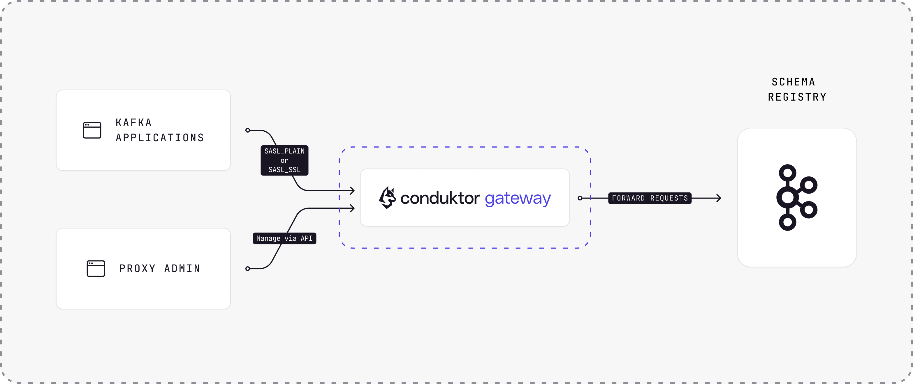
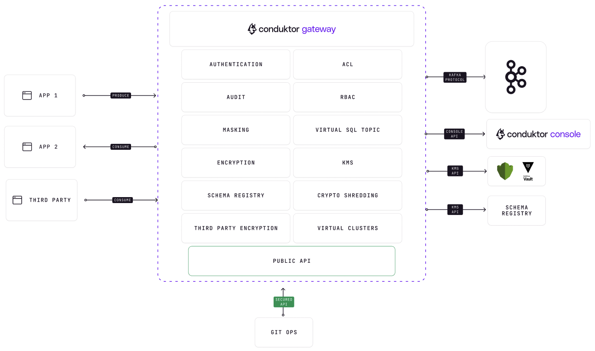

# Overview

- [Getting Started](#getting-started)
- [What is Conduktor Gateway](#what-is-the-conduktor-gateway)
- [Components](#components)
- [Resources](#resources)

## Getting Started

These documents allow you to setup, configure and explore the Conduktor Gateway.  

If you are looking at setting up your Gateway, [review the installation options](installation/installation.md).  

Need to configure Gateway for your specific setup, [review the configuration options](configuration/configuration.md).  

Adding a plugin a.k.a. an interceptor, then [view the interceptors](interceptors/data-security/field-level-encryption.md) to see what there is and view examples to copy.  

If you want to walkthrough a demo for yourself, or use it to copy configuration examples [checkout the demos](/gateway/category/encryption/).

Something missing, want more? [Contact us](https://support.conduktor.io/hc/en-gb), we're always reviewing and expanding our documentation.   

Happy reading 😃.


## What is the Conduktor Gateway

A vendor agnostic Apache Kafka proxy. Adding governance, security, cost-optimisation, and much more!

Kafka is a powerful tool, with great flexibility. This power and flexibility can lead to challenges around managing and bringing structure to your Kafka ecosystem, especially as that ecosystem grows.

When using Conduktor Gateway you can more easily follow the path to a mature Kafka set-up, avoiding the pitfalls and the common challenges that come with this progression.
Conduktor Gateway gives you the power to add structure, organisation, enhanced functionality, and therefore confidence in your Kafka environment. 
Gateway is fully Apache Kafka protocol compliant and vendor agnostic, it supports the use of Kafka wherever that Kafka is hosted.


## Components

The core of Conduktor Gateway is the transport layer between your Kafka client applications and your Kafka clusters.



This transport layer is enhanced by interacting with the Kafka, modifying the data or performing logical operations to add value. Gateway itself is made of two conceptual parts, the Gateway core, and interceptors.
There is so much you can do with a Conduktor Gateway, just some of the features include:
 - Virtual clusters for your clients through multi-tenancy
 - Encryption, for encrypting at the field level within your Kafka records, to aid with compliance around use of confidential, personal, or high value data
 - Chaos engineering, which enables you to develop against, and then prove that your Kafka applications can handle failure scenarios
 - Safeguarding, which puts structure and guards in place to ensure your Kafka environment is used in the right way

 


 ```mermaid
flowchart LR
    A[User App]
    subgraph G [Gateway]
        direction LR
        Auth[Authentication & </br> Authorization]
        subgraph I [Dynamic interceptor pipeline]
            direction LR
            I1(Plugin </br> priority: 1 </br> interceptor)
            I2(Plugin </br> priority: 10 </br> interceptor1 & interceptor2)
            I3(Plugin </br> priority: 42 </br> interceptor)
            I1 <--> I2 <--> I3
        end
        subgraph Core [Core features]
            direction TB
            LT(Logical Topics)
            VC(Virtual clusters)
        end
        Auth <--> I
    end
    subgraph K [Main Kafka cluster]
    B1(broker 1)
    B2(broker 2)
    B3(broker 3)
    B1 === B2 === B3
    end
    A <--> Auth
    I <--> Core
    Core <--> K
```

Kafka messages go through different components inside Gateway. Each of these components implements some logic for intercepting, inspecting and/or manipulating Kafka protocol messages.
Kafka protocol requests (such as Produce requests) pass sequentially through each of the components in the pipeline, before being forwarded to the broker.
When the broker returns a response (such as a Produce response) the components in the pipeline are invoked in the reverse order with each having the opportunity to inspect and/or manipulate the response. Eventually, a response is returned to the client.

There are three types of components in the flow, each with different responsibilities:
* Authentication & Authorization: identify the principal(see [client to GW security](./concepts/02-Clients.md)) of the request, and determine which [VCluster](concepts/05-Virtual%20Cluster.md) it belongs to
* Interceptors: These are dynamically configured, depending on both the principal and the Virtual Cluster, a chain of interceptors is built for the exchange. This allows you to selectively add new behavior to Gateway. See [Interceptors](concepts/06-Interceptors/01-Plugin.md) for more
* Core features: Coming last, this component implements the core features of Gateway: It rewrites broker address, performs isolation into Virtual Clusters, and translates Logical topics to physical topics. See the [Topic naming convention](reference/reference-docs/#topic-naming-convention) for more on the different types of topics in Gateway


## Resources

- [Support](https://www.conduktor.io/contact/support)
- [Arrange a technical demo from us](https://www.conduktor.io/contact/demo)
- [Try out some demos yourself](https://github.com/conduktor/conduktor-gateway-demos)
- [Roadmap](https://product.conduktor.help)