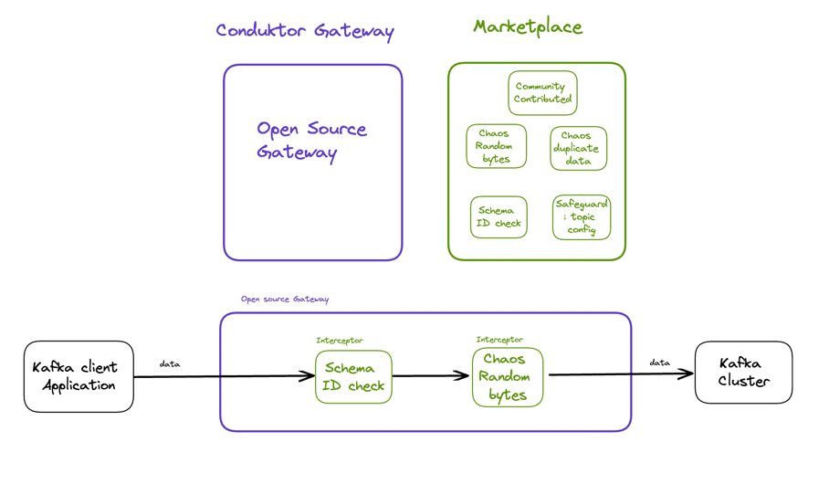

- [Overview](#overview)
- [Quick Start](#quick-start)
    - [Get a Kafka instance](#get-a-kafka-instance)
    - [Run the gateway](#database-properties)
    - [Run the logging interceptor](#run-the-logging-interceptor)
- [Configure an interceptor from Conduktor Marketplace](#configure-an-interceptor-from-conduktor-marketplace)
- [Use your own Kafka cluster and Kafka clients](#use-your-own-kafka-cluster-and-kafka-clients)
  - [Kafka Client to Conduktor Gateway configuration](#kafka-client-to-conduktor-gateway-configuration)
  - [Conduktor Gateway to Kafka cluster configuration](#Conduktor-gateway-to-kafka-cluster-configuration)

# Overview

The open source Conduktor Gateway is made up of two components, the gateway transport layer, and interceptors downloaded from the Conduktor Marketplace.

The gateway transport layer is the wiring between your Kafka client application and your Kafka broker. It has access to all the Kafka data flowing through it. 

Interceptors are loaded into the gateway.  The interceptors are triggered when Kafka data flows through the gateway, and provide functionality such as adding chaos to aid with testing, or adding safeguards around what Kafka configurations are allowed and keep your Kafka cluster protected.

It is also possible to [write your own interceptor](../interceptors/write-an-interceptor.md).

This diagram show the high level architecture of the open source Conduktor Gateway.



# Quick Start

The quick start guide demonstrates how to install Conduktor Gateway and configure it to run with a locally running Kafka. It then uses the example logging interceptor to write a log line to `stdout` when Kafka traffic flows through the gateway.  

## Get a Kafka instance up and running

Create a single broker cluster running on your local system by following step 1 and step 2 (Zookeeper or KRaft version) from the [Apache Kafka Quick Start](https://kafka.apache.org/quickstart).  Use the default configuration, which will start a broker on `localhost:9092`.

If you're not familiar with Kafka, you may find it more helpful to follow the [Conduktor Kafkademy tutorial](https://www.conduktor.io/kafka/starting-kafka/) for a step by step guide on how to do this.

Alternatively if you are more familiar with Kafka, you may use an existing Kafka cluster by updating the [Conduktor gateway configuration](#conduktor-gateway-to-kafka-cluster-configuration). However, for the sake of this demo you may prefer to keep things simple with a local cluster that doesn't require additional security configuration.

## Run the gateway

Build the Gateway image.

:::caution
Note this requires Java 17 or later. If you are using an older version, please download Java 17+

You'll also need a local kafka cluster running with a bootstrap address of `localhost:9092` as described immediately [above](#get-a-kafka-instance-up-and-running).
:::

The following command clones the conduktor-gateway repository, and then builds and packages the Conduktor Gateway .jar file.

```bash
git clone https://github.com/conduktor/conduktor-gateway && cd conduktor-gateway
mvn clean package
```

Once the `mvn clean package` has run successfully, you should see a `BUILD_SUCCESS` in the output from the `mvn clean package`:


## Run the logging interceptor

With Gateway now built, add the demo [logger interceptor](https://github.com/conduktor/conduktor-gateway/tree/main/logger-interceptor) to the classpath, and then start the gateway:

```bash
CLASSPATH=logger-interceptor/target/logger-interceptor-0.5.0-SNAPSHOT.jar bin/run-gateway.sh
```
:::info
In this example the `CLASSPATH` to the interceptor is relative to our git repo directory as we've included the logger interceptor, but you can store your future interceptors where you'd like.
:::

In the terminal window, you should see a log line similar to this, which indicates the gateway has started successfully:
```
Gateway started successfully with port range: 6969:6975
```

Test the demonstration logger interceptor by creating a topic. If you are using the Kafka command line tools this will look similar to the below. The logger interceptor writes lines to standard out (here the gateway logs) when Kafka traffic flows through the gateway:

```bash
cd <kafka_install_directory>
bin/kafka-topics.sh --create --topic my-gateway --bootstrap-server localhost:6969
```

Each Kafka flow that is sent by the calls above is intercepted by the Logger Interceptor as it passes through the Gateway, and information about that Kafka flow is written to the logs.

Look in the terminal window where the gateway is running. You'll find log lines, written by the Logger Interceptor, similar to:

```bash
Hello there, a class org.apache.kafka.common.requests.ApiVersionsRequest was sent/received
A RESPONSE was sent
```

This concludes the quick start and demo.

# Configure an interceptor from Conduktor Marketplace

Next, explore our other Interceptors on the [Conduktor Marketplace](https://marketplace.conduktor.io). In the Marketplace you'll find a wide range of Interceptors, a number of which are available for use for free in the open source Conduktor Gateway as well as our enterprise offering.

Once you've decided which of the free interceptors you'd like to try, select the "Download" button on the Interceptor's page in the Marketplace to download that interceptor's .jar file.  Save this to a location on your machine that you can add to your Java classpath.

[Update your Gateway's configuration file](../configuration/opensource-yaml-config.md), found at `<GATEWAY_REPOSITORY_LOCATION>/gateway-core/config/application.yaml` to enable each interceptor you'd like to try.  The `Configuration` section on each Interceptor's page in the Marketplace describes the available configuration and can be copy pasted directly.  

Multiple interceptors can be configured simultaneously, each as a separate list item, under the `interceptors` field in the `application.yaml` configuration file.

This example adds both the [Create topic validation](https://marketplace.conduktor.io/interceptors/safeguard-topic-creation-validation/) and [Schema id present](https://marketplace.conduktor.io/interceptors/safeguard-schema-id-present/) interceptors.

```yaml
kafkaSelector:
  type: file
  path: gateway-core/config/kafka.config
interceptors:
  - name: myCreateTopicChecksInterceptor
    pluginClass: io.conduktor.gateway.interceptor.CreateTopicSafeGuardPlugin
    priority: 100
    config:
      - key: topic
        value: '.*'
      - key: minNumPartition
        value: 5
      - key: maxNumPartition
        value: 10
      - key: minReplicationFactor
        value: 1
      - key: maxReplicationFactor
        value: 1
  - name: mySchemaIdPresentInterceptor
    pluginClass: io.conduktor.gateway.interceptor.SchemaIdPresentValidationPlugin
    priority: 100
    config:
      - key: topic
        value: my_topic_.*
      - key: schemaIdRequired
        value: false

```

Once you've updated the configuration file, update your classpath to include the interceptor .jar file(s), and then restart the gateway to pick up the changes.  For the example above, this would be:

```bash
CLASSPATH=<DOWNLOAD_LOCATION>/gateway-create-topic-safeguard-1.0.0.jar:<DOWNLOAD_LOCATION>/gateway-schema-id-present-validation-interceptor-1.0.0.jar bin/run-gateway.sh 
```  

:::note
If you remove the logger interceptor from your classpath, as is shown in the example above when we declare it again without the logger included, don't forget to remove the entry for this interceptor from your `application.yaml` configuration file too. It is fine to have unused interceptors in your CLASSPATH, but not fine when inlcuded as part of the configuration file.
:::

# Use your own Kafka cluster and Kafka clients

Once you've decided on your interceptors, update the configuration, following the instructions below, to use your own Kafka cluster and Kafka clients, so you can start exploring the benefits Conduktor Gateway can bring to your environment.

There are two sets of properties to configure when using your own client and your own Kafka cluster:

- The Kafka client to Conduktor Gateway connection information
- The Conduktor Gateway to Kafka cluster connection information


## Kafka Client to Conduktor Gateway configuration

By default the Conduktor Open Source Gateway does not run with any security enabled. [Basic security](../configuration/oss_security.md) is available.

To connect your Kafka clients to the gateway update the `bootstrap.servers` in the client properties to be `localhost:6969`. This will ensure all Kafka traffic is routed via the gateway.

If needed, you can update the host and port for the gateway by editing the [hostport configuration](../configuration/opensource-yaml-config.md#hostport-configurations).  If you update this configuration, remember to update the `bootstrap.servers` in your client configuration to match.

## Conduktor Gateway to Kafka cluster configuration

Conduktor Gateway can connect to any Kafka cluster that a standard Kafka application can connect to.

Gateway configuration is set in a `kafka.config` properties file, the location of which is configured by your [gateway configuration file](../configuration/opensource-yaml-config.md).

The default gateway configuration file can be found at `<GATEWAY_DOWNLOAD_LOCATION>/gateway-core/config/application.yaml`

The location of the Kafka configuration file used to connect to the backing Kafka cluster is set by the `kafkaSelector` section in the yaml file:

```yaml
kafkaSelector:
  type: file
  path: gateway-core/config/kafka.config
```

[Open Source Conduktor Gateway Security](../configuration/oss_security.md) describes the format of the kafka.config file in more detail, including how to connect to a secured Kafka cluster.


