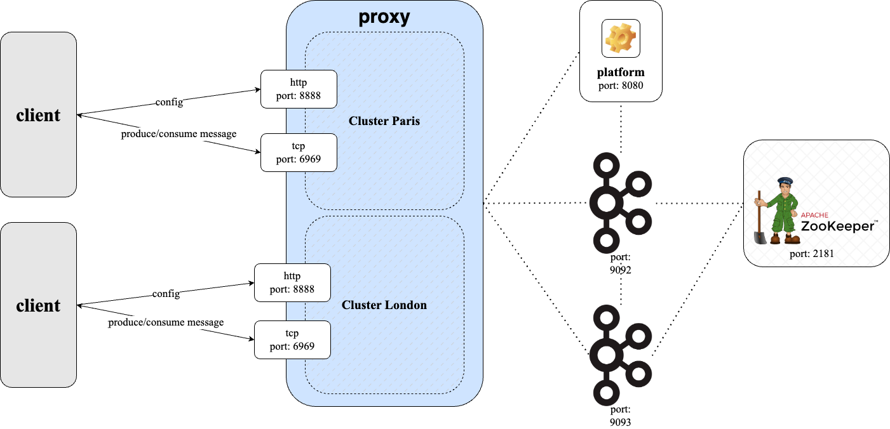

# Interceptors and beyond
So far you have learnt about setting up Gateway as an application and configuring it how you wish to in your environment. Once you have Gateway up, with your applications passing through it to your cluster then what next? Now we get to the interesting part of adding interceptors to inject functionality into your Gateway setup, and multi-tenancy allowing one Kafka cluster to appear as a number of isolated, virtual clusters to clients. Putting this together you can have many clusters/tenants being operated upon separately with no concern of side effects for the others.

To see the available Interceptors, including how to configure them, browse the marketplace at [marketplace.conduktor.io](https://marketplace.conduktor.io/).

To try out the Gateway features for yourself head to the [Gateway demos](https://github.com/conduktor/conduktor-gateway-demos).

For instructions on how to add or update interceptors & virtual clusters, refer to the Gateway [API documentation](https://developers.conduktor.io/).

