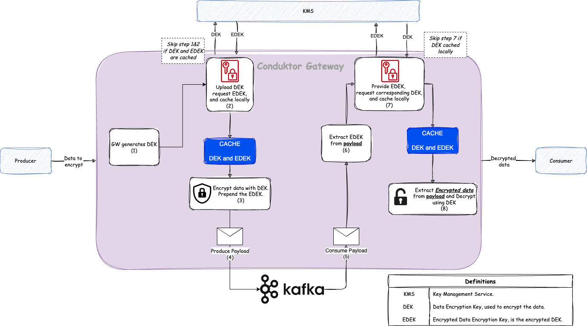

## Table of Contents

1. [Introduction](#introduction)
2. [Encryption and Decryption Processes](#encryption-and-decryption-processes)
3. [Key Management](#key-management)
4. [Encryption on Data with Avro, JSON Schema, and Protocol Buffers](#encryption-on-data-with-avro-json-schema-and-protocol-buffers)
5. [Frequently Asked Quetions](#faq)

## Introduction

This interceptor is designed to provide a robust and flexible solution for encrypting data within your Kafka records.
The primary purpose of this feature is to ensure that sensitive data cannot be read by unauthorized third parties,
thereby enhancing the security of your data both in transit and at rest.

The interceptor supports both field-level and full message encryption. Field-level encryption allows you to encrypt
specific fields within your Kafka records, such as passwords or personal user information. This is particularly useful
when only certain parts of the message are sensitive. Full message encryption, on the other hand, encrypts the entire
Kafka record. This is useful when the entire message needs to be secured.

The encryption process is handled seamlessly by the interceptor, which identifies the data to be encrypted, retrieves the encryption key from the Key Management Service (KMS), encrypts the data, and then sends the encrypted message to its destination. 
The interceptor supports various encryption algorithms and KMS options, providing flexibility to suit your specific requirements.

The interceptor also supports decryption of the encrypted data. This can be done for all fields, specific fields, or the
entire message, depending on your configuration. The decryption process is similar to the encryption process, with the
interceptor identifying the data to be decrypted, retrieving the decryption key from the KMS, decrypting the data, and
then making the decrypted message ready for consumption.

This interceptor is designed to be easy to configure and use, with various examples and detailed configuration options
provided in this document. Whether you need to secure specific fields or entire messages, this interceptor provides a
comprehensive solution for your data encryption needs in Kafka.

## Encryption and Decryption Processes

### How to Encrypt Data

1. Data Identification: The interceptor identifies the data that needs to be encrypted. This could be the entire message
   or specific fields within the message, based on your configuration. For example, if you have specified password as a
   field to be encrypted in the fields configuration, the interceptor will identify this field in the incoming Kafka
   record.
2. Key Retrieval: The interceptor retrieves the encryption key from the Key Management Service (KMS). The KMS could be
   Vault, Azure, AWS, GCP, or an in-memory service, depending on your configuration. The interceptor uses the
   keySecretId specified in the configuration to retrieve the correct key.
3. Encryption: The interceptor encrypts the identified data using the retrieved key and the specified encryption
   algorithm. The encrypted data replaces the original data in the message.
4. Transmission: Encrypted data is converted to json format and sent as a string to the destination.

### How to Decrypt Data

1. Data Identification: The interceptor identifies the data that needs to be decrypted. This could be the entire message
   or specific fields within the message, based on your configuration. The interceptor uses the fields configuration to
   identify which fields need to be decrypted.
2. Key Retrieval: The interceptor retrieves the decryption key from the KMS. This is usually the same key that was used
   for encryption. The interceptor uses the keySecretId specified in the configuration to retrieve the correct key.
3. Decryption: The interceptor decrypts the identified data using the retrieved key and the specified encryption
   algorithm. The decrypted data replaces the encrypted data in the message.
4. Consumption: The decrypted message is then ready for consumption by the end user or application. The interceptor
   ensures that the decrypted data is correctly formatted and compatible with the Kafka record structure.

Please note that the encryption and decryption process is transparent to the end user or application. The interceptor
handles all the operations, allowing you to focus on your core business logic.

## Key Management

### Definitions

| Term | Definition                                                                                                                                       |
|:-----|:-------------------------------------------------------------------------------------------------------------------------------------------------|
| KMS  | Key Management Service                                                                                                                           |
| KEK  | Key Encryption Key, used to encrypt the DEK (Data Encryption Key) and stored in the KMS. Importantly, The KEK is never known to the interceptor. |
| DEK  | Data Encryption Key, used to encrypt the data and was generated by the interceptor.                                                              |
| EDEK | Encrypted Data Encryption Key, the DEK encrypted by the KEK.                                                                                     |

### Envelope Encryption

The interceptor uses the envelope `encryption technique` to encrypt the data. This technique uses two keys, a `KEK` and
a `DEK`. The `KEK` is used to encrypt the `DEK`, which is then used to encrypt the data. The `KEK` is stored in
the `KMS`, while the `DEK` is generated by the interceptor. The `EDEK` is stored alongside the encrypted data then sent
to the destination.

When the data needs to be decrypted, if the `DEK` is not already known to the interceptor is takes the `EDEK` that's
stored with the encrypted data and sends it to the `KMS` to retrieve the `DEK`. The interceptor then uses the `DEK` to
decrypt the data.

To reduce the call to the `KMS`, the interceptor caches the `DEK` in memory. The time to live (TTL) of the cache is
configurable, and the interceptor will call the `KMS` to decrypt the `EDEK` if the `DEK` is not in the cache.

With caching enabled, the interceptor will be able to use old versions of key for encryption when that key is rotated in
the `KMS`. Configuring a low TTL will ensure that the interceptor will use the latest version of the key, but it is a
trade-off between performance (increased calls to `KMS`) and security (using the latest key version).

## Encryption on Data with Avro, JSON Schema, and Protocol Buffers

Encrypting data, regardless of its type, results in a string. This transformation poses a problem for strongly typed serialization formats like Avro, JSON Schema, and Protocol Buffers.
For instance, encrypting a numeric salary value of `10` yields an encrypted string such as `XQS213KKDK2Q`.
This string is incompatible with a schema expecting a numeric type.

### Before 3.3.0 (and later for Protobuf and JSON Schema)

To address this issue, we store all encrypted data in a JSON format. During decryption, we convert the data back to its original format.
If a field cannot be decrypted due to lack of permissions, it is replaced with a default value to maintain schema compatibility.

**Example**
Consider the case of a salary field:

Original value: `10` (integer)
Encrypted value: `XQS213KKDK2Q` (string)
When decrypting: 
- If decryption is successful and the user has the necessary permissions, the salary is restored to its original numeric value.
- If decryption fails due to insufficient permissions, the salary is set to a default value (e.g., 0) instead of the encrypted string.

This approach preserves the data structure's integrity and ensures compatibility with strongly typed systems.

### Starting from 3.3.0 (Avro only)

With the approach detailed above, we saw a few limitations:
- As the data pushed to Gateway are in Avro format, and the consumers expect Avro, the data **must** be decrypted to get back to its expected format.
- The Decryption plugin cannot be applied without decrypting a field. This means that your consumers were not able to consume data in its original format without decrypting at least one field.
- Even if the field encrypted is a string, we still store it as a JSON, even though it is not necessary.

To address these limitations, we reviewed in the 3.3.0 our encryption plugin (on field-level only) to improve its behavior.

This results in a new mode to preserve the record type. When configured via a top level `schemaDataMode` setting to `preserve_avro` (default as of 3.3.0), the plugin will preserve the in-bound message format when it encrypts the data IF the incoming data is Avro, rather than converting the message to JSON (as per previous behaviour).
For Protobuf and JSON Schema, this new setting has no effect (it is ignored).
Existing configuration is still supported, but the default behaviour is now to keep AVRO messages as avro when performing field level encryption.
To fallback on the previous behavior, you can set the `schemaDataMode` to `convert_json`.

So now, if the field type isn't a string, the interceptor will set it to the minimum value of its type (`-2147483648` for integers, `1.4e-45` for floats, etc.) instead of converting it to a JSON object. The encrypted value will be a string, and will be stored in the headers of the record.

## Frequently Asked Questions

### Does the interceptor support key rotation?

Key rotation is an important aspect of cryptographic key management. However, key rotation is not directly supported by
the interceptor. Key rotation is typically handled at the KMS level. When a key is rotated in the KMS, the interceptor
will automatically start using the new key for encryption and decryption.

### Is the KMS called on a per-message basis?

It depends on the configuration. If the interceptor is configured to cache the keys, it will only call the KMS when the
key is not found in the cache. If the interceptor is not configured to cache the keys, it will call the KMS on a
per-message basis. See the [Key Management](#key-management) section for more details.

### What happens if the interceptor is unable to encrypt the message?

If the interceptor is unable to encrypt the message, it will throw an error and the message will not be sent to the
destination. This ensures that sensitive data is always encrypted before it is sent to the destination.

### What happens if the interceptor is unable to decrypt the message?

If the interceptor is unable to decrypt the message, the encrypted message will be returned to the client. It ensures
that sensitive data is not exposed to unauthorized third parties.

### When we talk to the KMS? Do we store the keys in the interceptor?

The interceptor will cache the keys in memory. The time to live (TTL) of the cache is configurable, and the interceptor
will call the KMS to decrypt the key if it is not found in the cache. See the [Key Management](#key-management) section
for more details.

### Can I use encrypted data as the keySecretId?

No, you cannot use encrypted data as the keySecretId. Because the value of a field will be replaced with the encrypted value. So it is not allowed to use the encryption field as the keyId.

### What is the difference between the Encryption on Produce interceptor and the Encryption on Consume interceptor?

The Encryption on Produce interceptor is used to encrypt data before it is sent to the destination. The Encryption on
Consume interceptor is used to decrypt data before it is consumed by the end user or application.
