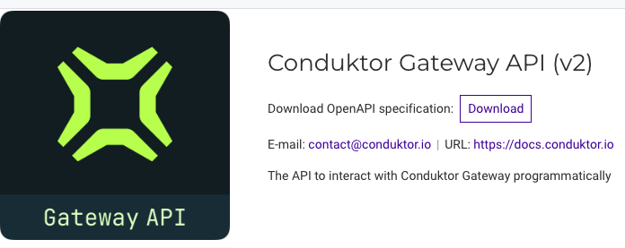

# API Reference

## Overview

The Conduktor Gateway REST API can be used to manage your organizations interceptors and other resources such as virtual clusters, alias topics and topic concentration rules.

**Open API documentation** portal is available on, `/` for the v1 API, and `/gateway/v2` for the v2 API, of your deployment host (e.g. `http://localhost:8888/gateway/v2`).

From within the API documentation, you can **download** the OpenAPI specification. This allows you to import the OpenAPI specification in tools such as [Postman](https://www.postman.com/).

