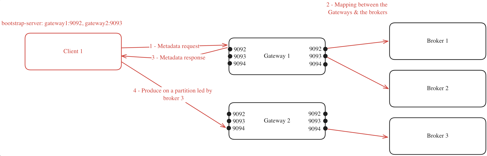
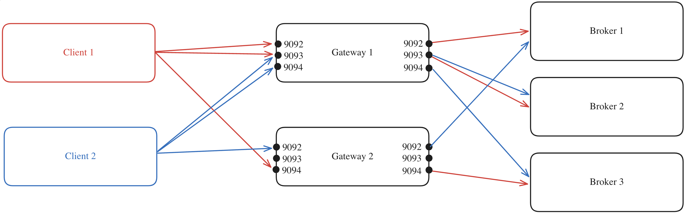
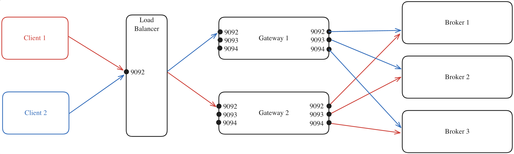

# Gateway - Load Balancing

In order to map the different Gateway nodes sharing the same cluster, and your Kafka brokers, you have two options:

-   Using the Gateway **internal load balancing**
-   Using an **external load balancing**

These options are only for the Kafka protocol, as any of the Gateway nodes can manage HTTP calls to their API.

Depending on your infrastructure, you might prefer one or the other.

## Internal Load Balancing

To deploy multiple Gateway nodes as part of the same Gateway cluster, you need to set the same `GATEWAY_CLUSTER_ID` in each node's deployment configuration. This configuration ensures that all nodes join the same consumer group, enabling them to consume the internal license topic from your Kafka cluster. This is how the nodes recognize each other as members of the same Gateway cluster.

When a client connects to one of the Gateway nodes to request metadata, the following process occurs (assuming `GATEWAY_FEATURE_FLAGS_INTERNAL_LOAD_BALANCING` is set to `true`, which is the default setting):

1.  The client chooses one of the bootstrap servers to ask for metadata
2.  The Gateway node generates a mapping between its cluster nodes and the Kafka brokers
3.  The Gateway node returns this mapping to the client
4.  With the mapping in hand, the client can efficiently route its requests. For instance, if the client needs to produce to a partition where broker 3 is the leader, it knows to forward the request to Gateway 2 on port 9094.

Consider a scenario where you have a Gateway cluster composed of two Gateway nodes, connected to a Kafka cluster with three brokers. The client's metadata discovery process might look like this:

This mapping will be made again for every client asking for metadata, and will be made again as soon as a Gateway node is added or removed from the Gateway cluster.

:::tip
If you have specified a `GATEWAY_RACK_ID`, then the mapping will take this into consideration, and a Gateway node in the same rack as the Kafka broker will be assigned.
:::

### Example with multiple clients

If we add a new client to the diagram above, here is what it could look like:

The process is repeated but will likely result in a different mapping compared to that of Client 1 due to the random assignment performed by the Gateway for the client.

### Limitations

In a Kubernetes environment, your ingress must point at a single service, which could be an external load balancer as detailed below.

## External Load Balancing

Alternatively, you can disable the internal load balancing by setting GATEWAY_FEATURE_FLAGS_INTERNAL_LOAD_BALANCING: false in your Gateway configuration. In this case, you would deploy your own load balancer, such as [HAProxy](https://www.haproxy.org/), to manage traffic distribution.

This would allow you to configure the stickiness of the load balancer as you wish.

This would look like below, where:

1. All client requests are directed to the external load balancer, which acts as the entry point to your Gateway cluster
2. The load balancer forwards each request to one of the Gateway nodes, regardless of the port
3. The selected Gateway node, which knows which broker is the leader of each partition, forwards the request to the appropriate Kafka broker

:::warning
When using an external load balancer, you **must** configure the `GATEWAY_ADVERTISED_LISTENER` of the Gateway nodes to the Load Balancer's hostname. If this is not done, applications will attempt to connect directly to the Gateway, bypassing the Load Balancer.
:::

### Limitations

This requires you to handle load balancing manually, as you won't have the advantage of the automatic load balancing offered by the Gateway's internal load balancing feature.