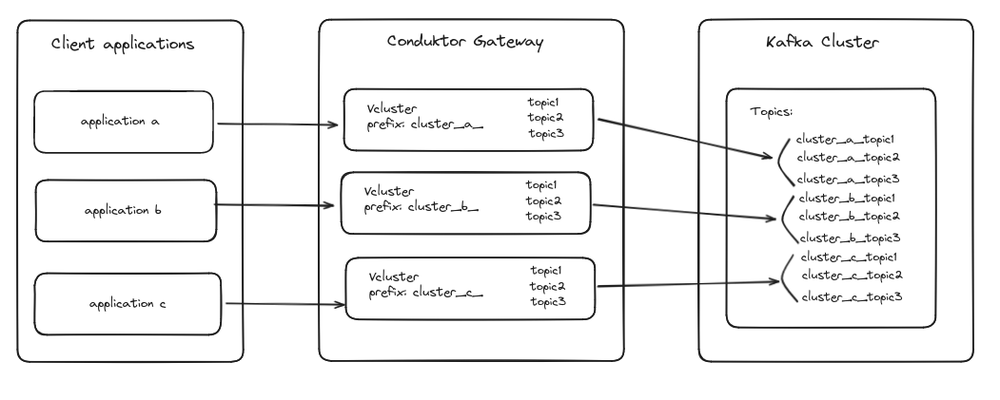
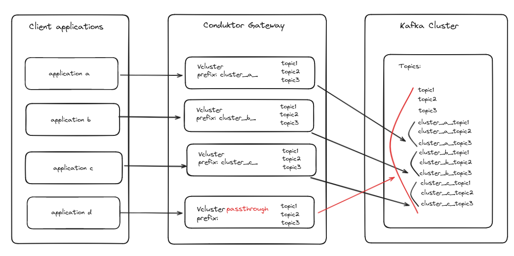

## What is a VCluster
A `VCluster` (or "virtual cluster") is a logical representation of a Kafka cluster in Conduktor Gateway. Thanks to this concept, Conduktor Gateway enables Kafka users to create as many (virtual) clusters as they wish while having only a single physical Kafka cluster deployed.

VClusters are also available when one of the [delegate to Kafka](/gateway/configuration/gateway_security/#delegated_sasl_plaintext) security protocols is used.

## Isolation
The primary goal of VClusters is to multiplex several logical Kafka clusters on a single physical Kafka clusters. For that we need to ensure isolation between the different VClusters (like if we enabled multi-tenancy in Kafka).

To achieve isolation every VCluster has a prefix.
The principle is that any Kafka resource (topic, group id, transactional id) whose key starts with a VCluster's prefix will be accessible from this VCluster.

## Passthrough VCluster
There is one special case, a VCluster with a prefix defined with the special name `passthrough` will not use any prefixing whether it reads or writes in Kafka. As a consequence, every resource on the physical Kafka is potentially accessible in this VCluster.

Since the prefix must be unique, a Gateway instance can only have one single `passthrough` VCluster.

