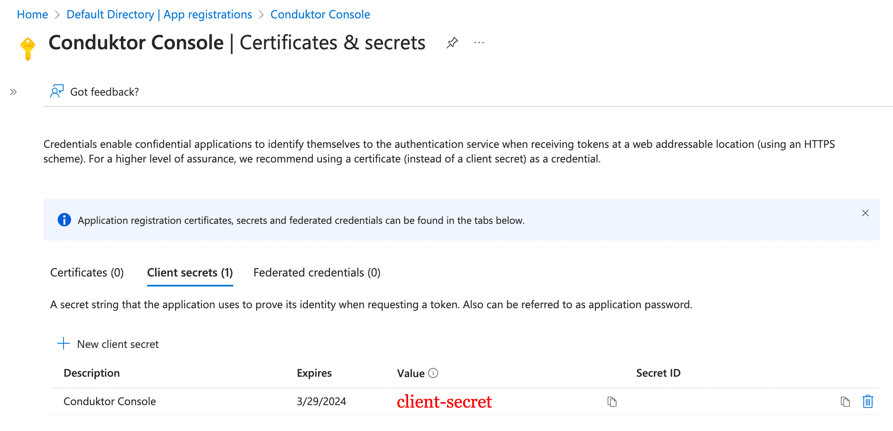
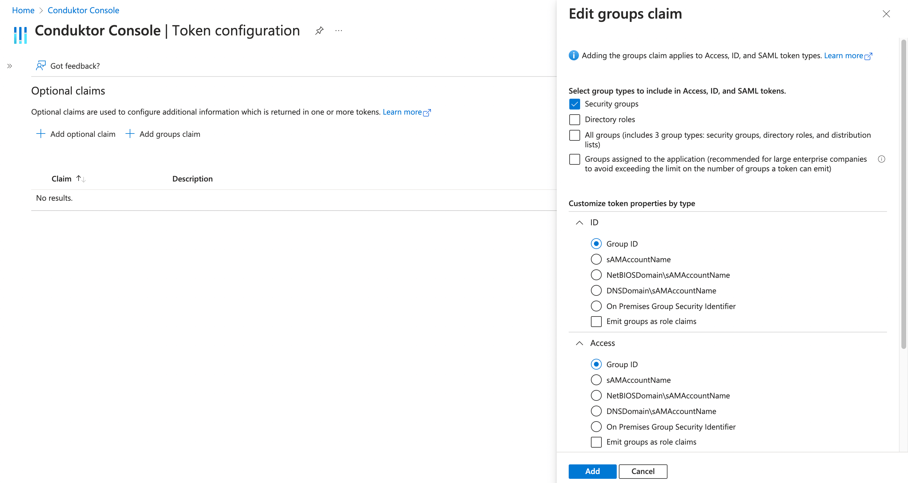

# Configure Azure AD / Entra ID as SSO

In this doc, we will name it Azure AD, but the product has been renamed Entra ID recently.

## Azure AD Configuration

On Azure AD side, you'll have to create a new application:

- **Step 1**: Create a new application in `App registrations` and set the callback URI

You can select the name you want, shown here as `Conduktor Console`, and enter the redirect URI as the following: `http(s)://<Console host>(:<Console port>)/oauth/callback/<OAuth2 config name>`. 

For example, if you deployed Console locally using the name `azure` in your configuration file, you can use `http://localhost:8080/oauth/callback/azure`, like on the screenshot below.

For more details on Console redirect URI for OAuth2, you can check the [documentation](generic-oauth2.md#more-details-on-console-external-url).


- **Step 2**: Create a new client secret from the **Certificates & secrets** tab



:::warning
You need to keep the `Value` somewhere safe, as you will not have access to it again.
:::

- **Step 3**: Find the `client ID` and `tenant ID` in the **Overview** tab


:::note
You can find the .well-known at: `https://login.microsoftonline.com/<tenant ID>/v2.0/.well-known/openid-configuration`.
:::

## Console Configuration

On Console side, you can add the snippet below to your configuration file. You have to replace the client ID, client secret, and tenant ID, with what you got during steps 2 and 3.

import Tabs from '@theme/Tabs'; import TabItem from '@theme/TabItem';

<Tabs>
<TabItem value="YAML  File" label="YAML File">

```yaml title="platform-config.yaml"
sso:
  oauth2:
    - name: "azure"
      client-id: "<client ID>"
      client-secret: "<client secret>"
      openid:
        issuer: "https://login.microsoftonline.com/<tenant ID>/v2.0"
```

</TabItem>
<TabItem value="Environment Variables" label="Environment Variables">

```json title=".env"
CDK_SSO_OAUTH2_0_NAME="azure"
CDK_SSO_OAUTH2_0_DEFAULT=true
CDK_SSO_OAUTH2_0_CLIENT-ID="<client ID>"
CDK_SSO_OAUTH2_0_CLIENT-SECRET="<client secret>"
CDK_SSO_OAUTH2_0_OPENID_ISSUER="https://login.microsoftonline.com/<tenant ID>/v2.0"
```

</TabItem>
</Tabs>

## Groups Configuration

If you want to use the `external groups mapping` to map groups between your Conduktor Console instance and Azure, you must add this claim to your Azure application in the **Token configuration** tab:



:::caution
If you have a **large number of groups** within your enterprise, you might need to [`assign some groups to the application`](https://learn.microsoft.com/en-us/azure/active-directory/manage-apps/assign-user-or-group-access-portal?pivots=portal#assign-users-and-groups-to-an-application), and check the `Groups assigned to the application` box when creating the groups claim on Azure AD. This is to avoid exceeding the limit on the number of groups a token can contain.
:::

Then, you must set the property `groups-claim` to `"groups"` in the Console configuration file. Below is the full snippet for your configuration file:

<Tabs>
<TabItem value="YAML  File" label="YAML File">

```yaml title="platform-config.yaml"
sso:
  oauth2:
    - name: "azure"
      client-id: "<client ID>"
      client-secret: "<client secret>"
      groups-claim: "groups"
      openid:
        issuer: "https://login.microsoftonline.com/<tenant ID>/v2.0"
```

</TabItem>
<TabItem value="Environment Variables" label="Environment Variables">

```json title=".env"
CDK_SSO_OAUTH2_0_NAME="azure"
CDK_SSO_OAUTH2_0_DEFAULT=true
CDK_SSO_OAUTH2_0_CLIENT-ID="<client ID>"
CDK_SSO_OAUTH2_0_CLIENT-SECRET="<client secret>"
CDK_SSO_OAUTH2_0_GROUPS-CLAIM="groups"
CDK_SSO_OAUTH2_0_OPENID_ISSUER="https://login.microsoftonline.com/<tenant ID>/v2.0"
```

</TabItem>
</Tabs>

### External Groups Mapping

Now that your configuration is finished, you can [set up the mapping](/platform/get-started/configuration/user-authentication/external-group-sync/#create-an-external-group-mapping) between Azure AD and Console groups. That way, when a user will log in, they will be automatically added to the corresponding Console groups, based on the groups they belong to in Azure AD.

The value you need to put as an external group is the `Object ID` of the Azure AD group.
