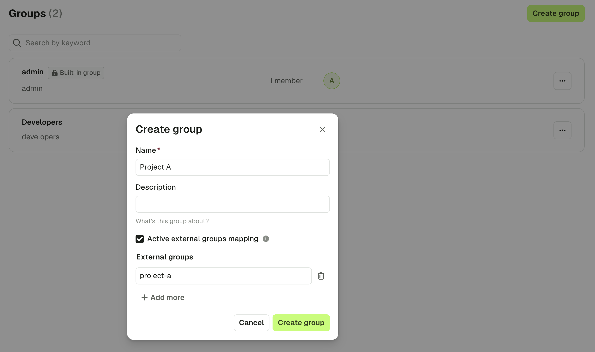
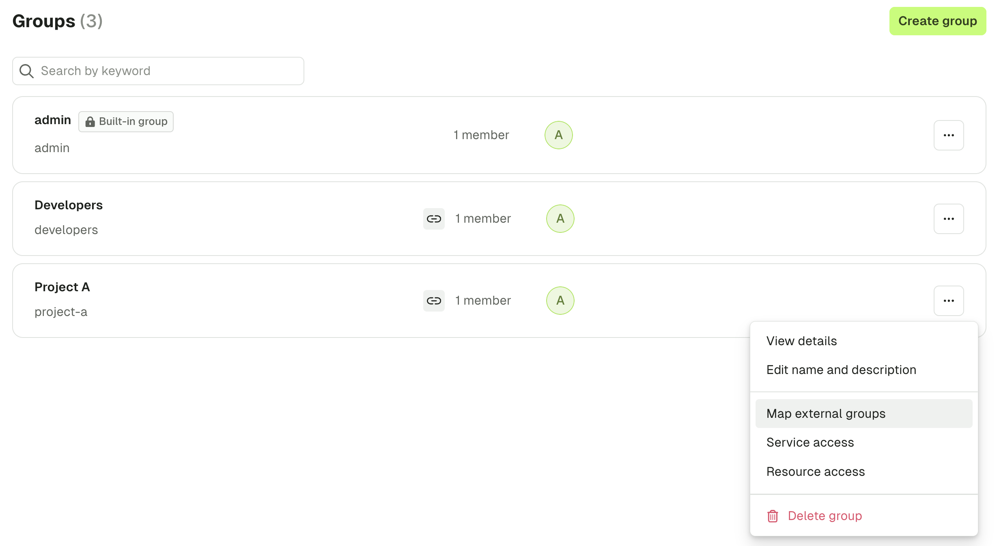

## Overview

External groups mapping allows you to integrate **Conduktor's RBAC system** with your **LDAP or OIDC source of truth**. 
When you map an external group, the **user is added to the Conduktor Console group at login**. 

This mechanism ensures a **user inherits necessary group permissions**, and that they are removed accordingly from Conduktor groups if their external membership changes.

## Prerequisites

You must first configure [SSO](/platform/category/configure-sso/) to an LDAP or OAuth2.0 identity provider. In addition to the properties required for the default configuration, you must also add the relevant group properties and create the scope in your IdP.

### LDAP

For [LDAP](/platform/get-started/configuration/user-authentication/SSO/ldap/), populate the `groups-base` and `groups-filter` attributes.

For more information see [configuration properties and environment variables](/platform/get-started/configuration/env-variables/#ldap-properties).

```yaml title="platform-config.yaml"
sso:
  ldap:
    - name: "default"
      server: "ldap://ldap.test.io:1389"
      managerDn: "cn=admin,dc=conduktor,dc=io"
      managerPassword: "pass"
      search-base: "dc=conduktor,dc=io"
      groups-base: "dc=conduktor,dc=io"
      groups-filter: "member={0}"
```

### OIDC

For OIDC, populate the `groups-claim` attribute. You can find some examples by [selecting your identity providers in this list](/platform/category/configure-sso/).

For more information see [configuration properties and environment variables](/platform/get-started/configuration/env-variables/#oauth2-properties).

```yaml title="platform-config.yaml"
sso:
  oauth2:
    - name: "<IdP>"
      client-id: "<client ID>"
      client-secret: "<client secret>"
      groups-claim: "<groups claim>"
      openid:
        issuer: "<issuer>"
```

## Create an External Group Mapping

Now that LDAP or OIDC is configured, you can create the mapping between external groups and Conduktor groups. You have two options for that:
 - Map a **new Conduktor group** to an external group
 - Map an **existing Conduktor group** to an external group

**Create a new group with an external group mapped**

From within Admin, navigate to the `Users and Groups` screen and select the `Groups` tab. 

 - Provide the `Name`, `Description` and select `Activate external groups mapping`
 - Provide 1 or more LDAP/OIDC groups



In the above example, any users that are present in the group `project-a` in your IdP, will be added to the Conduktor group `Project A`, and will inherit permissions that are set against it. 
To learn how to use Conduktor's RBAC system to enforce permissions, see [RBAC](/platform/navigation/settings/rbac/).

**Map an existing Conduktor group to an external group**

From within the `Groups` screen, select the breadcrumbs next to an existing group and select `Map external groups`.



The value to set depends on the IdP you use. For example, for **Azure**, you must put the `Object ID` of your groups. For **Keycloak**, this is the name of the group.

Once you have mapped external groups, use Conduktor's [RBAC](/platform/navigation/settings/rbac/) system to enforce permissions.
