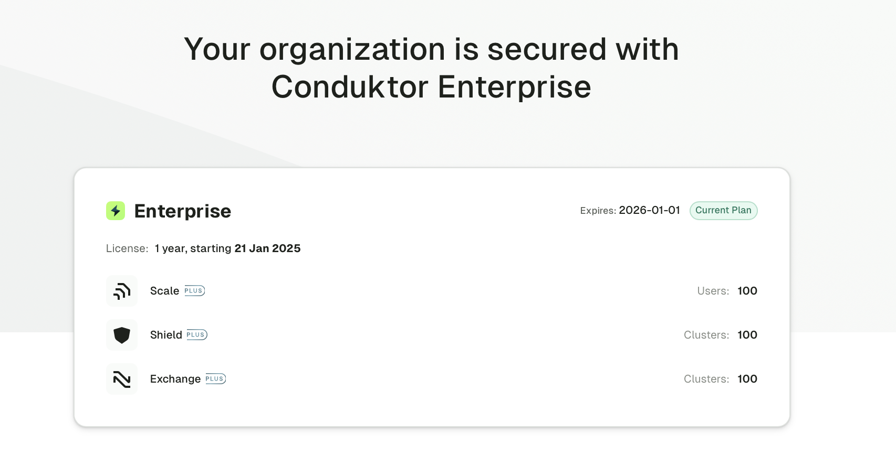

## Apply your license

We recommend applying your license to the environment variables. Alternatively, you can add it to your YAML config file.

import Tabs from '@theme/Tabs'; import TabItem from '@theme/TabItem';

<Tabs>
<TabItem value="Environment Variables" label="Environment variables">

```js title=".env"
CDK_LICENSE='YOUR_LICENSE_HERE'
```

</TabItem>
<TabItem value="YAML  File" label="YAML file">

```yaml title="platform-config.yaml"
license: 'YOUR_LICENSE_HERE'
```

</TabItem>
</Tabs>

:::info[Free access]
You don’t need a license to access the Community version of Conduktor. The Community plan allows you to manage and monitor any number of Kafka clusters but provides only limited access to powerful Conduktor features.

The unlicensed Conduktor Gateway version has a 14-day trial and will stop working when that period ends. [Contact us](https://conduktor.io/contact) to extend your trial or find out about licensing options.
:::

## Verify your license

Use Console to check that your license has been applied correctly. You can do this via the UI or by checking the logs.

### Use the UI

Log into Conduktor Console then go to **Settings** > **Plan**:



### Use the logs

Run Console then check the logs in the head: `License Enterprise is valid until 2026-01-01 00:00:00`.

:::note[Versions before 1.21]
Input configured license : Some("YOUR_LICENSE_HERE")
License is valid ! Remaining days : 365
:::

## Renew or update your license

To renew an existing or apply a new license, change the `CDK_LICENSE` value in the environment variables (or the `license` value in the YAML file, depending on your setup) and re-deploy the Conduktor Console container.
