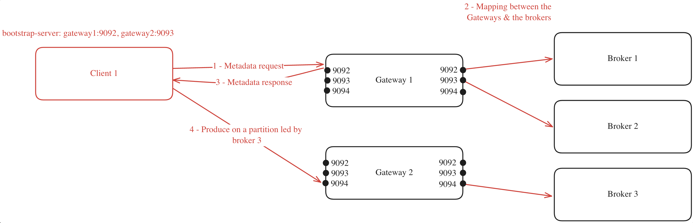
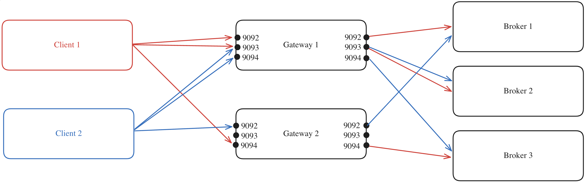
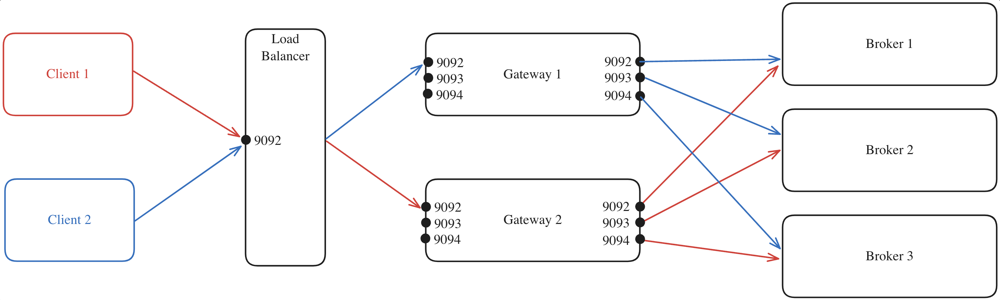
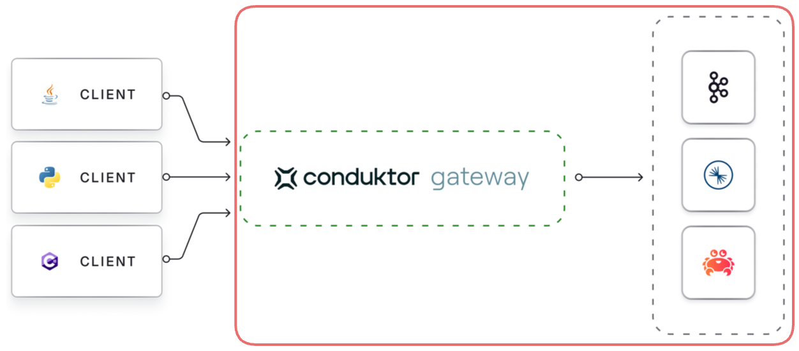

Configuring Conduktor Gateway involves making decisions regarding several subjects.

1. [Configure your network](#1-network-configuration).
1. Define [load balancing](#2-define-load-balancing) requirements.
1. [Connect Gateway to Kafka](#3-connect-gateway-to-kafka).
1. Configure [Gateway to accept client connections](../configuration/client-authentication.md).
1. Decide whether you need [Virtual Cluster](../concepts/virtual-clusters.md) capabilities.

## 1. Network configuration

When configuring Conduktor Gateway for the first time, selecting the appropriate routing method is crucial for optimizing your Kafka proxy setup. Pick one of these solutions depending on your requirements:

Choose [port-based routing](#port-based-routing) if your environment:

- doesn't require TLS encryption
- has flexible network port management capabilities
- prefers a simpler, straightforward configuration without DNS complexities

Choose [host-based routing (SNI)](#host-based-routing-sni) if your environment:

- requires TLS encrypted connections for secure communication
- faces challenges with managing multiple network ports
- seeks a scalable solution with easier management of routing through DNS and host names

### Port-Based routing

In port-based Routing, each Kafka broker is assigned a unique port number and clients connect to the appropriate port to access the required broker.

Gateway listens on as many ports as defined by the environment variable `GATEWAY_PORT_COUNT`. The recommended number of ports in production is **double the amount of the Kafka brokers** (to cover the growth of the Kafka cluster).

Configure port-based routing using the [environment variables](../configuration/env-variables.md#hostport):

- `GATEWAY_ADVERTISED_HOST`
- `GATEWAY_PORT_START`
- `GATEWAY_PORT_COUNT`
- `GATEWAY_MIN_BROKERID`

The default port range values cover the range of the brokerIds with an additional two ports.

The maximum broker ID is requested from the cluster, the min should be set as `GATEWAY_MIN_BROKERID`. E.g., in a three broker cluster with IDs 1, 2, 3, `GATEWAY_MIN_BROKERID` should be set to 1 and the default port count will be 5.

We recommend [SNI routing](#host-based-routing-sni) when not using a sequential and stable broker IDs range to avoid excessive port assignment. E.g., a three broker cluster with IDs 100, 200, 300 with `GATEWAY_MIN_BROKERID`=100 will default to 203 ports and would fail if broker ID 400 is introduced.

### Host-based routing (SNI)

With host-based routing, Gateway listens on a single port and leverages Server Name Indication (SNI) (an extension to the TLS protocol), to route traffic based on the hostname specified in the TLS handshake to determine the target Kafka broker, requiring valid TLS certificates, proper DNS setup, and DNS resolution. [Find out how to set up SNI routing](./tutorials/sni-routing.md).

## 2. Define load balancing

To map the different Gateway nodes sharing the same cluster and your Kafka brokers, you can either use:

- Gateway **internal load balancing** or
- an **external load balancing**

These options are only for the Kafka protocol, as any of the Gateway nodes can manage HTTP calls to their API.

### Internal load balancing

Gateway's ability to distribute the client connections between the different Gateway nodes in the same cluster is what we refer to as internal load balancing. This is done automatically by Gateway and is the default behavior.

To deploy multiple Gateway nodes as part of the same Gateway cluster, you have to set the same `GATEWAY_CLUSTER_ID` in each node's deployment configuration. This configuration ensures that all nodes join the same consumer group, enabling them to consume the internal license topic from your Kafka cluster. This is how the nodes recognize each other as members of the same Gateway cluster.

When a client connects to one of the Gateway nodes to request metadata, the following process occurs (assuming `GATEWAY_FEATURE_FLAGS_INTERNAL_LOAD_BALANCING` is set to `true`, which is the default setting):

1. The client chooses one of the bootstrap servers to ask for metadata.
1. The Gateway node generates a mapping between its cluster nodes and the Kafka brokers.
1. The Gateway node returns this mapping to the client.
1. With the mapping in hand, the client can efficiently route its requests. For instance, if the client needs to produce to a partition where broker 3 is the leader, it knows to forward the request to Gateway 2 on port 9094.

For example, you have a Gateway cluster composed of two Gateway nodes, connected to a Kafka cluster with three brokers. The client's metadata discovery process might look like this:



This mapping will be made again for every client asking for metadata, and will be made again as soon as a Gateway node is added or removed from the Gateway cluster.

:::note
If you have specified a `GATEWAY_RACK_ID`, then the mapping will take this into consideration and a Gateway node in the same rack as the Kafka broker will be assigned.
:::

Here's the same example but with multiple clients:



The process is repeated but will likely result in a different mapping compared to that of Client 1 due to the random assignment performed by the Gateway for the client.

#### Internal load balancing limitations

In a Kubernetes environment, your ingress must point at a single service, which could be an external load balancer as detailed below.

### External load balancing

Alternatively, you can disable the internal load balancing by setting `GATEWAY_FEATURE_FLAGS_INTERNAL_LOAD_BALANCING: false`.

In this case, you would deploy your own load balancer, such as [HAProxy](https://www.haproxy.org/), to manage traffic distribution. This would allow you to configure the stickiness of the load balancer as required.

Here's an example where:

1. All client requests are directed to the external load balancer which acts as the entry point to your Gateway cluster.
1. The load balancer forwards each request to one of the Gateway nodes, regardless of the port.
1. The selected Gateway node, which knows which broker is the leader of each partition, forwards the request to the appropriate Kafka broker.



:::warning
When using an external load balancer, you **must** configure the `GATEWAY_ADVERTISED_LISTENER` of the Gateway nodes to the Load Balancer's hostname. If this isn't done, applications will attempt to connect directly to Gateway, bypassing the Load Balancer.
:::

#### External load balancing limitations

This requires you to handle load balancing manually, as you won't have the advantage of the automatic load balancing offered by Gateway's internal load balancing feature.

## 3. Connect Gateway to Kafka



Gateway depends on a 'backing' Kafka cluster for its operation.

Configuring the Gateway connection to the backing Kafka cluster closely resembles configuring a standard Kafka client's connection to a cluster.

If you've not done so already, it's best to set the [Client to Gateway](/gateway/configuration/client-authentication) configuration variables, that way the Gateway will know how to interact with Kafka based on how authentication is being provided by the clients, the two are related because Gateway must know whether you wish to use [delegated authentication](#delegated-authentication) or not.

The configuration is done via environment variables, as it is for the other aspects of a Gateway configuration.

All environment variables that start with `KAFKA_` are mapped to configuration properties for connecting Gateway to the Kafka cluster.

As Gateway is based on the Java-based Kafka-clients, it supports all configuration properties that Java-clients do.
Kafka configuration properties are mapped to Gateway environment variables as follows:

- Add a `KAFKA_` prefix
- Replace each dot, `.` , with an underscore, `_`
- Convert to uppercase

For example, `bootstrap.servers` is set by the `KAFKA_BOOTSTRAP_SERVERS` environment variable.

### Supported protocols

You can use all the Kafka security protocols to authenticate Gateway to the Kafka cluster; `PLAINTEXT`, `SASL_PLAINTEXT`, `SASL_SSL` and `SSL`.  

These can be used with all SASL mechanisms supported by Apache Kafka: `PLAIN`, `SCRAM-SHA`, `OAuthBearer`, `Kerberos` etc. In addition, we support IAM authentication for AWS MSK clusters.

In the following examples, we provide blocks of environment variables which can be provided to Gateway, e.g. in a docker-compose file, or a `helm` deployment. 

Information which should be customized is enclosed by `<` and `>`.

#### PLAINTEXT

Kafka cluster without authentication or encryption in transit, `PLAINTEXT`.

In this case you just need the bootstrap servers:

```yaml
KAFKA_BOOTSTRAP_SERVERS: <your.kafka.broker-1:9092>,<your.kafka.broker-2:9092>
```

#### SSL

```yaml
GATEWAY_SECURITY_PROTOCOL: PLAINTEXT # Change to relevant client-side value if known
KAFKA_BOOTSTRAP_SERVERS: <your.kafka.broker-1:9092>,<your.kafka.broker-2:9092>
KAFKA_SECURITY_PROTOCOL: SSL
KAFKA_SASL_MECHANISM: PLAIN
KAFKA_SASL_JAAS_CONFIG: org.apache.kafka.common.security.plain.PlainLoginModule required username="<gw-sa-username>" password="<gw-sa-password>";
KAFKA_SSL_TRUSTSTORE_TYPE: <JKS>
KAFKA_SSL_TRUSTSTORE_LOCATION: </path/to/truststore.jks>
KAFKA_SSL_TRUSTSTORE_PASSWORD: <truststore-password>
KAFKA_SSL_KEYSTORE_TYPE: <JKS>
KAFKA_SSL_KEYSTORE_LOCATION: </path/to/keystore.jks>
KAFKA_SSL_KEYSTORE_PASSWORD: <keystore-password>
KAFKA_SSL_KEY_PASSWORD: <key-password>
```

##### mTLS

Kafka cluster with mTLS client authentication.

```yaml
GATEWAY_SECURITY_PROTOCOL: PLAINTEXT # Change to relevant client-side value if known
KAFKA_BOOTSTRAP_SERVERS: <your.kafka.broker-1:9092>,<your.kafka.broker-2:9092>, <your.kafka.broker-3:9092>
KAFKA_SECURITY_PROTOCOL: SSL
KAFKA_SSL_TRUSTSTORE_LOCATION: /security/truststore.jks
KAFKA_SSL_TRUSTSTORE_PASSWORD: conduktor
KAFKA_SSL_KEYSTORE_LOCATION: /security/kafka.gw.keystore.jks
KAFKA_SSL_KEYSTORE_PASSWORD: conduktor
KAFKA_SSL_KEY_PASSWORD: conduktor
```

#### SASL_PLAINTEXT

Kafka cluster with SASL_PLAINTEXT security protocol but no encryption in transit, supporting the following SASL_MECHANISMs.

#### SASL PLAIN

```yaml
GATEWAY_SECURITY_PROTOCOL: PLAINTEXT # Change to relevant client-side value if known
KAFKA_BOOTSTRAP_SERVERS: <your.kafka.broker-1:9092>,<your.kafka.broker-2:9092>
KAFKA_SECURITY_PROTOCOL: SASL_PLAINTEXT
KAFKA_SASL_MECHANISM: PLAIN
KAFKA_SASL_JAAS_CONFIG: org.apache.kafka.common.security.plain.PlainLoginModule required username="<gw-sa-username>" password="<gw-sa-password>";
```

#### SASL SCRAM

```yaml
GATEWAY_SECURITY_PROTOCOL: PLAINTEXT # Change to relevant client-side value if known
KAFKA_BOOTSTRAP_SERVERS: <your.kafka.broker-1:9092>,<your.kafka.broker-2:9092>
KAFKA_SECURITY_PROTOCOL: SASL_PLAINTEXT
KAFKA_SASL_MECHANISM: SCRAM-SHA-256 # or SCRAM-SHA-512
KAFKA_SASL_JAAS_CONFIG: org.apache.kafka.common.security.scram.ScramLoginModule required username="<gw-sa-username>" password="<gw-sa-password>";
```

#### OAuthbearer

```yaml
GATEWAY_SECURITY_PROTOCOL: PLAINTEXT
KAFKA_BOOTSTRAP_SERVERS: <your.kafka.broker-1:9092>,<your.kafka.broker-2:9092>
KAFKA_SECURITY_PROTOCOL: SASL_PLAINTEXT
KAFKA_SASL_MECHANISM: OAUTHBEARER
KAFKA_SASL_OAUTHBEARER_TOKEN_ENDPOINT_URL: "<https://myidp.example.com/oauth2/default/v1/token>"
KAFKA_SASL_LOGIN_CALLBACK_HANDLER_CLASS: org.apache.kafka.common.security.oauthbearer.secured.OAuthBearerLoginCallbackHandler
KAFKA_SASL_JAAS_CONFIG: org.apache.kafka.common.security.oauthbearer.OAuthBearerLoginModule required clientId=“<>” clientSecret=“<>” scope=“.default”;
```

#### SASL_SSL

Kafka cluster that uses SASL for authentication and TLS (formerly SSL) for encryption in transit.

#### PLAIN

Kafka cluster with SASL_SSL and PLAIN SASL mechanism.

#### Confluent Cloud with API key/secret

This example can be seen as a special case of the above.

```yaml
GATEWAY_SECURITY_PROTOCOL: PLAINTEXT # Change to relevant client-side value if known
KAFKA_BOOTSTRAP_SERVERS: <your.cluster.confluent.cloud:9092>
KAFKA_SECURITY_PROTOCOL: SASL_SSL
KAFKA_SASL_MECHANISM: PLAIN
KAFKA_SASL_JAAS_CONFIG: org.apache.kafka.common.security.plain.PlainLoginModule required username="<API_KEY>" password="<API_SECRET>";
```

As Confluent Cloud uses certificates signed by a well-known CA, you normally do not need to specify a trust-store.

Note: In case you are using this in a PoC setting without TLS encryption between *clients* and Gateway, you should set `GATEWAY_SECURITY_PROTOCOL` to `DELEGATED_SASL_PLAINTEXT`. Then clients will be able to authenticate using their own API keys/secrets. Delegated is [explained below](#delegated-authentication).

#### SASL SCRAM

```yaml
GATEWAY_SECURITY_PROTOCOL: PLAINTEXT # Change to relevant client-side value if known
KAFKA_BOOTSTRAP_SERVERS: <your.kafka.broker-1:9092>,<your.kafka.broker-2:9092>
KAFKA_SECURITY_PROTOCOL: SASL_SSL
KAFKA_SASL_MECHANISM: SCRAM-SHA-256 # or SCRAM-SHA-512
KAFKA_SASL_JAAS_CONFIG: org.apache.kafka.common.security.scram.ScramLoginModule required username="<gw-sa-username>" password="<gw-sa-password>";
KAFKA_SSL_TRUSTSTORE_TYPE: <JKS>
KAFKA_SSL_TRUSTSTORE_LOCATION: </path/to/truststore.jks>
KAFKA_SSL_TRUSTSTORE_PASSWORD: <truststore-password>
```

#### SASL GSSAPI (Kerberos)

```yaml
GATEWAY_SECURITY_PROTOCOL: PLAINTEXT # Change to relevant client-side value if known
KAFKA_BOOTSTRAP_SERVERS: <your.kafka.broker-1:9092>,<your.kafka.broker-2:9092>
KAFKA_SECURITY_PROTOCOL: SASL_SSL
KAFKA_SASL_MECHANISM: GSSAPI
KAFKA_SASL_JAAS_CONFIG: com.sun.security.auth.module.Krb5LoginModule required useKeyTab=true storeKey=true keyTab="<>>" principal="<>";
KAFKA_SASL_KERBEROS_SERVICE_NAME: <kafka>
KAFKA_SSL_TRUSTSTORE_TYPE: <JKS>
KAFKA_SSL_TRUSTSTORE_LOCATION: </path/to/truststore.jks>
KAFKA_SSL_TRUSTSTORE_PASSWORD: <truststore-password>
```

#### OAuthbearer

```yaml
GATEWAY_SECURITY_PROTOCOL: PLAINTEXT
KAFKA_BOOTSTRAP_SERVERS: <your.kafka.broker-1:9092>,<your.kafka.broker-2:9092>
KAFKA_SECURITY_PROTOCOL: SASL_SSL
KAFKA_SASL_MECHANISM: OAUTHBEARER
KAFKA_SASL_OAUTHBEARER_TOKEN_ENDPOINT_URL: "<https://myidp.example.com/oauth2/default/v1/token>"
KAFKA_SASL_LOGIN_CALLBACK_HANDLER_CLASS: org.apache.kafka.common.security.oauthbearer.secured.OAuthBearerLoginCallbackHandler
KAFKA_SASL_JAAS_CONFIG: org.apache.kafka.common.security.oauthbearer.OAuthBearerLoginModule required clientId=“<>” clientSecret=“<>” scope=“.default”;
```

### AWS MSK cluster with IAM

```yaml
GATEWAY_SECURITY_PROTOCOL: PLAINTEXT # Change to relevant client-side value if known
KAFKA_BOOTSTRAP_SERVERS: <b-3-public.****.kafka.eu-west-1.amazonaws.com:9198>
KAFKA_SECURITY_PROTOCOL: SASL_SSL
KAFKA_SASL_MECHANISM: AWS_MSK_IAM
KAFKA_SASL_JAAS_CONFIG: software.amazon.msk.auth.iam.IAMLoginModule required;
KAFKA_SASL_CLIENT_CALLBACK_HANDLER_CLASS: io.conduktor.aws.IAMClientCallbackHandler
KAFKA_AWS_ACCESS_KEY_ID: <access-key-id>
KAFKA_AWS_SECRET_ACCESS_KEY: <secret-access-key>
```

### Service account and ACL requirements

Depending on the client to Gateway authentication method you choose, the service account used to connect the Gateway might need different ACLs to operate properly.

#### Delegated authentication

In delegated authentication, the credentials provided to establish the connection between the client and the Gateway are the same used from Gateway to the backing Kafka. As a result, the client will inherit the ACLs of the service account configured on the backing cluster.

On top of that, Gateway needs its own service account with the following ACLs to operate correctly:

- `Read` on internal topics and they should exist
- Describe consumer group for internal topic
- Describe on cluster
- Describe topics for alias topics creation

#### Non-delegated

In non-delegated authentication (Local, Oauth or mTLS), the connection is using Gateway's service account to connect to the backing Kafka.

This service account must have all the necessary ACLs to perform not only these Gateway operations:

- `Read` on internal topics and they should exist
- Describe consumer group for internal topic
- Describe on cluster
- Describe topics for alias topics creation but also all the permissions necessary to serve all Gateway users.

If necessary, you can enable ACLs for non-delegated authentication.

First, configure `GATEWAY_ACL_STORE_ENABLED=true` and then you can use **AdminClient** to maintain ACLs with any service account declared in `GATEWAY_ADMIN_API_USERS`.

## 4. Configure Gateway to accept client connections

## 5. Decide on virtual clusters
