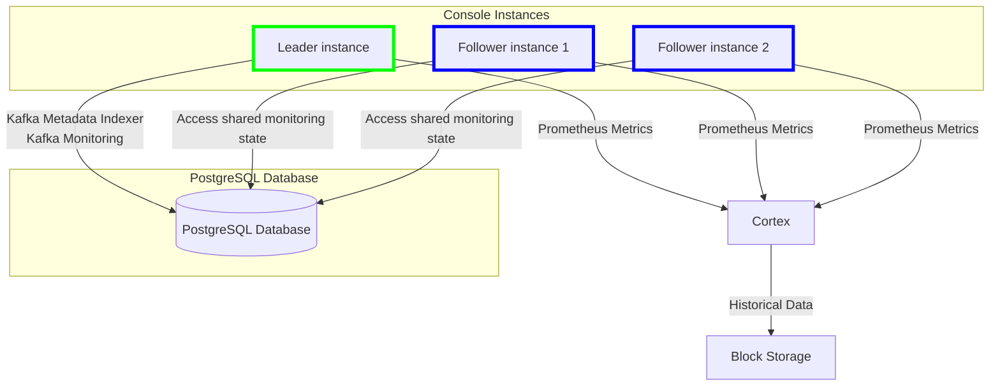

## Hardware

| Component | Usage | RAM | CPU cores | Disk space |
| :------ | :--- | :--- | :--- | :--- |
| Gateway | Light  | 4 GB | 2 | N/A |
| Gateway | Medium | 8 GB | 4 | N/A |
| Console | Min | 3 GB | 2 | 5 GB |

## Gateway requirements

Conduktor Gateway is provided as a [Docker image](../docker) and a [Helm chart](../kubernetes). These are hardware and Kafka requirements for Gateway.

### Minimum setup

Per Gateway node, for light usage:

- 2 CPU cores
- 4 GB of RAM

Running on this level of machine, each Gateway instance should support around 20-30 MB/s of sustained throughput with a minimal effect on latency.

### Recommended starting setup

Per Gateway node, for medium to high usage:

- 4 CPU cores
- 8 GB of RAM

Running on this level of machine, each Gateway instance should support around 40-50 MB/s of sustained throughput with a minimal effect on latency.

For **production setups** we recommended that you **run at least three Gateway instances**. Any further scaling should be done horizontally first: to increase throughput, add instances to the cluster.

### Local storage requirements

Gateway itself doesn't use local storage but certain interceptors, such as [large message handling](/gateway/interceptors/advanced-patterns-support/large-message-and-batch-handling), might require temporary local storage.

### Scaling Gateway

Conduktor Gateway is **designed to scale horizontally or vertically**, as required.

Depending on your needs and use cases, one or both of these methods may be used to get the best out of Conduktor. Multiple instances of Gateway can be run as a cluster and Gateway will handle the load balancing and other work distribution concerns between the nodes in a cluster.

Gateway is predominantly CPU bound - it stores very little, unless you've configured or adjusted the default caching setup. The recommendation here represents a good starting point - to further scale you should use the metrics produced by gateway to tune the installation to your workloads.

### Interceptor impact

Gateway should be tuned to your workloads based on the interceptors you intend to run - they generate most of the CPU load for Gateway.

The interceptors sit in line with the processing of a request, so they affect the end-to-end latency. Some do a lot more work than others. For example, any interceptor that needs to inspect the data being sent (such as field-level encryption or data quality), has a high CPU requirement. This is because the intercepted data has to be de-serialized and re-serialized.

For high CPU loads, you should also add more memory in addition to cores. We recommend to configure 4 GB of RAM per CPU. This provides more headroom for the underlying memory management to run (predominantly for the garbage collection in the JVM).

### Kafka requirements

Conduktor Gateway requires Apache Kafka version to be 2.5.0 or higher, and lower than version 4.0.0.

Gateway should connect to Kafka as an 'admin user'. At a minimum, this user should have access to:

- manage topics and consumer groups
- commit offsets
- describe cluster information

## Console requirements

Conduktor Console is provided as a single Docker container.

### Production requirements

For production environments, there are **mandatory requirements** to ensure your deployment is **reliable**, **durable**, and **can be recovered easily**.

To ensure you meet these requirements, you must:

- Set up an [external PostgreSQL (13+) database](/platform/get-started/configuration/database/) with appropriate backup policy
  - This is used to store data relating to your Conduktor deployment; such as your users, permissions, tags and configurations
  - Note we recommend configuring your PostgreSQL database for [high-availability](#database-connection-fail-over)
- Setup [block storage](/platform/get-started/configuration/env-variables#monitoring-properties) (S3, GCS, Azure, Swift) to store metrics data required for Monitoring
- Meet the [hardware requirements](#hardware-requirements) so that Conduktor has sufficient resources to run without issue
- Running Apache Kafka version 2.5.0 or higher, and lower than version 4.0.0

Note that if you are deploying the [Helm chart](/platform/get-started/installation/get-started/kubernetes/), the [production requirements](/platform/get-started/installation/get-started/kubernetes#production-requirements) are clearly outlined in the installation guide.

### Hardware requirements

To configure Conduktor Console for particular hardware, you can use container CGroups limits. More details [here](/platform/get-started/configuration/memory-configuration)

#### Minimum

- 2 CPU cores
- 3 GB of RAM
- 5 GB of disk space

#### Recommended

- 4+ CPU cores
- 4+ GB of RAM
- 10+ GB of disk space

See more about [environment variables](/platform/get-started/configuration/env-variables/), or starting the Platform in [Docker Quick Start](/platform/get-started/installation/get-started/docker/).

### Deployment architecture

As noted in the [production requirements](#production-requirements), a complete deployment of Console depends on:

- **PostgreSQL database** for storing Platform metadata, [Indexer](/platform/navigation/console/about-indexing/) state, and shared Monitoring state
- Our bespoke [**Cortex image**](/platform/get-started/configuration/cortex/) for metric collection and storage
- **Block storage** for storing historical monitoring data

Below outlines how an external persistent store (PostgreSQL) and a leader election service are used to manage stateful data and monitoring tasks across multiple Console instances.

### State persistence in PostgreSQL

#### Single instance (Pre-Console 1.25.0)

In the pre-1.25.0 architecture, Kafka Monitoring maintained its state in-memory. This posed several problems in a multi-instance setup, such as discrepancies in metrics or failures when trying to distribute monitoring tasks across instances.

#### Multiple instances (Post-Console 1.25.0)

From Console 1.25.0 onwards, the monitoring state is now stored in the external PostgreSQL database, allowing the state to be shared and accessed by all instances of Console. This change brings several advantages:

- **Consistency**: Multiple Console instances can now deployed with a leader elected to handle the stateful components (Kafka [Metadata Indexer](/platform/navigation/console/about-indexing/) and Monitoring).
- **Redundancy & Fault Tolerance**: If the leader instance fails, another instance takes over as the leader, without losing any monitoring data.
- **Prometheus Metrics**: Every Console instance is now capable of exposing [Prometheus metrics](/platform/reference/metric-reference/) through the API. This allows for real-time monitoring of the application regardless of which instance is the leader, as the monitoring state is available to all instances.

### High-Availability limitations

 While the architecture introduced in Console 1.25 greatly improves the **UI layers horizontal scalability**, there are notable limitations related to the use of Cortex for metrics storage.

#### Cortex in standalone mode

The system currently uses Cortex in standalone mode, which does not inherently provide high availability. The implications of this limitation are:

- **Metrics Unavailability**: In the event of a Cortex failure, monitoring data inside Console might not be accessible until the container is restarted.
- **Alerting Unavailability**: In the event of a Cortex failure, alerting functionality inside Console will not be present until the container is restarted.
- **No Redundancy**: Without a multi-node or clustered setup for Cortex, the system lacks the resilience and failover capabilities that are present in other components like Console and PostgreSQL.

#### Database connection fail-over

Since version 1.30 Console supports using multiple database URLs in configuration to achieve high availability (HA). For example, [Connection Fail-over](https://jdbc.postgresql.org/documentation/use/#connection-fail-over) as seen in the case of PostgreSQL.

For Conduktor configuration details see [Multi-host database configuration](docs/platform/get-started/configuration/database.md#multi-host-configuration) which supports multiple hosts.
For Postgresql HA configuration it's best to discuss with your architect, one example is using [Bitnami's postgresql-ha chart](https://github.com/bitnami/charts/blob/main/bitnami/postgresql-ha/README.md#differences-between-the-postgresql-ha-and-postgresql-helm-charts).

In earlier versions we recommend instead that you configure an HA Postgres database where you should specify the single connection URL (e.g. the endpoint of PgBouncer or HAProxy) in the Conduktor Console database configuration. There are several solutions available such as:

- [**Patroni**](https://www.cybertec-postgresql.com/en/patroni-setting-up-a-highly-available-postgresql-cluster/): Automates Postgres replication and failover
- **PgBouncer** or **HAProxy**: For connection pooling and distributing connections across multiple Postgres instances
- **Cloud-managed solutions**: Managed Postgres services like AWS RDS, Google Cloud SQL, or Azure Database for PostgreSQL often provide built-in HA

### Kafka ACL requirements

Conduktor Console requires the following ACLs to take advantage of all the capabilities of the product:

| Permission | Operation | ResourceType   | ResourceName  | PatternType | Description                        |
|------------|-----------|----------------|---------------|-------------|------------------------------------|
| ALLOW      | ALL       | TOPIC          | *             | LITERAL     | Full management of topics          |
| ALLOW      | ALL       | CONSUMER GROUP | *             | LITERAL     | Full management of consumer groups |
| ALLOW      | ALL       | CLUSTER        | kafka-cluster | LITERAL     | Full management of the cluster     |

If you prefer to provide read-only access to Conduktor Console, these are the minimum ACLs required:

| Permission | Operation        | ResourceType   | ResourceName  | PatternType | Description                                                  |
|------------|------------------|----------------|---------------|-------------|--------------------------------------------------------------|
| ALLOW      | DESCRIBE         | TOPIC          | *             | LITERAL     | List topic, fetch metadata                                   |
| ALLOW      | DESCRIBE_CONFIGS | TOPIC          | *             | LITERAL     | See topic configuration                                      |
| ALLOW      | READ             | TOPIC          | *             | LITERAL     | Read data                                                    |
| ALLOW      | DESCRIBE         | CONSUMER GROUP | *             | LITERAL     | List consumer groups and fetch metadata on it                |
| ALLOW      | READ             | CONSUMER GROUP | *             | LITERAL     | Be able to fetch offset definition (used to compute lag)     |
| ALLOW      | DESCRIBE         | CLUSTER        | kafka-cluster | LITERAL     | Describe Kafka ACLs, fetch the amount of data stored on disk |
| ALLOW      | DESCRIBE_CONFIGS | CLUSTER        | kafka-cluster | LITERAL     | Describe cluster/broker configuration                        |
