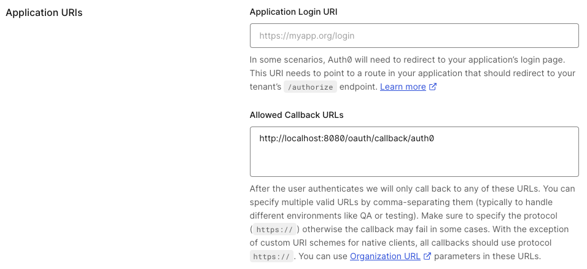

# Configure Auth0 as SSO

## Auth0 Configuration

On Auth0 side, you'll have to create a new application:

- **Step 1**: Create a **Regular Web Application**

import Auth0CreateApp from './assets/auth0-create-app.png';


- **Step 2**: Get the `client ID`, `client secret` and `domain`

import Auth0ClientIdSecretDomain from './assets/auth0-client-id-secret-domain.png';


- **Step 3**: Configure the callback URI

The redirect URI can be like: `http(s)://<Console host>(:<Console port>)/oauth/callback/<OAuth2 config name>`. 

For example, if you deployed Console locally using the name `auth0` in your configuration file, you can use `http://localhost:8080/oauth/callback/auth0`, like in the screenshot below.

For more details on Console redirect URI for OAuth2, you can check the [documentation](/platform/get-started/configuration/user-authentication/SSO/generic-oauth2/#more-details-on-console-external-url).



:::tip
You can find the .well-known at: `https://<domain>/.well-known/openid-configuration`.
:::

:::caution
Do not forget to select how you want to connect via the **Connections** tab of your Auth0 application.
:::

## Console Configuration

On Console side, you can add the snippet below to your configuration file. You have to replace the `client ID`, `client secret`, and `domain`, with what you got during step 2.

import Tabs from '@theme/Tabs'; import TabItem from '@theme/TabItem';

<Tabs>
<TabItem value="YAML  File" label="YAML File">

```yaml title="platform-config.yaml"
sso:
  oauth2:
    - name: "auth0"
      client-id: "<client ID>"
      client-secret: "<client secret>"
      openid:
        issuer: "https://<domain>"
```

</TabItem>
<TabItem value="Environment Variables" label="Environment Variables">

```json title=".env"
CDK_SSO_OAUTH2_0_NAME="auth0"
CDK_SSO_OAUTH2_0_DEFAULT=true
CDK_SSO_OAUTH2_0_CLIENT-ID="<client ID>"
CDK_SSO_OAUTH2_0_CLIENT-SECRET="<client secret>"
CDK_SSO_OAUTH2_0_OPENID_ISSUER="https://<domain>"
```

</TabItem>
</Tabs>
