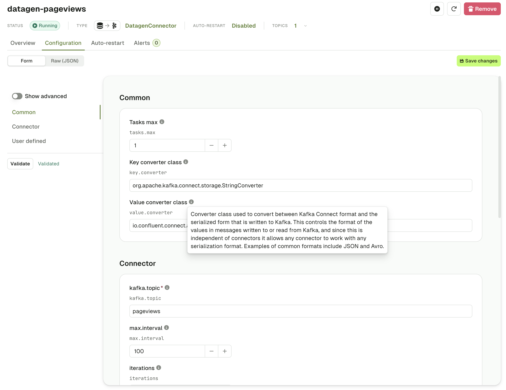
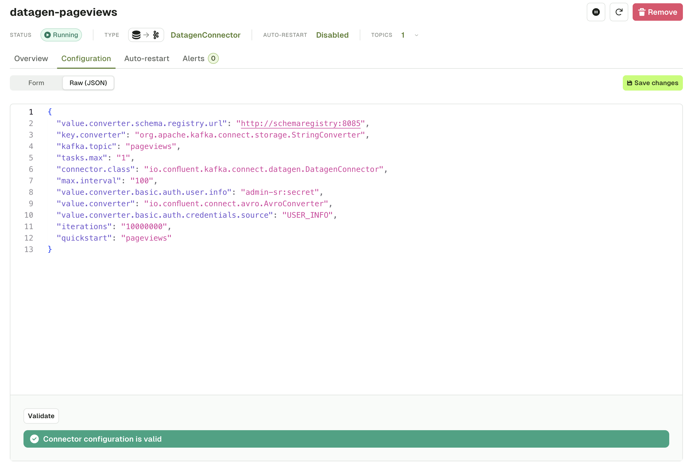

Similar to the Create Connector workflow, the Connector Configuration tab lets you **view** or **edit** your Connector configuration using a wizard which is taking full advantage of the [Kafka Connect Validate API](https://docs.confluent.io/platform/current/connect/references/restapi.html#put--connector-plugins-(string-name)-config-validate):

- A form is generated with structured configuration groups to be filled out
- Supportive error handling is included with each individual field
- Embedded documentation helps you understand which fields are required and what their expected, and default, values are
- Toggle advanced configuration to visualize only the most important fields
- Switch seamlessly between Form View and JSON View at any time

The same configuration as a JSON:

