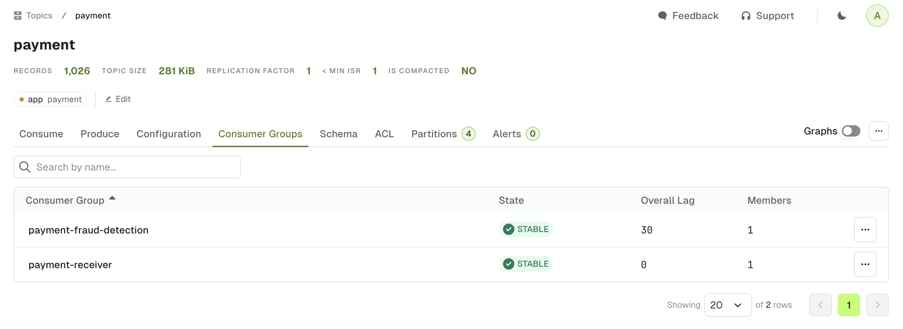
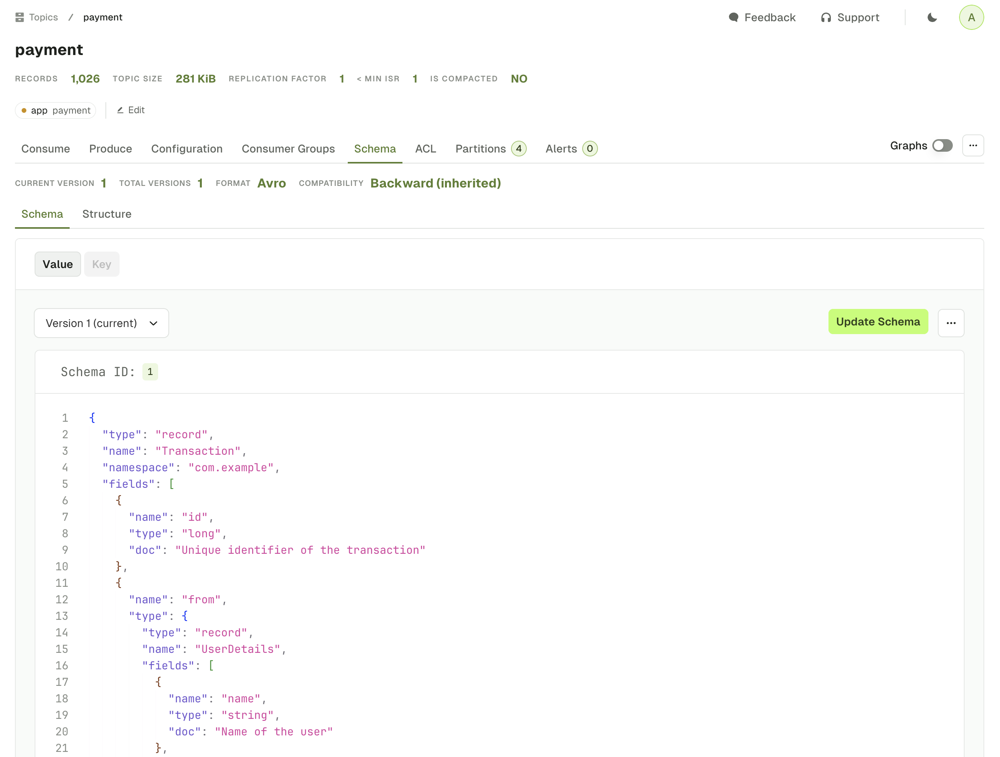
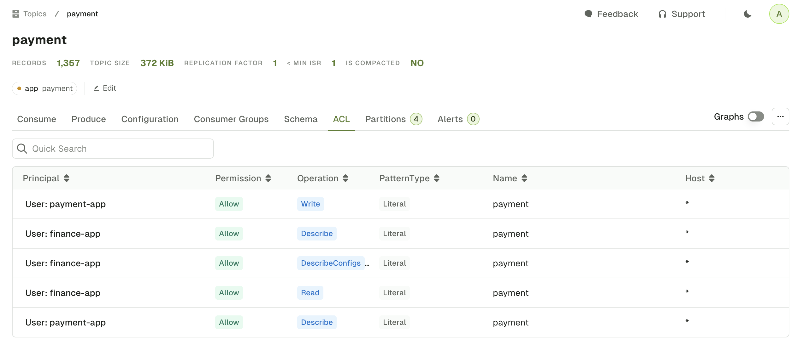

If you need to find related resources, your can use one of the following tabs to display all the Kafka resources associated to this specific topic.

## Linked Consumer Groups

The Topic Consumer Groups tab displays the consumer groups associated to the current Topic.

## Linked Schema Registry Subjects

The Schema tab displays the Key subject and Value subject associated to your topic, assuming your have defined them using [TopicNameStrategy](https://docs.confluent.io/cloud/current/sr/fundamentals/serdes-develop/index.html#how-the-naming-strategies-work).

## Linked ACLs

The ACL tab displays the list of Kafka permissions associated to the current Topic.

:::caution 
Only the permissions from the default Kafka authorizer implementation, AclAuthorizer available using AdminClient are listed currently.  
If you are using one of Console's other supported ACL (Aiven, Confluent Cloud), use the dedicated Service Account page instead.
:::

