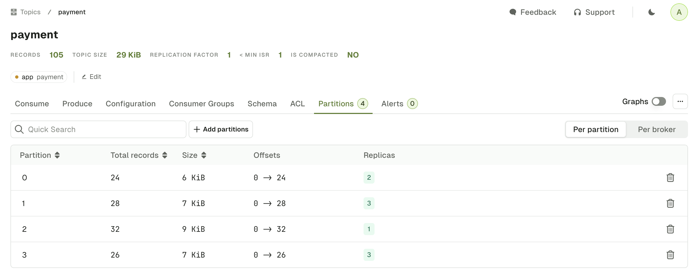
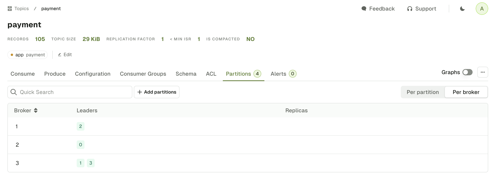

The Topic Partitions tab displays all the partition information associated to the topic.  
You can switch from the default "Per partition" view to the "Per broker" view.  

The **Per partition** view presents the data available for each partition:  
- Total number of records (estimated using EndOffset - BeginOffset)
- Partition Size
- Begin and End Offsets
- Broker Ids of the Partition Leader (green) and Followers (grey)

The **Per broker** view pivots the data to show for each broker:  
- Partitions where the broker is Leader
- Partitions where the broker is Follower

## Operations
### Empty Partition
On the Per partition view, you can click on the bin icon to remove the Kafka records from this specific partition.

:::tip
If you need to delete all records from all partitions, click on the `...` icon above the Per partition / Per broker switch, and select **Empty Topic**.
:::
