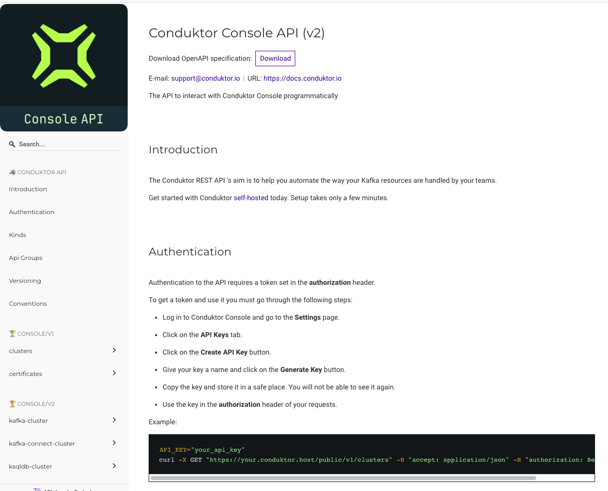

# API Reference

## Overview

The Conduktor HTTP API can be used to manage your organizations Users, Groups and their associated Permissions. Additionally, it can be used to interact with Kafka resources that are added to your organization such as Clusters and Certificates.

**Open API documentation** portal documents all endpoints for the API. The API doc for the running version is available on `/docs` of your deployment host (e.g. `http://localhost:8080/docs`), or the latest is available online at [developers.conduktor.io](https://developers.conduktor.io).

## Access the Open API specification

Only members of the Admin group can generate API keys and access the API.

From within the API documentation portal, you can **download** the OpenAPI specification. This allows you to import the OpenAPI specification in tools such as [Postman](https://www.postman.com/).



## Generate an API key

To start using the Conduktor API, you can navigate to the 'API Keys' tab in [Settings](/platform/navigation/settings/api-key/), or [from the CLI](/platform/reference/cli-reference/#token).

## Example request

The following example lists the permissions associated with your group "project-a".

```bash
curl -X GET http://localhost:8080/public/v1/groups/project-a/permissions -H "Authorization: Bearer {token}"
[
    {
        "clusterId": "local",
        "topicPattern": "projectA-*",
        "permissions": [
            "topicConsume",
            "topicViewConfig"
        ],
        "resourceType": "Topic"
    },
    {
        "clusterId": "local",
        "consumerGroupPattern": "projectA-*",
        "permissions": [
            "consumerGroupView"
        ],
        "resourceType": "ConsumerGroup"
    }
]
```
