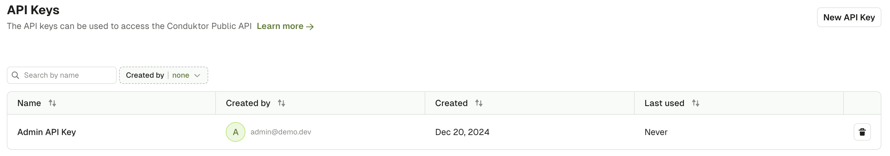
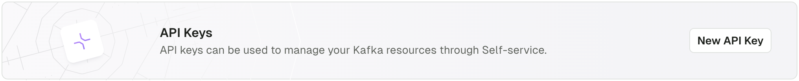

import Tabs from '@theme/Tabs';
import TabItem from '@theme/TabItem';

# CLI reference

Conduktor CLI gives you the ability to perform some operations directly from your command line or a CI/CD pipeline.  
Check for the list of supported resources and their definition in the dedicated [Resources reference](/platform/reference/resource-reference/) page.

[Read more](https://docs.conduktor.io/platform/navigation/self-serve/) about how the CLI can be used for Kafka Self-service.

## Install & Configure

You have 2 options to Install Conduktor CLI.
- [**Native binary**](#native-binary) for individual use and testing
- [**Docker**](#docker) build for integration in CI/CD pipelines

### Native binary
**From Github (Windows, Linux, MacOS)**  
Download Conduktor CLI from the [Releases page on GitHub](https://github.com/conduktor/ctl/releases).  
In the Assets lists, download the build that corresponds to your machine (`darwin-arm64` for Apple Silicon)  
  
**Brew (MacOS)**
````
brew install conduktor/brew/conduktor-cli
````
### Docker
````
docker pull conduktor/conduktor-ctl
````

### Configure

To use Conduktor CLI, you need to define 2 environment variables:
- The URL of Conduktor Console
- Your API Key

````bash
export CDK_BASE_URL=http://localhost:8080
export CDK_API_KEY=<your-api-key>
````

There are 3 types of API Keys:
- [Admin API Keys](#admin-api-key)
- [Self-Service Application API Keys](#self-service-application-api-key)
- [Short-lived User API Keys](#short-lived-user-api-keys)

:::note
Use a Short-lived User API Key to bootstrap the first Admin Key
:::

#### Admin API Key
Admin API Keys grant the maximum permissions on Console.  
They are generated either from the UI or using the CLI.

<Tabs>
<TabItem  value="CLI" label="CLI">

````bash
# Generate a key named my-admin-key
$ conduktor token create admin my-admin-key
AWpw1sZZC20=.29Qb9KbyeQTrewMtnVDYAprxmYo7MUQats2KHzVhx+B/kGOBuIoH8CMsjOcvolUjLKFqbQNSvY0/98wb8mqxU4NwQTSgbSSAlLxau3caByHR6/X9EeqQdj3Lhf0xCzh87/GxYK5JG2DI1VWj55A6xcH++ottyG909PwuGe/GIwgfxX3FKaopg8hxgUmPJNRSWqX+75a8eQi014J4YxuTD7w+723kOQBTXOysfGUaYnfwCCjPPmSWXEEqy5wkH2NS+jXi3S6+fH0ts8CoqvV6Z8YLmBupdMgCtJ9MVBYeDarIzQw6XY7yNuypUqer0dcd9B3KyVR8ecNpFiF7ybvP4g==
````

</TabItem>
<TabItem value="GUI" label="UI">
Navigate to Settings / API Keys

Select **New API Key** to generate a new API key.


</TabItem>
</Tabs>

<hr />

#### Self-service Application API Key
Self-service Application API Key permissions are limited to the scope of the [ApplicationInstance](/platform/reference/resource-reference/self-service/#application-instance) for which they have been generated.  
Check the [Self-service documentation](/platform/navigation/self-serve/) for more details.  
They can be obtained either from the UI or using the CLI.

<Tabs>
<TabItem  value="CLI" label="CLI">

````bash
$ conduktor token create application-instance -i=<my-app-instance> my-app-instance-key
AWpw1sZZC20=.29Qb9KbyeQTrewMtnVDYAprxmYo7MUQats2KHzVhx+B/kGOBuIoH8CMsjOcvolUjLKFqbQNSvY0/98wb8mqxU4NwQTSgbSSAlLxau3caByHR6/X9EeqQdj3Lhf0xCzh87/GxYK5JG2DI1VWj55A6xcH++ottyG909PwuGe/GIwgfxX3FKaopg8hxgUmPJNRSWqX+75a8eQi014J4YxuTD7w+723kOQBTXOysfGUaYnfwCCjPPmSWXEEqy5wkH2NS+jXi3S6+fH0ts8CoqvV6Z8YLmBupdMgCtJ9MVBYeDarIzQw6XY7yNuypUqer0dcd9B3KyVR8ecNpFiF7ybvP4g==
````

</TabItem>
<TabItem value="GUI" label="UI">

Navigate to Applications, pick your Application, then under Application Instances tabs, you will find a button to generate an API Key:


</TabItem>
</Tabs>

#### Short-lived User API Keys
This type of API Key have the permissions of the user who created it.  
It can only be generated from the CLI, and it only works for Local Users or LDAP users.  
Short-lived User API Keys will be valid for the same duration as the [Session Lifetime](/platform/get-started/configuration/user-authentication/session-lifetime/).  
**OIDC users can't generate this type of API Key.**  

````bash
export CDK_USER=admin@conduktor.io
export CDK_PASSWORD=admin
$ conduktor login
AWpw1sZZC20=.29Qb9KbyeQTrewMtnVDYAprxmYo7MUQats2KHzVhx+B/kGOBuIoH8CMsjOcvolUjLKFqbQNSvY0/98wb8mqxU4NwQTSgbSSAlLxau3caByHR6/X9EeqQdj3Lhf0xCzh87/GxYK5JG2DI1VWj55A6xcH++ottyG909PwuGe/GIwgfxX3FKaopg8hxgUmPJNRSWqX+75a8eQi014J4YxuTD7w+723kOQBTXOysfGUaYnfwCCjPPmSWXEEqy5wkH2NS+jXi3S6+fH0ts8CoqvV6Z8YLmBupdMgCtJ9MVBYeDarIzQw6XY7yNuypUqer0dcd9B3KyVR8ecNpFiF7ybvP4g==
````

## Commands Usage
````
Usage:
  conduktor [flags]
  conduktor [command]

Available commands:
  apply              Upsert a resource on Conduktor
  completion         Generate the autocompletion script for the specified shell
  delete             Delete resource of a given kind and name
  get                Get resource of a given kind
  help               Help about any command
  login              Login user using username password to get a JWT token
  run                run an action
  sql                
  template           Get a .yaml example for a given kind
  token              Manage Admin and Application Instance tokens
  version            Display the version of Conduktor

Flags:
  -h, --help         help for  Conduktor
      --permissive   permissive mode, allow undefined environment variables
  -v, --verbose      show more information for debugging

Use "conduktor [command] --help" for more information about a command.
````

### Apply

The `apply` command allows you to deploy any resource.

````
Usage:
   conduktor apply [flags]

Flags:
      --dry-run            Don't really apply change but check on backend the effect if applied
  -f, --file stringArray   Specify the files to apply
  -h, --help               help for apply

Global Flags:
  -v, --verbose   Show more information for debugging
````

Example:
````
$ conduktor apply -f .
application/clickstream-app: NotChanged
app-instance/clickstream-app-dev: NotChanged
````

### Template

The `template` command allows you to get an example of a resource definition:
```
$ conduktor template topic                                                                                                                                                       
---
apiVersion: v2
kind: Topic
metadata:
    name: my-topic
    cluster: my-cluster
    labels:
        user-labels: I am a user label
    catalogVisibility: PUBLIC
    descriptionIsEditable: true
    description: This is a topic description
    sqlStorage:
        retentionTimeInSecond: 42
spec:
    partitions: 1
    replicationFactor: 1
    configs:
        cleanup.policy: delete
        retention.ms: '86400000'
```

You can also save the output in a file, in order to edit it before applying it:
```
conduktor template KafkaCluster -o definition.yml
conduktor template Topic >> definition.yml   #Appending to a already existing files
vim definition.yml # (or any other text editor you like)
conduktor apply -f
```


### Delete

The `delete` command allows you to delete a resource.

Please note that the resources are deleted instantly and cannot be recovered once deleted. Any data or access associated with the resource is permanently lost.

Example(s):
````
$ conduktor delete -f ./directoryOfResources
$ conduktor delete -f resource.yml
$ conduktor delete topic myTopic
````

### Get

```
$ conduktor get user --help
If name not provided it will list all resource

Usage:
  conduktor get user [name] [flags]

Aliases:
  User, user

Flags:
  -h, --help            help for User
  -o, --output output   Output format. One of: json|yaml|name (default yaml)

Global Flags:
  -v, --verbose   show more information for debugging
```

Examples:
```
$ conduktor get app-instance
$ conduktor get app-instance clickstream-app-dev
```

#### Select the output format

By using the flag `--output` or `-o`, you can select the output format of the command.

<Tabs>
  <TabItem value="YAML" label="YAML">

    ```yaml title="conduktor get user -o yaml"
    ---
    apiVersion: v2
    kind: User
    metadata:
      name: alice@demo.dev
    spec:
      permissions:
        - resourceType: TOPIC
          cluster: underlying-kafka
          name: alice-
          patternType: PREFIXED
          permissions:
            - topicViewConfig
            - topicConsume
    ---
    apiVersion: v2
    kind: User
    metadata:
      name: bob@demo.dev
    spec:
      permissions:
        - resourceType: TOPIC
          cluster: underlying-kafka
          name: bob-
          patternType: PREFIXED
          permissions:
            - topicViewConfig
            - topicConsume
    ---
    apiVersion: v2
    kind: User
    metadata:
      name: admin@demo.dev
    spec: {}
    ```

  </TabItem>
  <TabItem value="JSON" label="JSON">

    ```json title="conduktor get user -o json"
    [
      {
        "apiVersion": "v2",
        "kind": "User",
        "metadata": {
          "name": "alice@demo.dev"
        },
        "spec": {
          "permissions": [
            {
              "resourceType": "TOPIC",
              "cluster": "underlying-kafka",
              "name": "alice-",
              "patternType": "PREFIXED",
              "permissions": [
                "topicViewConfig",
                "topicConsume"
              ]
            }
          ]
        }
      },
      {
        "apiVersion": "v2",
        "kind": "User",
        "metadata": {
          "name": "bob@demo.dev"
        },
        "spec": {
          "permissions": [
            {
              "resourceType": "TOPIC",
              "cluster": "underlying-kafka",
              "name": "bob-",
              "patternType": "PREFIXED",
              "permissions": [
                "topicViewConfig",
                "topicConsume"
              ]
            }
          ]
        }
      },
      {
        "apiVersion": "v2",
        "kind": "User",
        "metadata": {
          "name": "admin@demo.dev"
        },
        "spec": {}
      }
    ]
    ```

  </TabItem>
  <TabItem value="List of names" label="List of names">

    ```txt title="Conduktor get user -o name"
    User/alice@demo.dev
    User/bob@demo.dev
    User/admin@demo.dev
    ```

  </TabItem>
</Tabs>

### Token

```bash
# To create an Admin API Key, you need to set either `CDK_API_KEY` or `CDK_USER`/`CDK_PASSWORD`:
$ conduktor token create admin my_first_admin_token
AWpw1sZZC20=.29Qb9KbyeQTrewMtnVDYAprxmYo7MUQats2KHzVhx+B/kGOBuIoH8CMsjOcvolUjLKFqbQNSvY0/98wb8mqxU4NwQTSgbSSAlLxau3caByHR6/X9EeqQdj3Lhf0xCzh87/GxYK5JG2DI1VWj55A6xcH++ottyG909PwuGe/GIwgfxX3FKaopg8hxgUmPJNRSWqX+75a8eQi014J4YxuTD7w+723kOQBTXOysfGUaYnfwCCjPPmSWXEEqy5wkH2NS+jXi3S6+fH0ts8CoqvV6Z8YLmBupdMgCtJ9MVBYeDarIzQw6XY7yNuypUqer0dcd9B3KyVR8ecNpFiF7ybvP4g==

# List admin API Keys
$ conduktor token list admin
my_first_admin_token    1233ff18-0e95-4638-b3fc-f55e20088b8d
other_admin_token       86cefd40-4d61-4290-8aa7-28c4f4d26079

# Delete an API Key
$ conduktor token delete 1233ff18-0e95-4638-b3fc-f55e20088b8d

# Create a Self-service API Key
$ conduktor token create application-instance -i=my_instance my_token_for_my_instance
AWpw1sZZC20=.29Qb9KbyeQTrewMtnVDYAprxmYo7MUQats2KHzVhx+B/kGOBuIoH8CMsjOcvolUjLKFqbQNSvY0/98wb8mqxU4NwQTSgbSSAlLxau3caByHR6/X9EeqQdj3Lhf0xCzh87/GxYK5JG2DI1VWj55A6xcH++ottyG909PwuGe/GIwgfxX3FKaopg8hxgUmPJNRSWqX+75a8eQi014J4YxuTD7w+723kOQBTXOysfGUaYnfwCCjPPmSWXEEqy5wkH2NS+jXi3S6+fH0ts8CoqvV6Z8YLmBupdMgCtJ9MVBYeDarIzQw6XY7yNuypUqer0dcd9B3KyVR8ecNpFiF7ybvP4g==

# List Self-service API Keys
$ conduktor token list application-instance -i=my_instance
```

### Version
Check the current version of your CLI using this command
````
$ conduktor version
Version: v0.3.0
Hash: 9911cbe9b956095ea29394fb1f7da95d39d0625f
````

## Integrate Conduktor CLI with your CI/CD

Conduktor CLI can be easily integrated to a CI/CD pipeline.

This example presents 2 pipelines:
- The first one triggers on each new PR and launches the CLI using the `--dry-run` flag, generating a report confirming that the resources can be successfully created or modified.
- The second one triggers on a push to the `main` branch, making the changes live.

Consider the following folder structure:
````
├── resources/
│   ├── topics.yml          # Your topics are there
|   ├── permissions.yml     # Your permissions to other Apps are there
````

<Tabs>
<TabItem value="github" label="Github Actions">


```yaml title=".github/workflows/on-pr.yml"

name: Check PR Validity
on:
  pull_request:
    branches: [ "main" ]
  workflow_dispatch:
jobs:
  build:
    runs-on: ubuntu-latest
    container: conduktor/conduktor-ctl
    steps:
      - uses: actions/checkout@v3
      - run: /bin/conduktor apply -f resources/ --dry-run
        env:
          CDK_BASE_URL: https://conduktor.domain.com
          CDK_API_KEY: ${{ secrets.CONDUKTOR_TOKEN }}
```

```yaml title=".github/workflows/on-push.yml"
name: Execute committed changes
on:
  push:
    branches: [ "main" ]
jobs:
  build:
    runs-on: ubuntu-latest
    container: conduktor/conduktor-ctl
    steps:
      - uses: actions/checkout@v3
      - run: /bin/conduktor apply -f resources/
        env:
          CDK_BASE_URL: https://conduktor.domain.com
          CDK_API_KEY: ${{ secrets.CONDUKTOR_TOKEN }}
```

</TabItem>
<TabItem value="gitlab" label="Gitlab CI/CD">
    

```yaml title=".gitlab-ci.yml"
conduktor-pr:
  only:
    - merge_requests
  stage: deploy
  image:
    name: conduktor/conduktor-ctl
    entrypoint: [""] 
  variables:
    - export CDK_BASE_URL=https://conduktor.domain.com
    - export CDK_API_KEY=${CONDUKTOR_TOKEN}
  script:
    - /bin/conduktor apply -f resources/ --dry-run

conduktor-main:
  only:
    refs:
      - main
  stage: deploy
  image:
    name: conduktor/conduktor-ctl
    entrypoint: [""] 
  variables:
    - export CDK_BASE_URL=https://conduktor.domain.com
    - export CDK_API_KEY=${CONDUKTOR_TOKEN}
  script:
    - /bin/conduktor apply -f resources/
```
    

</TabItem>
</Tabs>


### Using Environment Variables for Secrets
When reading YAML manifests, the Conduktor CLI searches for `${ENV}` patterns and replaces them using environment variables matching the `ENV` name.
It also supports default values as fallback using POSIX notation `${ENV:-default}`.

It will fail if an environment variable is not found or set to empty, unless the `--permissive` flag is set e.g. `conduktor apply -f clusters.yaml --permissive`. In which case when an env var is blank or is missing, then it will be replaced with an empty string.

See below example for a Conduktor cluster configuration, where the credentials to the cluster are hidden.

```yaml
apiVersion: console/v2
kind: KafkaCluster
metadata:
  name: my-cluster
spec:
  displayName: "My Kafka Cluster"
  icon: "kafka"
  color: "#000000"
  bootstrapServers: "localhost:9092"
  ignoreUntrustedCertificate: false
  properties:
    sasl.jaas.config: org.apache.kafka.common.security.plain.PlainLoginModule required username="${ENV_VAR_FOR_USER}" password="${ENV_VAR_FOR_PASSWORD}";
    security.protocol: SASL_SSL
    sasl.mechanism: PLAIN
  schemaRegistry:
    type: "ConfluentLike"
    url: http://localhost:8080
    security:
      type: BasicAuth
      username: ${ENV_VAR_FOR_USER}
      password: ${ENV_VAR_FOR_PASSWORD}
    ignoreUntrustedCertificate: false
  kafkaFlavor:
    type: "Confluent"
    key: "${ENV_VAR_CONFLUENT_KEY}"
    secret: "${ENV_VAR_CONFLUENT_SECRET}"
    confluentEnvironmentId: "${ENV_VAR_CONFLUENT_ENV_ID:-dev}"
    confluentClusterId: "${ENV_VAR_CONFLUENT_CLUSTER_ID:-main}"
```
