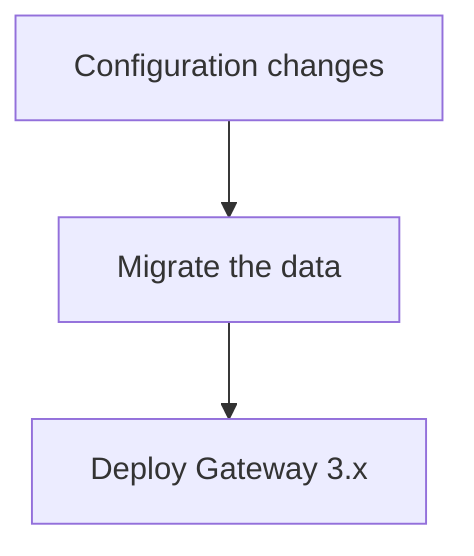

Upgrade to the latest Conduktor version.

## Release cadence

Conduktor provides a new release roughly every month. We suggest that upgrades are done no more than two versions apart at a time.

[Subscribe to get notified about new releases](https://support.conduktor.io/hc/en-gb/articles/20131942687889-How-to-get-notified-when-there-is-a-new-version-of-Conduktor-Console-or-Gateway).

## Console upgrade process

Conduktor is released as a Docker container. To upgrade from one release to the next (in production):

1. Make a database dump (just in case you need to roll-back).

1. Pull the latest image from Docker hub:

```bash
docker pull conduktor/conduktor-console
```

1. Change the version of your container (either in your docker-compose, or helm chart) and deploy it again.

1. Check the logs and the UI to ensure the upgrade was successful.

## Gateway migration guide

Migrating Gateway from v2.x to a 3.x.
---

#### Steps: 



##### 1. Configuration changes

###### 1.1 Internal topics renaming

In Gateway 3.x, the default internal topics have been changed to be prefixed with **\_conduktor_gateway_** 

As a consequence, existing 2.x topics must be explicitly given via the environment configuration.


* Add

| Environment variable               | Value to set <br/> if you did not customize topic names in 2.x | Value to set <br/> if you customized topic names in 2.x                        |
|------------------------------------|----------------------------------------------------------------|--------------------------------------------------------------------------------|
| GATEWAY_TOPIC_MAPPINGS_TOPIC       | _conduktor_gateway_topicmappings                               | N/A                                                                            |
| GATEWAY_INTERCEPTOR_CONFIGS_TOPIC  | _conduktor_gateway_interceptor_configs                         | N/A                                                                            |
| GATEWAY_LICENSE_TOPIC              | _license                                                       | Value of former <br/>GATEWAY_LICENSE_BACKING_TOPIC                             |
| GATEWAY_USER_MAPPINGS_TOPIC        | _userMapping                                                   | Value of former <br/>GATEWAY_USER_MAPPING_BACKING_TOPIC                        |
| GATEWAY_CONSUMER_SUBSCRIPTIONS_TOPIC| _consumerGroupSubscriptionBackingTopic                         | Value of former  <br/>GATEWAY_OFFSET_STORE_CONSUMER_GROUP_SUBSCRIPTION_BACKING_TOPIC |
| GATEWAY_CONSUMER_OFFSETS_TOPIC      | _offsetStore                                                   | Value of former  <br/>GATEWAY_OFFSET_STORE_COMMITTED_OFFSET_BACKING_TOPIC      |
| GATEWAY_ENCRYPTION_CONFIGS_TOPIC    | _encryptionConfig                                              | Value of former <br/>GATEWAY_ENCRYPTION_CONFIG_BACKING_TOPIC                   |
| GATEWAY_ACLS_TOPIC                  | _acls                                                          | Value of former <br/>GATEWAY_ACLS_STORES_BACKING_TOPIC                         |
| GATEWAY_AUDIT_LOG_TOPIC            | _auditLogs                                                     | Value of former <br/>GATEWAY_AUDIT_LOG_SERVICE_BACKING_TOPIC                   |


__Warning:__ 
Do not use the same name for 2 topics even in different versions of Gateway as it could make the data migration fail.

* Remove

    * GATEWAY_LICENSE_BACKING_TOPIC                                                          
    * GATEWAY_TOPIC_STORE_MAPPING_BACKING_TOPIC
    * GATEWAY_TOPIC_STORE_REGISTRY_BACKING_TOPIC 
    * GATEWAY_USER_MAPPING_BACKING_TOPIC                                                     
    * GATEWAY_OFFSET_STORE_CONSUMER_GROUP_SUBSCRIPTION_BACKING_TOPIC                         
    * GATEWAY_OFFSET_STORE_COMMITTED_OFFSET_BACKING_TOPIC                                    
    * GATEWAY_INTERCEPTOR_STORE_BACKING_TOPIC                                                
    * GATEWAY_ENCRYPTION_CONFIG_BACKING_TOPIC                                                
    * GATEWAY_ACLS_STORES_BACKING_TOPIC                                                      
    * GATEWAY_AUDIT_LOG_SERVICE_BACKING_TOPIC                                                


###### 1.2 Gateway mode removal

* Update value

__If you are using GATEWAY_MODE=KAFKA_SECURITY__, update the value of `GATEWAY_SECURITY_PROTOCOL` according to the following table :

| V2.x value       | V3.x corresponding value   |
|------------------|----------------------------|
| `SASL_PLAINTEXT` | `DELEGATED_SASL_PLAINTEXT` |
| `SASL_SSL`       | `DELEGATED_SASL_SSL`       |
| `PLAINTEXT`      | `PLAINTEXT`                |
| empty            | empty                      |

* Remove
   * GATEWAY_MODE

#### 2. Migrate the data

The data can be migrated before Gateway 3.x is deployed. Gateway 2.x 's data won't be altered and it will keep running during the data migration to 3.x.
This prevents from any service interruption.

__Prerequisites__:
- The target Kafka cluster must be reachable
- Docker is installed
- Create a properties file according to your Kafka cluster configuration. Here is an example:

```properties
# The Kafka bootstrap servers
bootstrap.servers=PLAINTEXT://your.kafka.host:9092
# Add any other Kafka properties here
```


__warnings__: from this point, the changes made on Gateway 2.x can be lost in the migration process. Until the migration it finished it is recommended to :
* Stop using the Gateway 2.x API
* Stop creating concentrated topics

###### 2.1 Topic mappings

Replace the following placeholders with the actual topic names:
* targetTopicMappingsTopicName = value of GATEWAY_TOPIC_MAPPINGS_TOPIC environment variable
* sourceTopicMappingTopicName = value of GATEWAY_TOPIC_STORE_MAPPING_BACKING_TOPIC environment variable
* sourceTopicRegistryTopicName = value of GATEWAY_TOPIC_STORE_REGISTRY_BACKING_TOPIC environment variable

```bash
docker run -v ~/my-kafka.properties:/tmp/my-kafka.properties \
    harbor.cdkt.dev/public/conduktor-gateway-migration:3.0.1 \
    topic -t={targetTopicMappingsTopicName} \
    --topicMappingsTopic={sourceTopicMappingTopicName} \
    --topicRegistryTopic={sourceTopicRegistryTopicName} \
    /tmp/my-kafka.properties
```

Expected output:
```bash
2024-03-19T09:53:34.843+0000 [      main] [INFO ] [TopicMappingRegistryCommand:83] - Loading topic mapping from source topic _topicMappings
2024-03-19T09:53:35.186+0000 [      main] [INFO ] [TopicMappingRegistryCommand:85] - Loading topic registry from source topic _topicRegistry
2024-03-19T09:53:35.252+0000 [      main] [INFO ] [TopicMappingRegistryCommand:90] - Insert in target topic _logicalTopicMappings new configurations
```

###### 2.2 Interceptors

Replace the following placeholders with the actual topic names:
* targetInterceptorsTopicName = value of GATEWAY_INTERCEPTOR_CONFIGS_TOPIC environment variable
* sourceInterceptorsTopicName = value of GATEWAY_INTERCEPTOR_STORE_BACKING_TOPIC environment variable
 
```bash
docker run -v ~/my-kafka.properties:/tmp/my-kafka.properties \
    harbor.cdkt.dev/public/conduktor-gateway-migration:3.0.1 \
    interceptor -t={targetInterceptorsTopicName} \
    --topicInterceptorConfigs={sourceInterceptorsTopicName} \
    /tmp/my-kafka.properties
```

Expected output:
```bash
2024-03-19T10:00:23.362+0000 [      main] [INFO ] [InterceptorConfigurationCommand:56] - Loading topic mapping from source topic _interceptorConfigs
2024-03-19T10:00:23.585+0000 [      main] [INFO ] [InterceptorConfigurationCommand:61] - Insert in target topic _conduktor_gateway_interceptor_configs new configurations
```

#### 3. Deploy Gateway 3.x

Deploy the new Gateway 3.x with the new configuration settings. Your client applications should work seamlessly.

## Migrating from API v1 to v2

Gateway `3.3.0` introduces API V2 to bring an enhanced user experience when interacting with Gateway resources. 

If you are migrating from API V1 to V2, your Gateway resources will be preserved (meaning, you can interact with old resources via the V2 API), and only minimal attention is required for the below resources:

#### Virtual clusters

- The automation will derive the boolean value `aclEnabled` from the previously used `GATEWAY_ACL_STORE_ENABLED` variable.
- The migration will not populate the `superUsers` list automatically, so this must be addressed as part of your migration.

Example configuration:

```yaml
---
apiVersion: gateway/v2
kind: VirtualCluster
metadata:
  name: "mon-app-A"
spec:
  aclEnabled: true # defaults to false
  superUsers:
  - username1
  - username2
```

##### Gateway service account

User Mappings become GatewayServiceAccount. Every existing User Mapping is migrated to V2 as EXTERNAL GatewayServiceAccount.  

If you were using Local Users (and generating tokens) with API V1, new actions are required on your part.

**Required action**: You will need to first declare LOCAL users in V2 APIs to then be able to generate tokens.

## Related resources

- [View our version policy](/support)