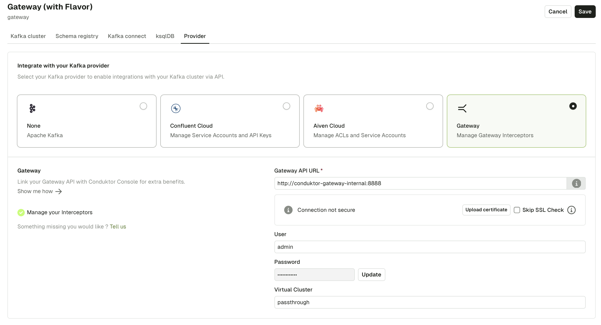

## Overview

Chargeback allows organizations to track and allocate costs/usage associated with Kafka resources to different teams or departments based on their data consumption and processing, facilitating cost accountability and management.

As of now, the tracked metrics are:

- Service Accounts produced bytes
- Service Accounts consumed bytes

We plan to add more metrics to Chargeback in the future. Let us know which metrics you would like to see next.

## Requirement

Chargeback requires both Console and Gateway:

- Console 1.29.0+
- Gateway 3.4.0+

## Configuration

To enable the Chargeback screens in Console, the following steps are necessary:

1. [Configure](/platform/navigation/settings/managing-clusters/) the Gateway cluster in Console
1. Configure the **Provider** tab with Gateway API credentials:

    :::info
    Virtual clusters are not supported yet. When populating the provider tab, you should instead use the default value `passthrough`.
    :::

    

1. Deploy the [Chargeback Interceptor](/gateway/interceptors/observability/chargeback) on Gateway. This can be done through Console UI or using the Gateway API/[CLI](/gateway/reference/cli-reference)

  ```yaml
  apiVersion: gateway/v2
  kind: Interceptor
  metadata:
    name: observability-interceptor
  spec:
    pluginClass: "io.conduktor.gateway.interceptor.observability.ObservabilityPlugin"
    priority: 100
    config:
      topicName: observability # name of the Topic where the Chargeback data will be stored
      replicationFactor: 3
      flushIntervalInSecond: 300
  ```

After a few minutes, you should see your active Service Accounts appear in the Chargeback UI.


Check the [Chargeback Usage](/platform/navigation/chargeback/) pages for details on the different tabs and UI features.
