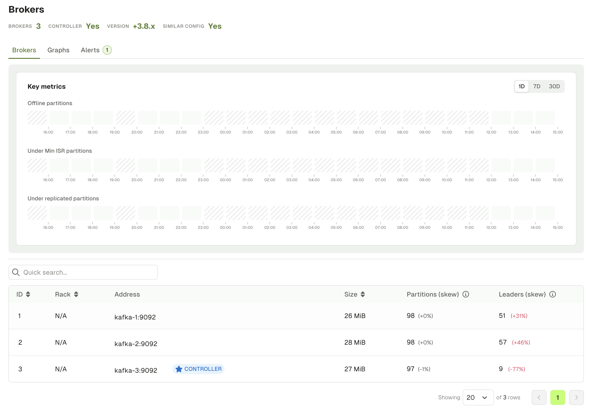
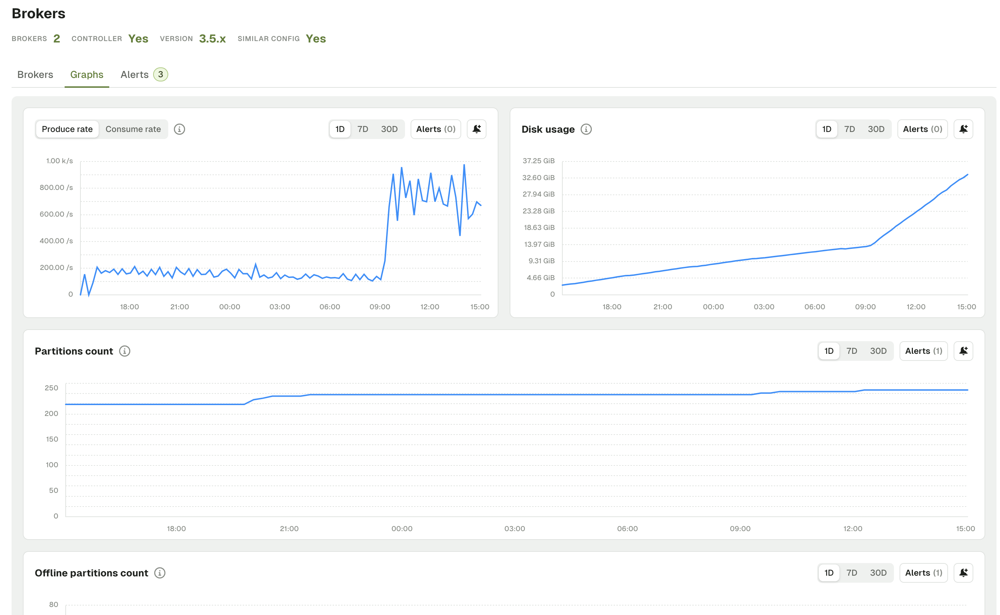
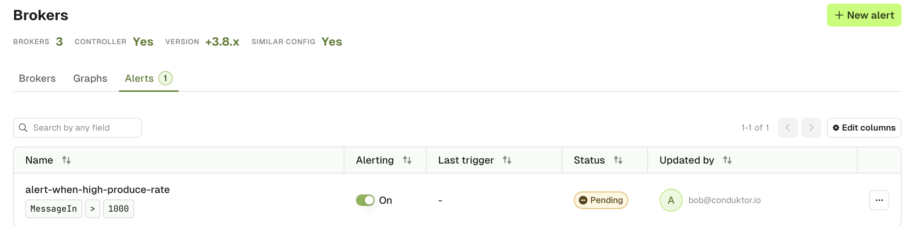

The Brokers menu lets you explore all your Kafka Cluster related info.

## Brokers List

The statistics section provides you with relevant information about the current state of your Kafka Cluster.
- Number of Brokers
- Version of your Kafka Cluster
- Whether all Brokers are configured the same or not

The Brokers List is a summary view of all your Kafka Brokers as well as sizing and partition balance information.

You can click on a specific Kafka Broker to get to the Brokers details page, which will give you detailed information about the Broker configuration.

## Graphs Tab

The Brokers Graphs tab lets you visualize the current and past state of your Kafka Cluster over a few metrics:
- Produce Rate and Consume Rate
- Disk usage
- Total partition count
- Offline, Under replicated and Under min ISR partition count

Graphs can be visualized over 24 hours, 7 days or 30 days periods.

On each metric you have the option to create an Alert. This will open a side panel requesting you to set the parameters to triggers your Alert.

import BrokerCreateAlert from './assets/brokers-create-alert.png';

## Alerts Tab

The Brokers Alert tab lets you visualize all active alerts associated to this Kafka Cluster.  
You can edit them or toggle them on or off.

<!-- TODO: add the section about brokers details. When you click on a broker, you get its configuration, logs, and some graphs too -->