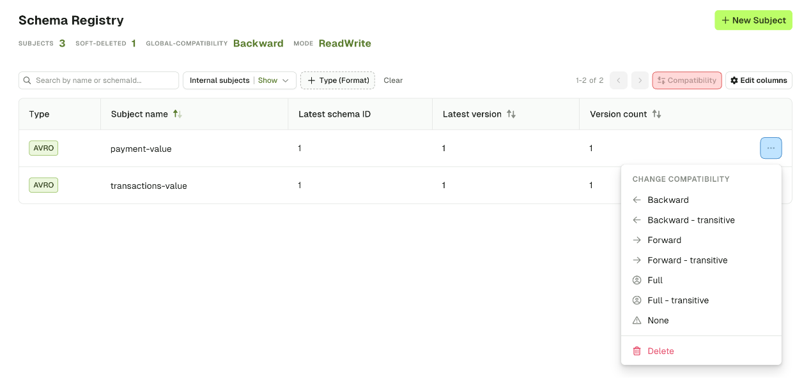
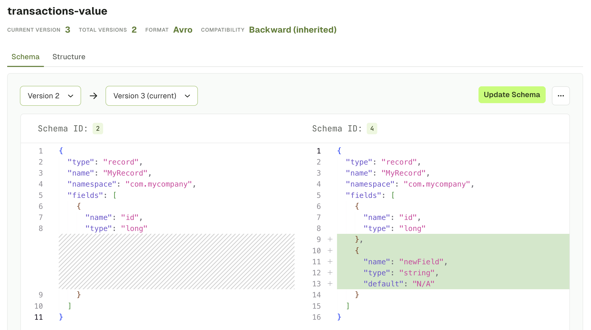
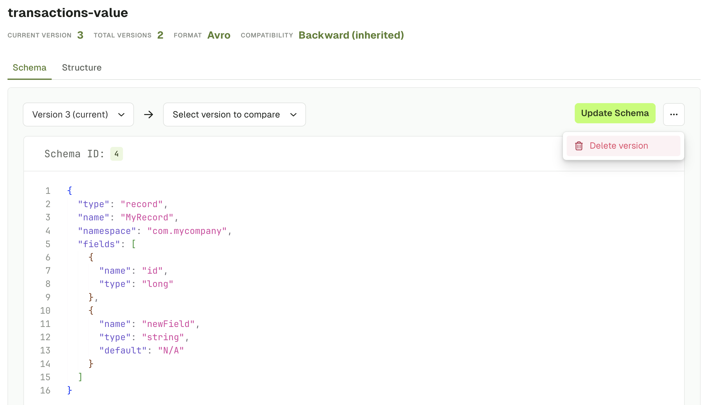

import Admonition from '@theme/Admonition';
import Label from '@site/src/components/Labels';

Conduktor provides a visual interface for Schema Registry, allowing you to create and manage Subjects and Schemas with ease. Having Schema Registry ensures there is an automated way of ensuring data verification, Schema evolution, and ability for new consumers to emerge without breaking downstream.

Conduktor supports **Confluent**, **Confluent like** (e.g. Karapace) and **AWS Glue** Schema Registry types.

## Getting Started

Schema Registry needs to be enabled on a per-cluster basis before any Schemas can be added. To add Schema Registry to your cluster, head to the [Cluster settings](/platform/navigation/settings/managing-clusters/) section to learn how. Add your Schema Registry details on the tab available on an existing cluster configuration.

To see an example of setting up Schema Registry, head to [Part 3 of this blog post](https://www.conduktor.io/blog/what-is-the-schema-registry-and-why-do-you-need-to-use-it). This example uses an Aiven cluster and Karaspace Schema Registry.

## Create subject

Once Schema Registry is setup, you can explore your Subjects in the **Schema registry** tab from the left-hand menu. From there, click on the **New subject** button in the top right corner. This will open a side panel where you can configure your new Subject.

import CreateSubject from './assets/create-subject.png'

### Subject formats

Conduktor Console supports the [Avro](https://avro.apache.org/docs/current/spec.html), [JSON](https://json-schema.org/), and [Protobuf](https://developers.google.com/protocol-buffers/) formats for Schema Registry.

### Strategy

Subjects can be applied in several ways: To topics, to records, to both topics and records, or through a custom method.

- **Topic Name**: This strategy associates your Subject with a specific topic of your choosing. Simply enter the topic name that you want the Subject to apply to. You will also need to specify if the Subject will apply to the key or value of a message. The topic name field will auto-complete for you, so no need to remember specific spellings!

- **Record Name**: This is set within a message. The Subject will only apply to messages with the record name that you define, but it will apply globally across all topics. Note that the field which this will apply to varies based on the format you choose. For Avro, this is set by `{name}`. For JSON, it is `{title}`. For Protobuf, it will be `{message}`.

- **Topic + Record Name**: Choose this option if you want your Subject to apply to both a specific topic, and messages with a specific name within that topic.

- **Custom**: For more advanced options, use the Custom strategy. You can define your strategy in the Custom name field.

### Subject content

Once you have decided on your format and strategy, you will need to enter your Subject structure in the form provided.

Once it is ready, click **Create** and the Subject will be complete.

## Manage subject and schemas

You can manage your Subjects and Schemas from the Schema Registry tab. This includes:

**For subjects**:

- Change their compatibility
- Delete them

**For schemas**:

- Update a Schema and create a new version
- Compare Schemas from the same Subject
- Delete them

### Change subject compatibility

Each Subject has a compatibility type that determines how they should deal with evolution over time. As mentioned above, updating a Subject can cause issues upstream or downstream on applications, and choosing the right compatibility type can prevent this from occurring.

There are seven possible compatibility types:

1. Backward
1. Backward Transitive
1. Forward
1. Forward Transitive
1. Full
1. Full Transitive
1. None

See the [Schema Registry docs](https://docs.confluent.io/platform/current/schema-registry/avro.html#summary) for a guide to what each type does.

Compatibility can be changed **per subject** or **globally**.

### Delete subject

From the dropdown shown just above, you can also delete a Subject with the bin icon at the bottom.

This will be a **soft-delete**, meaning that the Schema versions under this Subject will be removed, but their metadata such as their Schema IDs will remain for lookup.

### Update schema

To update a Schema, select the relevant Subject and click on **Update Schema**. This will open a side panel where you can add or remove fields from your Schema.

import UpdateSchema from './assets/update-schema.png'

Before updating, use the **Check compatibility** button to understand if this change will break anything upstream or downstream on our applications.

### Compare schemas

If you have more than 2 Schemas associated to your Subject, you will be able to compare them. For that, simply select the two versions you'd like to compare.

### Delete schema

To delete a Schema, select the right version in the dropdown and click on the `...`. From there, click on **Delete version**.

This will be a **soft-delete**, meaning that the Schema version will be removed, but its metadata such as its Schema ID will remain for lookup.

Note that if you only have one Schema for this Subject, the Subject will be soft-deleted too.
