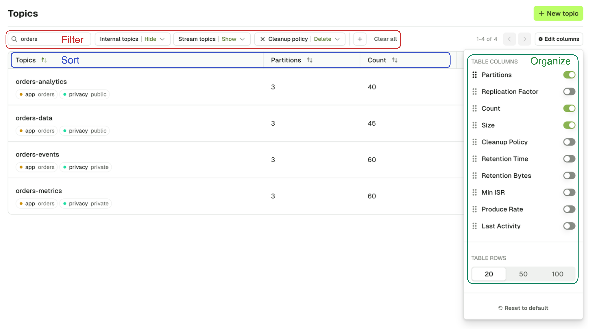

## Topic List

The Topic page lets you search for any topic on your currently selected Kafka cluster.
:::warning
Configure **RBAC** to restrict your users to View, Browse, or perform any operation only to certain topics.  
Check the [Settings](https://docs.conduktor.io/platform/admin/rbac/) for more info.
:::
Multiple search capabilities can be combined to help you find to the topic you want faster.

**Filtering** is possible on:

-   Topic name
-   Show/Hide Internal topics (starts with `_`)
-   Show/Hide Kafka Stream topics (ends with `-repartition` or `-changelog`)
-   Cleanup policy
-   Labels (click on a label to add/remove it from the filters, [See Add Topic Label](#manage-topic-labels))

**Sorting** is possible on all columns.

**Active columns** can be picked from a list of Available columns from the side button « ⚙️ Edit columns »

:::info
Your current **filters**, active **sort**, and **visible columns** are stored in your browser's local storage for each Kafka Cluster and persist across sessions
:::

## Operations

Several actions are also available from the Topic List: Create topic, Add partitions, Empty topic and Delete topic.

### Create Topic

On the Create Topic screen, you are asked to provide all the necessary information to create a topic.
:::info
The default choices made by Console are generally safe for most typical Kafka Production deployments.  
If you want to understand more deeply what those parameters are about, here's some recommended reads:  
[Choosing the Replication Factor and Partition Count](https://www.conduktor.io/kafka/kafka-topics-choosing-the-replication-factor-and-partitions-count/)  
[Kafka Cleanup Policies Explained](https://www.conduktor.io/kafka/kafka-topic-configuration-log-compaction/)
:::

import CreateTopic from './assets/topic-create.png';

**Topic name**

As per [Kafka specification](https://github.com/apache/kafka/blob/08c437d25e74d63f11ae3f184dfb3889d4639ece/clients/src/main/java/org/apache/kafka/common/internals/Topic.java#L49-L62), topic name must only contain the following characters `[a-zA-Z0-9._-]` and not exceed 249 characters.

**Partitions**

This lets you define how scalable your topic will be for your consumers. In general you want a multiple of your number of brokers.

Default: `3`

**Replication factor**

This configuration helps prevent data loss by writing the same data to more than one broker.

Default: `min(3, number of brokers)`

**Cleanup Policy**

The Cleanup policy (along with its associated advanced configurations) controls how the retention of your messages is done.

**Labels**

Use labels to organize your topics and facilitate searching them in Console. Each label is a key-value pair.

**Advanced configuration**

Upon toggling the Advanced configuration, you will be shown all the available topic configurations.
:::info
Read more about Apache Kafka topic configuration [here](https://kafka.apache.org/documentation/#topicconfigs)
:::

import CreateTopicAdvanced from './assets/topic-create-advanced.png';

### Add partitions

Increase the number of partitions for your topic. Number of partitions cannot be decreased.
:::warning
Adding partitions reshuffles the target partition of messages with a given key. Existing data will stay on the previous partition. Consumers that rely on partition ordering could be impacted.
:::

import AddPartitions from './assets/topic-add-partitions.png';

### Empty topic

This lets you delete all records from a topic. This operation is permanent and irreversible.

If you want to only delete all records from given partition, there's a dedicated operation on the Partitions tab of the topic detail.

import EmptyTopic from './assets/topic-empty.png';

### Delete topic

This lets you delete the topic from Kafka. This operation is permanent and irreversible.

import DeleteTopic from './assets/topic-delete.png';

          
### Manage topic labels

You can help categorize your Topics further using key-value pairs called labels.

To manage your topic's labels via the UI, click on the topic and on the "Edit" button from the topic details view.

import EditLabel from './assets/label-edit.png';

A side bar will appear with the current tags associated with the topic, and a button to add more. You can also click on the trash icon to remove a label.

import LabelNew from './assets/label-new.png';

