:::info
Check out the video that presents the most important features of topic consume: [filter and sort techniques for exploration and troubleshooting with Console](https://www.youtube.com/watch?v=8fg0VJ3jSFc)
:::

## Configure the Kafka consumer

When you access a Topic from the Topic List page for the first time, a consumer is automatically triggered with default settings:

-   Show From: `Most recent`
-   Limit: `500 records`
-   Partitions: `All`

This default setup lets you quickly browse through the 500 most recent messages produced in the topic.
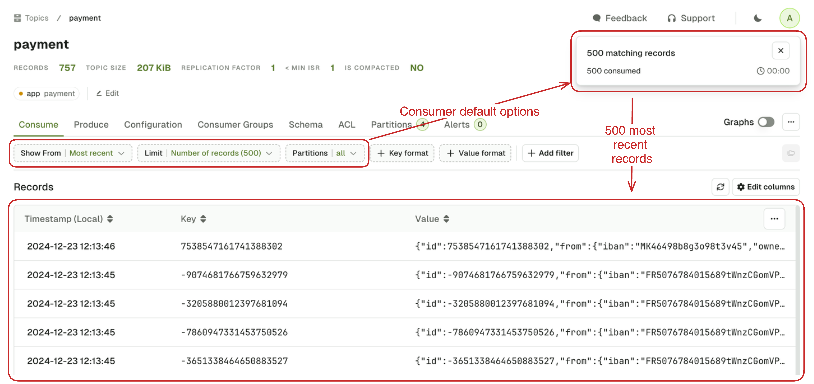

There's a good chance this will not correspond to your requirements, so let's explore how you can configure you consumer to give you the records you need.

### Show from

`Show From` defines the starting point for the Kafka Consumer in your topic.

import ShowFromOptions from './assets/topic-show-from-choices.png';


The possible values are as follow:

-   `Most Recent` option works differently depending on the **Limit** that you select
    -   With **Number of records** limit (let's say 500), it sets the starting point in your topic backward relative to **Now**, in order to get your the 500 _most recent_ records.
        -   [How Most Recent 500 works?](/platform/navigation/console/topics/topic-consume/most-recent/)
    -   With **None (live consume)**, it simply set the starting point to **Now**. This lets you consume only the messages produced **after** the consumer was started.
-   `Latest hour`, `Today`, `Yesterday` to start the consumer respectively
    -   60 minute ago,
    -   At the beginning of the day at 00:00:00 (Local Timezone based on your browser)
    -   At the beginning of the day before at 00:00:00 (Local Timezone)
-   `Beginning` to start the consumer from the very beginning of the topic.
-   `Date` and `Timestamp` to start from a specific point in time datetime or an epoch
    -   Date: ISO 8601 DateTime format with offset `2024-12-21T00:00:00+00:00`
    -   Timestamp: Unix timestamp in **milliseconds** `1734949697000`
-   `Offset` to start the consumer at a specific offset, ideal for use with a single **Partition** setting.
-   `Consumer Group` to start the consumer from the last offsets committed by a consumer group on this topic.

### Limit

`Limit` defines when your consumer must stop.

import LimitOptions from './assets/topic-limit-choices.png';


Possible choices are:

-   `Latest Offset` stop the consumer upon reaching the end of the topic.
    -   ⚠️ The end offsets are calculated when you trigger the search. Records produced after that point **will not appear** in the search results.
-   `None (live consume)` to start a Live Consumer that will look for messages indefinitely
-   `Number of records` stop the consumer after having sent a certain number of records to the browser.
    -   💡 When you have active filters, non-matching records will not count toward this limit.
-   `Date` stop the consumer after reaching the configured date
    -   ISO 8601 DateTime format with offset `2023-12-21T00:00:00+00:00`

### Partitions

`Partitions` lets you restrict the consumer to only consume from certain partitions of your topic. By default, records from **all partitions** are consumed.

import PartitionsOptions from './assets/topic-partitions-choices.png';


### Key and value format

`Key format` and `Value format` lets you force the deserializer for your topic.

import TopicKeyFormatOptions from './assets/topic-key-format-choices.png';


#### Automatic deserializer

This is the default deserializer. **Automatic** infers the correct deserializer in the following order:

- Schema Registry Deserializers (Avro, Protobuf, Json Schema)
- JsonDeserializer
- StringDeserializer
- ByteDeserializer (fallback)

Automatic deserializer applies to all the records within a topic, based on the one that matches the first record it encounters.

#### Custom deserializer

If you have installed them, your Custom Deserializers will appear here. Optionally, configure them using the `Properties` text and your messages will show as expected.  

Check our guide on how to [Install and configure custom deserializers](/platform/guides/custom-deserializers/) in Console.
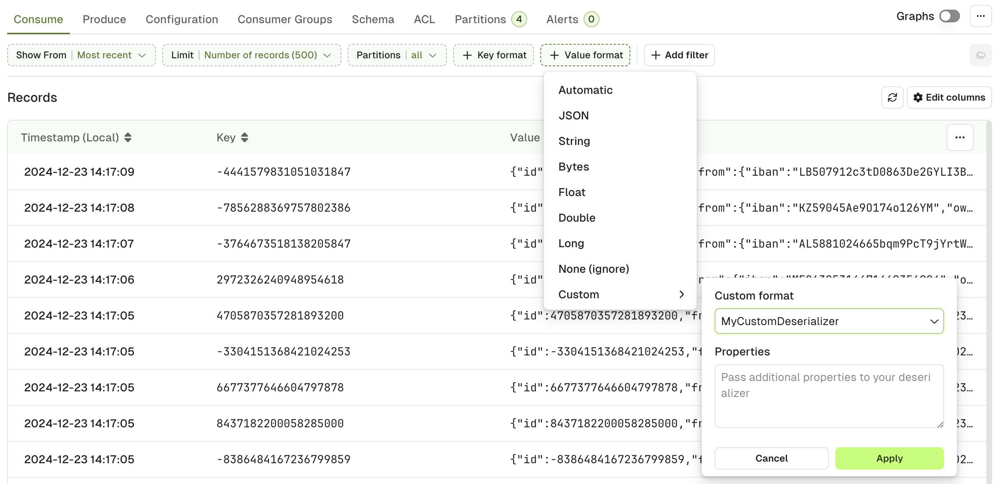

#### JSON deserializer

JSON Deserializer will explicitly fail on records that doesn't match a JSON type.

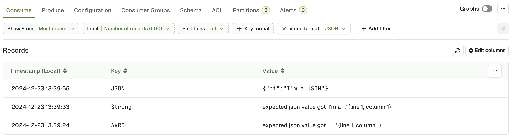

#### Bytes deserializer

Bytes Deserializer helps you visualize your records by printing the non-ASCII characters as hexadecimal escape sequences. For instance, the following sequence of bytes:

```undefined
00 00 00 00 07 10 49 27 6D 20 41 56 52 4F
```

corresponding to the [wire format of a Schema Registry AVRO message](https://docs.confluent.io/cloud/current/sr/fundamentals/serdes-develop/index.html#wire-format):

```undefined
00                            0   Magic Byte (0)
00 00 00 07                   1-4 Schema ID (7)
10 49 27 6D 20 41 56 52 4F    5+  serialized AVRO data
```

will be represented like this:

```undefined
\x00\x00\x00\x00\x07\x10I'm AVRO
```

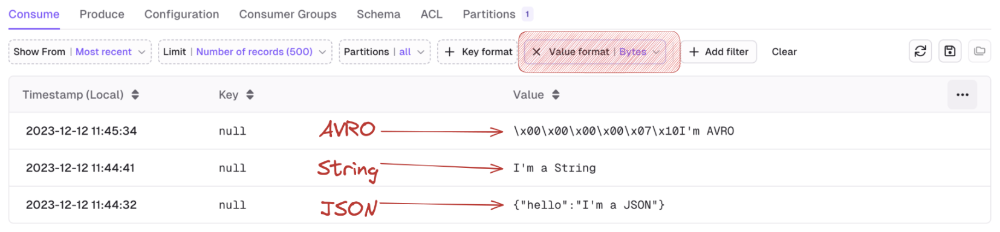

## Filter records

Console give you 3 methods to define filters that will be executed on the server and will only return the records that matches. This is a very powerful feature that lets you quickly see the records that matter to you in large topics.

### Global search

Global Search is the most simple type of filter you can use.

1. Specify whether to look in the Key or in the Value,
2. Pick an operator (contains, not contains, equals, not equals)
3. Type your search term

:::info
Internally, this will treat the record Key or Value as text to apply the operation (contains, equals, ...).  
This might not be the preferred approach if your record is JSON-ish
:::

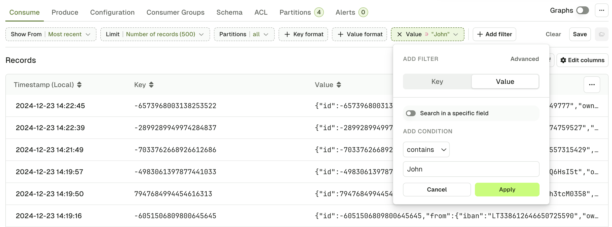

### Search in a specific field

You can make your search more fine-grained by activating "Search in a specific field".
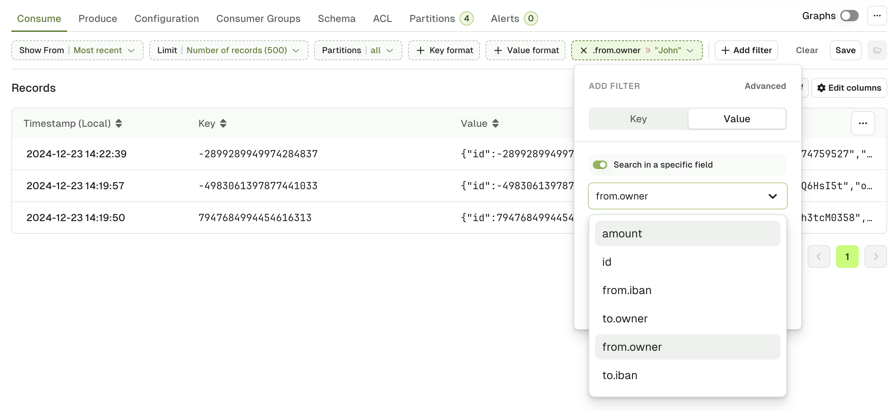

:::info
Console will generate an autocomplete list by looking at the most recent 50 messages in the topic. If the key you're looking for is not here, you can type it manually.  
Examples:  
`data.event.name`  
`data.event["correlation-id"]`  
`data.clientAddress[0].ip`  
:::

### JS search

If you need to construct more advanced filters, you can switch to the advanced view and use plain Javascript to build your filter.  
Check this article on [JS Filters syntax](../js-filter-syntax/) to get examples and syntax around this filter.
:::caution
While it is the option that can potentially address the most complex use-cases, it is not the recommended or the fastest one.
:::

### Statistics pop-up

While the consumer is processing, you will see the following statistics window.

This little window present the necessary information to let you decide wether it's worth pursuing the current search or if you should rather refine it further.

Here's how to read it:

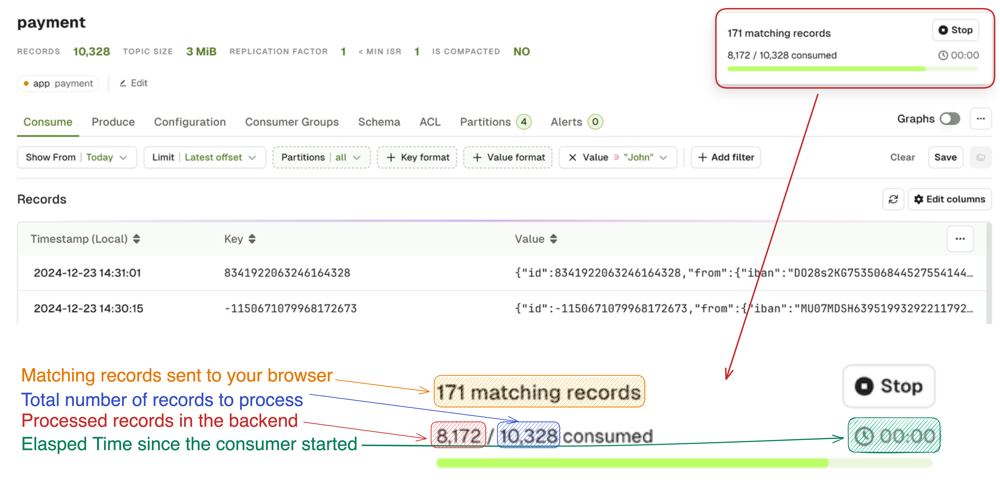

## Browse records

### From the main table

Once the search starts, you will see messages appearing in the main table. The table has 3 columns: Timestamp, Key and Value.  

:::info
Note that the Timestamp column takes the **local timezone** of the user.  
For example, if you are producing a message from Dublin, Ireland (UTC+1) at `14:57:38 local time`, and you then consume this message from your browser (in Dublin), you will see `14:57:38`.  
However, if another user consumes the same message in Console but from Paris, France (UTC+2), they will see `15:57:38`.  
Please be aware that this isn't a mistake from Kafka itself, you are simply seeing messages displayed in your local timezone.  
:::

### Individual records

Upon clicking on a record from the list, a side bar will open on the right to display the entire record.

:::info
Use the arrow keys to navigate between messages: ⬆️ ⬇️
:::

There are 3 tabs at the top to display different elements of your record: Data, Headers and Metadata.

import RecordDetails from './assets/topic-browse.png';


The **Share** button will lead you to a page dedicated to this record, allowing you to share it with your colleagues, and to get more details about it.

import ShareRecord from './assets/record-details.png';


### Data tab

The Data tab lets you visualize your record's Key and Value.

If your record Value is serialized with JSON or using a Schema Registry it is presented by default using the Table view. You can also switch to the JSON view if necessary.

import DataTabs from './assets/topic-browse-json-table.png';


The 2 views have different features associated.

#### Table View

The table view lets you visualize your message field by field and also gives you the possibility to restrict your search further by applying more filters on individual fields. Filter types are Include and Exclude.

Filters are available for:

- **string** fields
- **number** fields
- **bool** fields

but disabled for:

- **null** fields
- fields contained within **lists**

#### JSON View

The JSON view lets you visualize your message , the "Enable JQ" toggle lets you create a different projection your record value.

The basic syntax lets you focus on sub-elements of your record, as shown in the screenshot below.

```undefined
{ foo: .bar }  // Renders {"foo": "value of .bar"}
.meta.domain // Renders a single String
{ id, meta } // Renders a new JSON with both elements
```

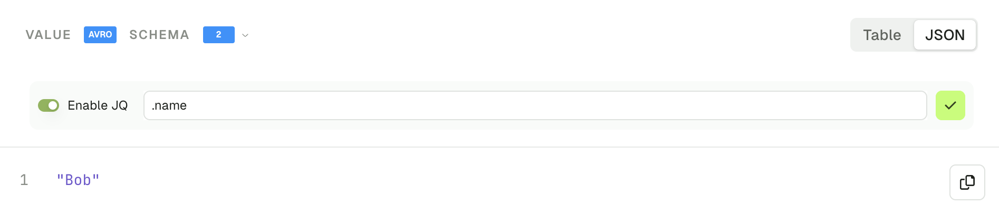
Check the [JQ Syntax Reference](https://jqlang.github.io/jq/manual/#object-construction) for more advanced use-cases.

### Headers tab

The headers tab show you all the headers of your Kafka record, and lets you find more messages with the same header value, using the funnel icon.

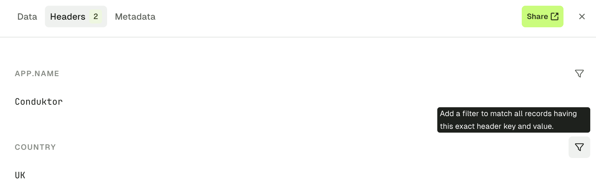
The resulting filter will be created:
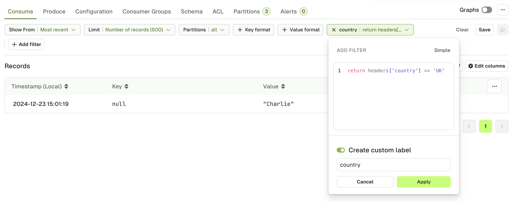

:::warning
While Kafka header values are internally stored as `byte[]`, Console uses StringDeserializer to display and filter them.  
If your producer doesn't write header values as UTF8 String, this tab might not render properly, and header filter might not work as expected.
:::

### Metadata tab

The metadata tab gives you all the other information regarding your record that could be useful under certain circumstances. The information presented are as follow:

- Record Partition
- Record Offset
- Record Timestamp
- The Key and Value Serializer inferred by the [Automatic Deserializer](#automatic-deserializer)
- Key Size and Value Size (how it's serialized on the broker)
- Compression type
- Schema ID if any

import MetadataTab from './assets/topic-metadata.png';


## Operations

### Export records in CSV and JSON

You have the ability to export the records in either JSON or CSV format.

CSV particularly useful in particular because you can use Console to re-import them either in a new topic or in the same topic after having modified them (or not)

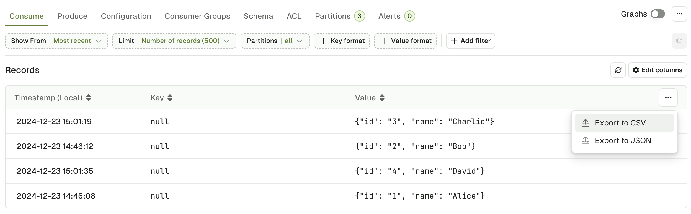

The resulting files will look like this:
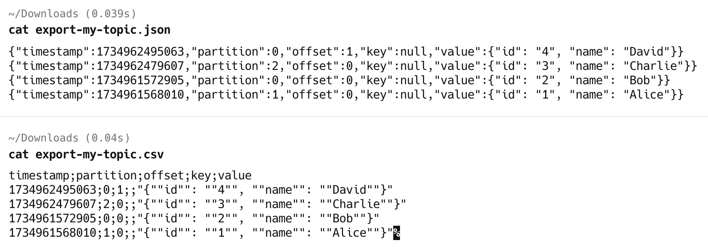

### Reprocess record

This feature lets you pick a record from the list and reprocess it either in the same or in a different topic, while letting you change its content beforehand.

Upon click the Reprocess message **(1)**, you will be asked to pick a destination topic **(2)**, and then you will end up on the produce tab with your message pre-filled. From there you can either Produce the message directly or make adjustments before **(3)**.

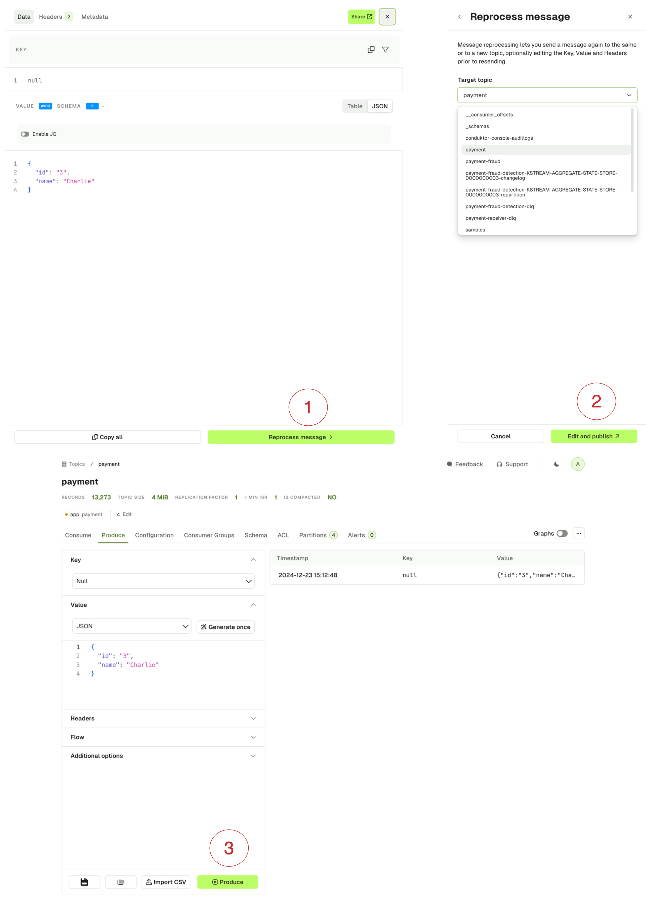

Know more about [How to reprocess records](/platform/guides/reprocess/).

### Save and load views

If you are regularly using the same set of Consume Configuration (Show From, Limit, ...) and Filters, or if you'd like to share them with your colleagues, you can save your current view as a template for reuse.

**Create a new view**

Click on the Save icon button to save your current view as a template:
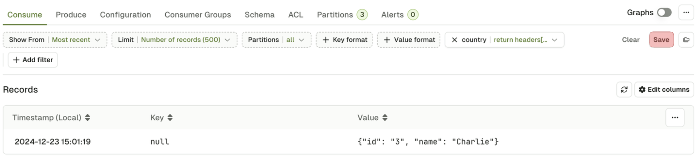

From there, you can name your view, add a description, and select whether this view is private, or if you want everyone in your organization to be able to see it and use it.

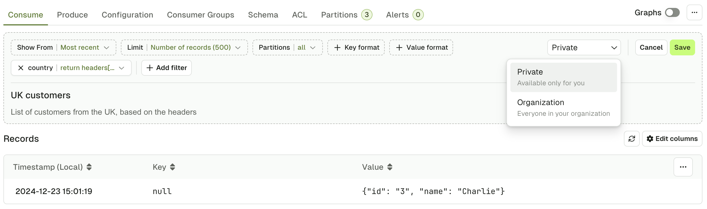

**List the existing views**

To list the existing views, click on the folder icon:

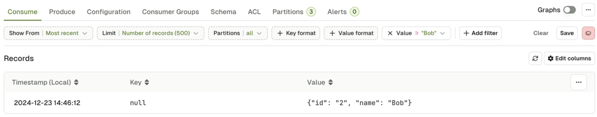

From here, you will see your private views, and the organization views that you created, or that were created by your colleagues.

import SharedViews from './assets/list-shared-views.png';


