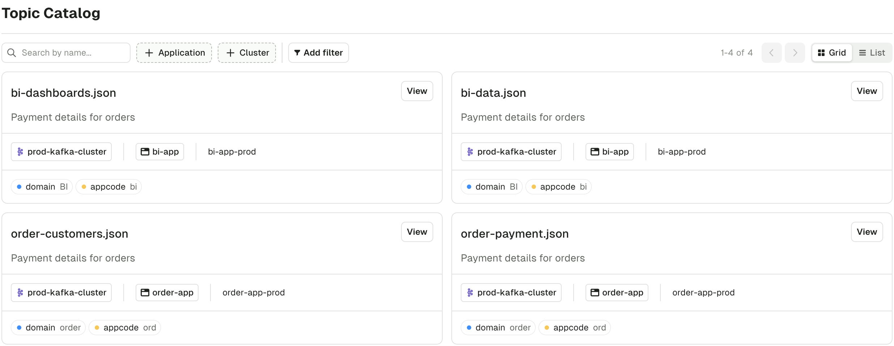

:::note
Self-service UI is almost entirely Read-only for now.  
Use the CLI to interact with the product.
:::

## Topic Catalog Page

The Application Catalog lets you search through the Topics marked as public deployed in your organization.

You can filter by multiple dimensions: Application, Kafka Cluster, and also the Topic metadata.

