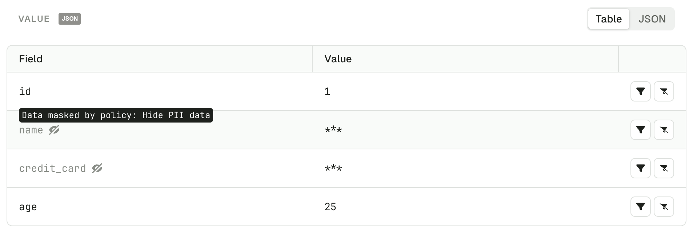

In order to create a Data Masking policy and protect your data, you should navigate to the **Data Policies** section of the **Settings**. If you don't see this tab, you may not have the appropriate permissions to create policies.

Here, you can click on **New policy** and fill out the form with the policy details.

Here are the information you'll have to fill:

| Policy Detail                       | Description                                                                                                                                           |
|-------------------------------------|-------------------------------------------------------------------------------------------------------------------------------------------------------|
| Policy Name                         | Unique name for identifying your policy                                                                                                               |
| Compliance                          | The compliance regulation the policy adheres to (e.g. GDPR, PCI-DSS)                                                                                  |
| Information Kind                    | The kind of information for obfuscation (e.g. PII, Financial)                                                                                         |
| Masking Rule                        | How the obfuscation should be implemented (e.g. hide-all, hide-last-3)                                                                                |
| Risk Level                          | Categorization for the risk level associated with the policy                                                                                          |
| Fields                              | List of fields that should be obfuscated. It's based on JSON, and can be a path. If you want to hide multiple fields, you can click on **Add field**. |
| Resources                           | List of resources where the policy must be applied, like clusters or topics. To add new resources, you can click on **Add resource**.                 |
| Exclude Users or Groups from policy | In case you want some users or groups to see the data, you can exclude them from the policy.                                                          |

import PolicyConfig from './assets/policy-config.png'

In the case above, the policy will mask the field `credit_card`, for all the users **except people from the group "Order Owners"**, on the topic prefixed by `payment-` of the `Prod Kafka Cluster`.

## Validate a Policy
Once you have created a policy, you should validate it through the Conduktor Console. 

* Navigate to a topic that contains data where your policy should be applied
* Check that the expected fields are obfuscated using the appropriate masking rule

We can see that the name and the credit_card are completely hidden, as we defined in the masking rules.
