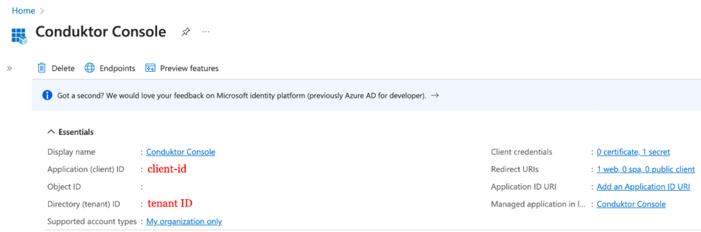

# Configure JumpCloud as SSO

## JumpCloud Configuration

On the JumpCloud side, you'll have to create a new application:

- **Step 1**: Create a new application in `SSO Applications` and set the callback URI.

You can select the name you want, shown here as `conduktor`, and enter the redirect URI as the following: `http(s)://<Console host>:<Console port>/oauth/callback/<OAuth2 config name>`. 

For example, if you deployed Console locally using the name `jumpcloud` in your configuration file, you can use `http://localhost:8080/oauth/callback/jumpcloud`, like on the screenshot below.


- **Step 2**: Create a new client secret from the **Certificates & secrets** tab


:::warning
You need to keep the `Value` somewhere safe, as you will not have access to it again.
:::

- **Step 3**: Find the `client ID` and `tenant ID` in the **Overview** tab



:::tip
You can find the .well-known at: `https://login.microsoftonline.com/<tenant ID>/v2.0/.well-known/openid-configuration`.
:::

## Console Configuration

On Console side, you can add the snippet below to your configuration file. You have to replace the client ID, client secret, and tenant ID, by what you got during the steps 2 and 3.


```yaml title="platform-config.yaml"
sso:
  oauth2:
    - name: "jumpcloud"
      default: true
      client-id: "<client ID>"
      client-secret: "<client secret>"
      groups-claim: "groups" #if wanting to use groups mapping
      openid:
        issuer: "https://oauth.id.jumpcloud.com/"
```
Or using environment variables:

```json
CDK_SSO_OAUTH2_0_NAME="jumpcloud"
CDK_SSO_OAUTH2_0_DEFAULT=true
CDK_SSO_OAUTH2_0_CLIENT-ID="<client ID>"
CDK_SSO_OAUTH2_0_CLIENT-SECRET="<client secret>"
CDK_SSO_OAUTH2_0_GROUPS-CLAIM="groups"
CDK_SSO_OAUTH2_0_OPENID_ISSUER="https://login.microsoftonline.com/<tenant ID>/v2.0"
```

## Groups Configuration

If you want to use the `external groups mapping` to map groups between your Conduktor Console instance and Azure, you must add this claim to your Azure application in the **Token configuration** tab:


:::caution
If you have a **large number of groups** within your enterprise, you might need to [`assign some groups to the application`](https://learn.microsoft.com/en-us/azure/active-directory/manage-apps/assign-user-or-group-access-portal?pivots=portal#assign-users-and-groups-to-an-application), and check the `Groups assigned to the application` box when creating the groups claim on Azure AD. This is to avoid exceeding the limit on the number of groups a token can contain.
:::

Then, you must set the property `groups-claim` to `"groups"` in the Console configuration file. Below is the full snippet for your configuration file:

```yaml title="platform-config.yaml"
sso:
  oauth2:
    - name: "azure"
      default: true
      client-id: "<client ID>"
      client-secret: "<client secret>"
      groups-claim: "groups"
      openid:
        issuer: "https://login.microsoftonline.com/<tenant ID>/v2.0"
```

Or using environment variables:

```json
CDK_SSO_OAUTH2_0_NAME="azure"
CDK_SSO_OAUTH2_0_DEFAULT=true
CDK_SSO_OAUTH2_0_CLIENT-ID="<client ID>"
CDK_SSO_OAUTH2_0_CLIENT-SECRET="<client secret>"
CDK_SSO_OAUTH2_0_GROUPS-CLAIM="groups"
CDK_SSO_OAUTH2_0_OPENID_ISSUER="https://login.microsoftonline.com/<tenant ID>/v2.0"
```

### External Groups Mapping

Now that your configuration is finished, you can [setup the mapping](https://docs.conduktor.io/platform/get-started/configuration/user-authentication/external-group-sync/#create-an-external-group-mapping) between Azure AD and Console groups. That way, when a user will log in, they will be automatically added to the corresponding Console groups, based on the groups they belong to in Azure AD.

The value you need to put as external group is the `Object ID` of the Azure AD group.
