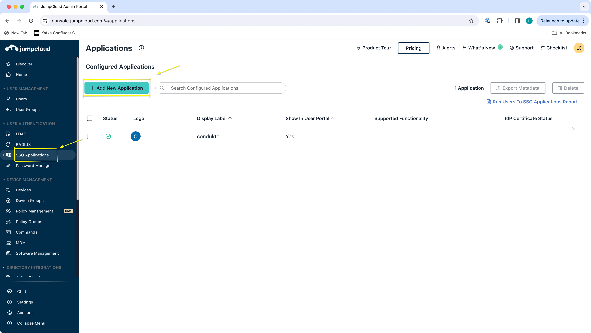
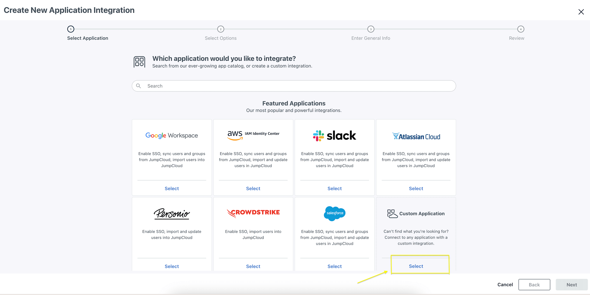
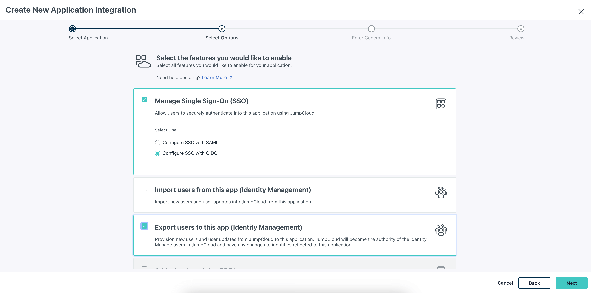
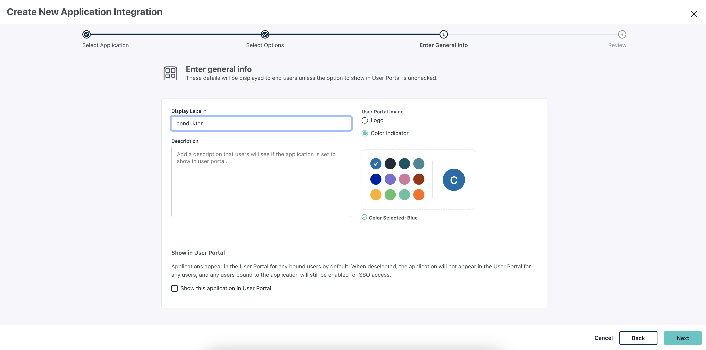
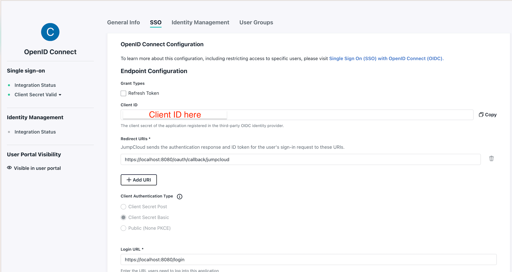
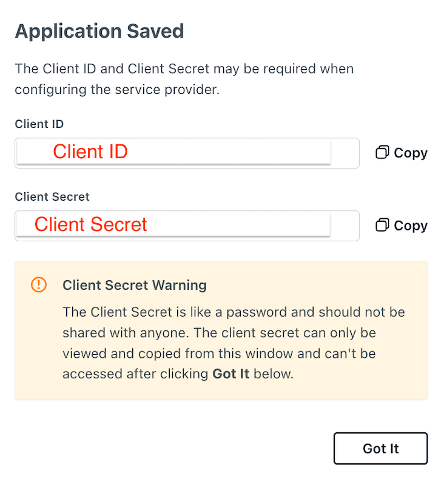
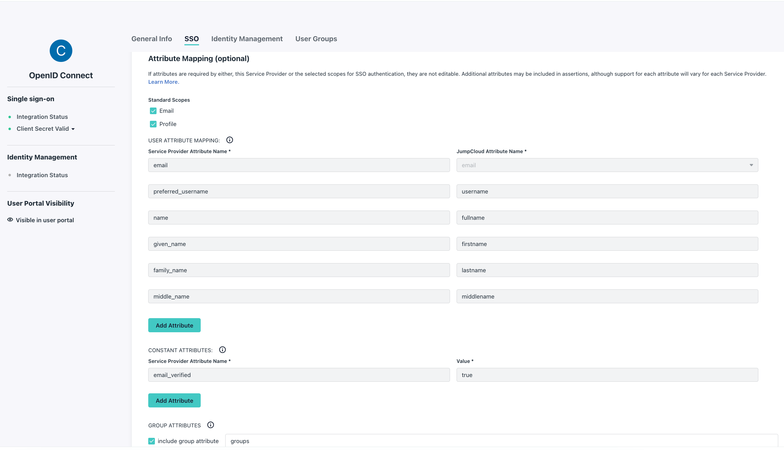

# Configure JumpCloud as SSO

## JumpCloud Configuration

On the JumpCloud side, you'll have to create a new application:

- **Step 1**: Create a new application in `SSO Applications`.



- **Step 2**: Select a `Custom Application` as shown below.


Then ensure to select `Manage Single Sign-On (SSO)`, then `Configure SSO with OIDC` and `Export users to this app (Identity Management)` as seen in screenshot below.


Following this, enter general information for your custom application, including the display label, such as `conduktor` as seen in screenshot below and configure this application.




- **Step 3**: Add `Redirect URI(s)` and `Login URL`.

The Redirect URI is where JumpCloud sends the authentication response and ID token for the user's sign-in request to. The Login URL is the the URL users need to log into this application. 

Enter the redirect URI in the following way:

`http(s)://<Console host>:<Console port>/oauth/callback/<OAuth2 config name>`. 

For example, if you deployed Console locally using the name `jumpcloud` in your configuration file, you can use
`https://localhost:8080/oauth/callback/jumpcloud`, as seen on the screenshot below.

Enter the Login URL, which is the URL users need to log into this application, in example below this is `https://localhost:8080` .




- **Step 4**: Find the `Client ID` and `Client Secret`.

After clicking activate during Step 3 you will be shown configurations for `Client ID` and `Client Secret`, be sure to save these somewhere safe.
 



:::warning
You need to keep the `Client Secret` somewhere safe, as you will not have access to it again.
:::


## Conduktor Console Configuration

On the Conduktor Console side, you can add the snippet below to your configuration file. You will have to replace the Client ID and Client Secret, as shown during the steps 3 and 4. 

:::tip
You can find the opendid issuer at: `https://oauth.id.jumpcloud.com/` as shown [`here`](https://jumpcloud.com/support/sso-with-oidc)
:::

```yaml title="platform-config.yaml"
sso:
  oauth2:
    - name: "jumpcloud"
      default: true
      client-id: "<Client ID>"
      client-secret: "<Client Secret>"
      groups-claim: "groups" #if wanting to use groups mapping
      openid:
        issuer: "https://oauth.id.jumpcloud.com/"
```
Or using environment variables:

```json
CDK_SSO_OAUTH2_0_NAME="jumpcloud"
CDK_SSO_OAUTH2_0_DEFAULT=true
CDK_SSO_OAUTH2_0_CLIENT-ID="<Client ID>"
CDK_SSO_OAUTH2_0_CLIENT-SECRET="<Client Secret>"
CDK_SSO_OAUTH2_0_GROUPS-CLAIM="groups"
CDK_SSO_OAUTH2_0_OPENID_ISSUER="https://oauth.id.jumpcloud.com/"
```

## Groups Configuration

If you want to use the `external groups mapping` to map groups between your Conduktor Console instance and JumpCloud:

From the JumpCloud side ensure you have checked ` Email` and `Profile` under the standard scopes, that `email_verified` has a value of true and include group attribute contains the value stated in the `groups-claim` or `CDK_SSO_OAUTH2_0_GROUPS-CLAIM` environmental variable on the Conduktor Console side. See example  screenshot shown below.



From the Conduktor Console side you must set the property `groups-claim` to `"groups"` in the Console configuration file. 
Below is the full snippet for your configuration file:

```yaml title="platform-config.yaml"
sso:
  oauth2:
    - name: "jumpcloud"
      default: true
      client-id: "<Client ID>"
      client-secret: "<Client Secret>"
      groups-claim: "groups"
      openid:
        issuer: "https://oauth.id.jumpcloud.com/"
```

Or using environment variables:

```json
CDK_SSO_OAUTH2_0_NAME="jumpcloud"
CDK_SSO_OAUTH2_0_DEFAULT=true
CDK_SSO_OAUTH2_0_CLIENT-ID="<Client ID>"
CDK_SSO_OAUTH2_0_CLIENT-SECRET="<Client Secret>"
CDK_SSO_OAUTH2_0_GROUPS-CLAIM="groups"
CDK_SSO_OAUTH2_0_OPENID_ISSUER="https://oauth.id.jumpcloud.com/"
```

### External Groups Mapping

Now that your configuration is finished, you can [setup the mapping](https://docs.conduktor.io/platform/get-started/configuration/user-authentication/external-group-sync/#create-an-external-group-mapping) between JumpCloud and Conduktor Console groups. This way, when a user logs in, they will be automatically added to the corresponding Conduktor Console groups, based on the groups they belong to in JumpCloud.

The value you need to put as external group is the name of the JumpCloud group.
