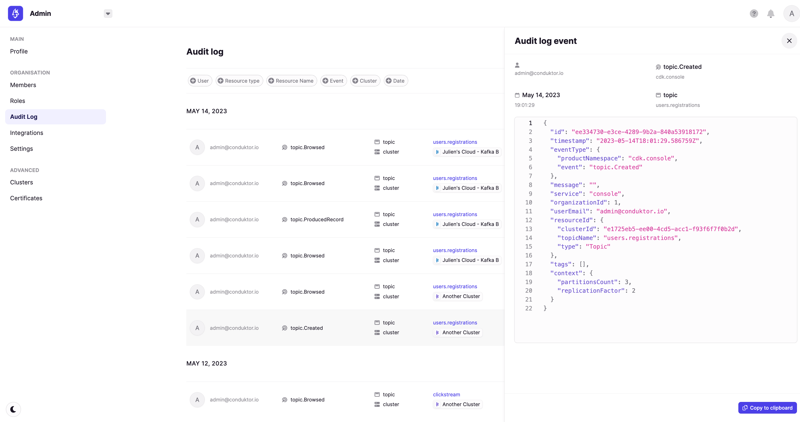

# Audit Log Events

:::info
Audit log is an Enterprise feature. Please [contact us](https://www.conduktor.io/contact) to discuss getting access.
:::

# Overview

When you navigate Conduktor, audit events are captured that give you detailed tracking of actions relating to Kafka. This gives you centralized visibility of user-related and resource-related events.

Clicking on an event in the audit log exposes event-specific metadata. The below example demonstrates an audit event for topic creation, which also details the number of partitions and replication factor that were used.

## Audit Events

Below outlines the audit events currently tracked by Conduktor.

  - [Console](#console)
  - [Data Masking](#data-masking)
  - [Topic as a Service](#topic-as-a-service)
  - [Testing](#testing)
  - [Admin](#admin)

## Console

### ResourceType: `Topic`

CRN: `kafka:/cluster/<uuid>/topic/<topic-name>`

- topic.ProducedRecord
- topic.Browsed
- topic.Deleted
- topic.Created
- topic.Updated
- topic.Emptied
- topic.Tagged
- topic.Untagged

### ResourceType: `Subject`

CRN `kafka:/cluster/<uuid>/subject/<subject-name>`

- subject.Created
- subject.Updated
- subject.ChangedCompat
- subject.Deleted
- subject.DeletedVersions
- subject.DeletedVersion

### ResourceType: `SchemaRegistry`

CRN `kafka:/cluster/<uuid>`

- registry.ChangedGlobalCompat

### ResourceType: `ConsumerGroup`

CRN `kafka:/cluster/<uuid>/group/<group-name>`

- consumergroup.Created
- consumergroup.Updated (ResetOffsets)
- consumergroup.Deleted

### ResourceType: `Connector`

CRN `kafka:/cluster/<uuid>/connect/<connect-cluster-id>/<connector-name>`

- connector.Created
- connector.Updated
- connector.Deleted
- connector.Restarted
- connector.RestartedTask
- connector.Paused
- connector.Resumed

## Data Masking

### ResourceType: `DatamaskingPolicy`

CRN `platform:/datamasking/<uuid>`

- policy.Upserted
- policy.Deleted

## Topic as a Service

### ResourceType: `Application`

CRN `platform:/application/<app-slug>`

- application.Created
- application.Deleted
- application.Updated
- application.access-request.Approved
  from / to
- application.access-request.Rejected

## Testing

### ResourceType: `Workspace`

CRN: `testing:/workspace/<organization-id>`

- testing.workspace.Created
- testing.workspace.Updated
- testing.workspace.Deleted

### ResourceType: `Test Suite`

CRN: `testing:/testsuite/<workspace-id>`

- testing.testsuite.Created
- testing.testsuite.Renamed
- testing.testsuite.Deleted

### ResourceType: `Test Scenario`

CRN: `testing:/scenario/<test-suite-id>`

- testing.scenario.Created
- testing.scenario.Updated
- testing.scenario.Deleted
- testing.scenario.Executed

### ResourceType: `Task`

- CRN: `testing:/task/<scenario-id>`
- testing.task.Created
- testing.task.Updated
- testing.task.Duplicated (missing resource right now)
- testing.task.Deleted

### ResourceType: `Environment`

CRN: `testing:/environment/<workspace-id>`

- testing.environment.Created
- testing.environment.Updated
- testing.environment.Deleted

### ResourceType: `Environment Variable`

CRN: `testing:/variableDefinition/<workspace-id>`

- testing.variableDefinition.Created
- testing.variableDefinition.Updated
- testing.variableDefinition.Deleted

### ResourceType: `Cluster`

CRN: `testing:/cluster/<workspace-id>`

- testing.cluster.Created
- testing.cluster.Updated
- testing.cluster.Deleted

### ResourceType: `Agent`

CRN: `testing:/agent/<agent-id>`

- testing.agent.Created
- testing.agent.Deleted

## Admin

### ResourceType: `Cluster`

CRN `kafka:/cluster/<uuid>`

- cluster.Created
- cluster.Updated
- cluster.Deleted

### ResourceType: `Group`

CRN `platform:/group/<uuid>`

- group.Created
- group.member.Added
- group.member.Deleted
- group.permission.Added
- group.permission.Deleted

### ResourceType: `User`

CRN `platform:/user/<email>`

- user.permission.Added
- user.permission.Deleted
- user.platform_role.Updated
