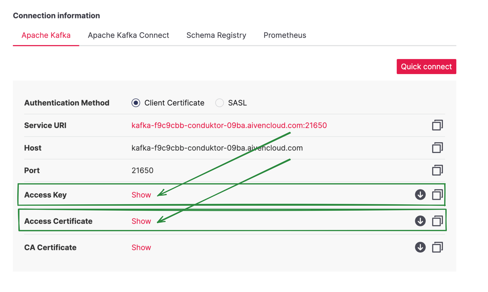
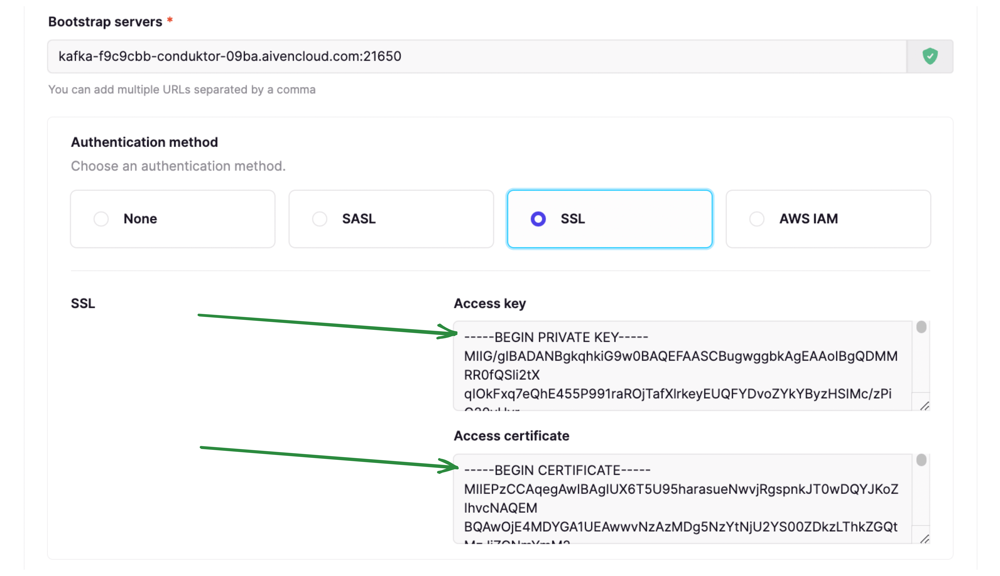

# SSL/TLS configuration

Depending on the environment, Conduktor might need to access external services like Kafka clusters, SSO servers, database, or object-storage that require custom certificate for SSL/TLS communication.

:::info
Since version `1.8.0` Conduktor provides a mechanism inside the UI for managing custom certificates for Kafka, Kafka Connect and Confluent Schema Registry\*\*
:::

The following table gives you an overview of what's currently supported and which methods you can use to configure it:

- From the UI (recommended). From Conduktor Platform, you can manage you certificates in a dedicated screen. You can also configure SSL authentication from the broker setup wizard
- Volume mount. This method is available as a backup plan, or if you have LDAPS

|                                | Kafka clusters            | Kafka Connect / Schema Registry | LDAPS, OIDC               |
| ------------------------------ | ------------------------- | ------------------------------- | ------------------------- |
| SSL to secure data in transit  | ✅ UI<br/>✅ volume mount | ✅ UI<br/>✅ volume mount       | 🚫 UI<br/>✅ volume mount |
| SSL to authenticate the client | ✅ UI<br/>✅ volume mount | 🚫 Unsupported                  | 🚫 Unsupported            |

Jump to:

- [Using the Conduktor Certificate Store](#using-the-conduktor-certificate-store)
  - _Recommended for Kafka, Kafka Connect and Schema Registry connections_
- [Mounting Custom Truststore](#mounting-custom-truststore)
  - _Recommended for SSO, DB or other external services requrigin SSL/TLS communication_
- [Client Certificate Authentication](#client-certificate-authentication)

## Using the Conduktor Certificate Store

Since version `1.8.0` you can manage custom certificates for Kafka, Kafka Connect and Schema Registry. This enables you to import and parse the certificates as text or files. The supported file formats are:

- .crt
- .pem
- .jks

### Uploading certificates in the cluster configuration screen

Assuming you have appropriate permissions, you can add cluster configurations from within **Admin**. When you add the bootstrap server to your configuration, a check will be made to validate if the certificate is issued by a valid authority.


If the response indicates the certificate is not issued by a valid authority, you have two options:

- **Skip SSL Check**: This will skip validation of the SSL certificate on your server. This is an easy option for development environments with self-signed certificates.
- **Upload Certificate**: This option will enable you to upload the certificate (.crt, .pem or .jks files), or paste the certificate as text.


Upon uploading the certificate, you should then see the green icon indicating **connection is secure**.


### Adding certificates in the dedicated certificates screen

Provided you have permissions, you can also manage organization certificates via the **Certificates** tab within **Admin**.

Simply add all of your certificates by uploading them or pasting them as text. In doing this, the SSL context will be derived when you configure Kafka, Kafka Connect and Schema Registry connections.


## Mounting Custom Truststore

Since version `1.5.0` Conduktor supports SSL/TLS connections using Java Truststore. The below details how to mount a custom truststore when starting Conduktor.

### Create TrustStore (jks) from certificate in pem format

If you already have a truststore, you can ignore this step.

For that ou need `keytool` program that is usually package on JDK distributions and a certificat in PEM format (`.pem` or `.crt`).

```bash
keytool  \
    -importcert \
    -noprompt \
    -trustcacerts \
    -keystore ./truststore.jks \       # Output truststore jks file
    -alias "my-domain.com" \           # Certificate alias inside the truststore (usually the certificate subject)
    -file ./my-certificate-file.pem \  # Input certificate file
    -storepass changeit \              # Truststore password
    -storetype JKS
```

### Configure custom truststore on Conduktor Platform

For that we need to mount the truststore file into the conduktor-platform container and pass the correct environment variables
for locating truststore file inside the container and password if needed.

Assuming that truststore file is named `truststore.jks` with password `changeit`.  
We mount truststore file into `/opt/conduktor/certs/truststore.jks` inside the container.

If run from docker :

```bash
 docker run --rm \
   --mount "type=bind,source=$PWD/truststore.jks,target=/opt/conduktor/certs/truststore.jks" \
   -e CDK_SSL_TRUSTSTORE_PATH="/opt/conduktor/certs/truststore.jks" \
   -e CDK_SSL_TRUSTSTORE_PASSWORD="changeit" \
  conduktor/conduktor-platform:latest
```

From docker-compose :

```yaml
version: '3.8'

services:
  conduktor-platform:
    image: conduktor/conduktor-platform:latest
    ports:
      - 8080:8080
    volumes:
      - type: bind
        source: ./truststore.jks
        target: /opt/conduktor/certs/truststore.jks
        read_only: true
    environment:
      CDK_SSL_TRUSTSTORE_PATH: '/opt/conduktor/certs/truststore.jks'
      CDK_SSL_TRUSTSTORE_PASSWORD: 'changeit'
```

## Client Certificate Authentication

This mechanism uses TLS protocol to authenticate the client.
Other names include:

- Mutual SSL, Mutual TLS, mTLS
- Two-Way SSL, SSL Certificate Authentication
- Digital Certificate Authentication, Public Key Infrastructure (PKI) Authentication

### Using the UI (Recommended method)

Your Kafka Admin or your Kafka Provider gave you 2 files for authentication

- An Access key (.key file)
- An Access certificate (.pem or .crt file)

Here's an example with Aiven


You need to paste the 2 file contents into Conduktor Platform


### Using Volume Mount (Alternate method)

:::info
Unsupported from the UI as of version `1.8.0`, there's a bug that prevents saving `ssl.keystore.location`. Use the YAML cluster configuration if you must use the alternate method.
:::

You can mount the keystore file in Conduktor Platform:

```yaml
version: '3.8'
services:
conduktor-platform:
image: conduktor/conduktor-platform:latest
ports:
  - 8080:8080
volumes:
  - type: bind
source: ./keystore.jks
target: /opt/conduktor/certs/keystore.jks
read_only: true
```

And then configure the Kafka additional properties like this:

```properties
security.protocol=SSL
ssl.keystore.location=/opt/conduktor/certs/keystore.jks
ssl.keystore.password=changeit
ssl.key.password=password
```
